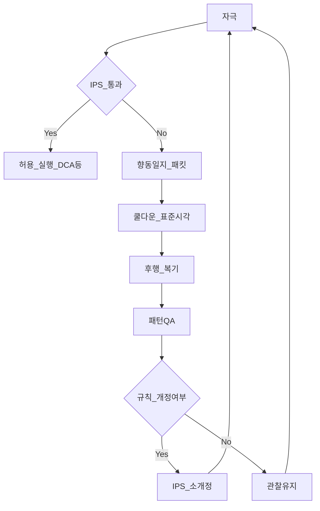
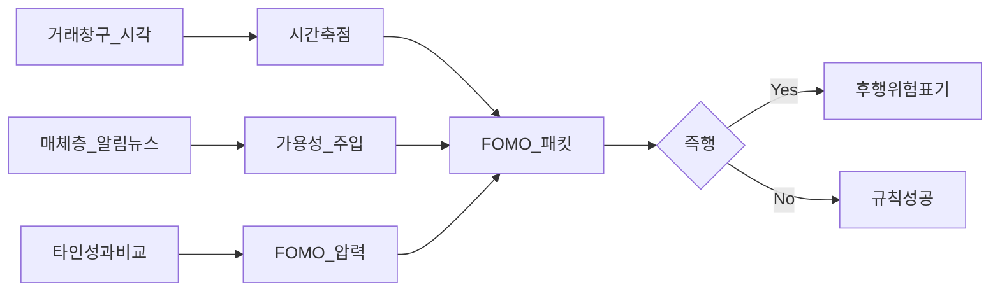
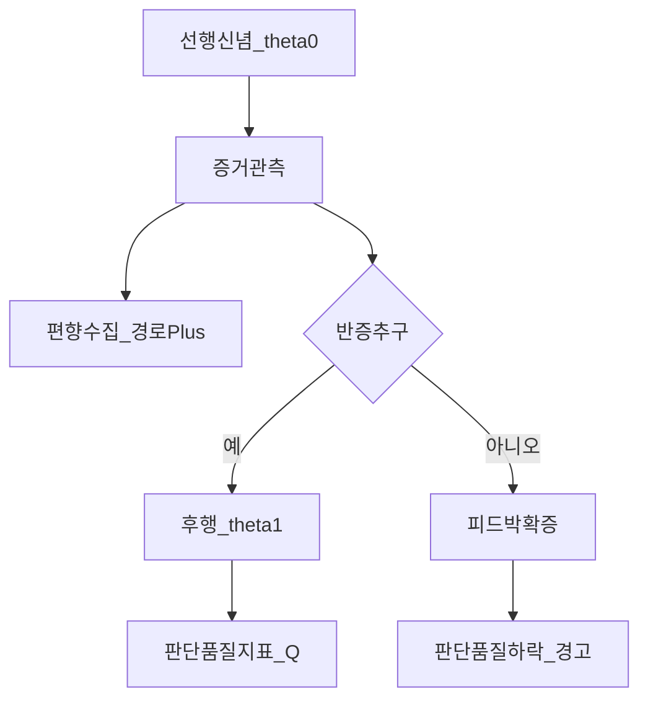
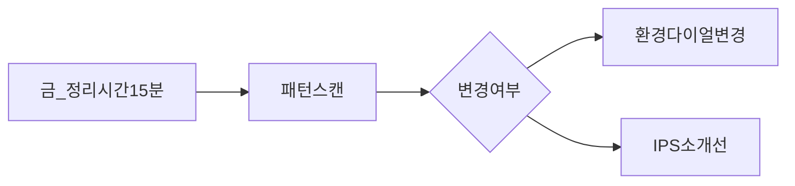
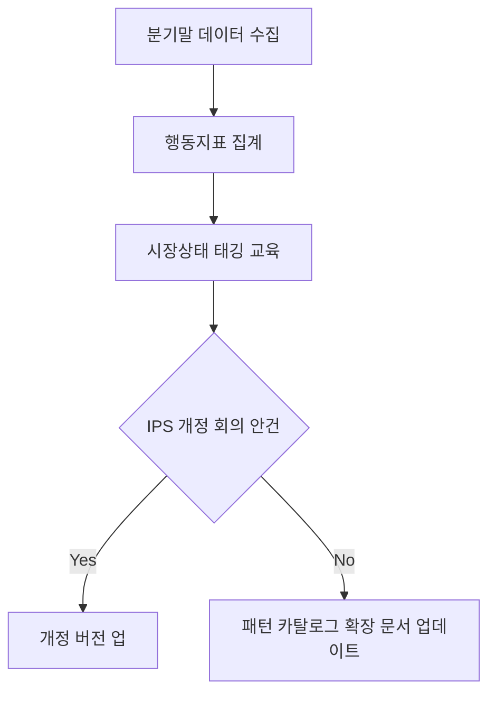

# 투자일지와 심리기록 — 템플릿·FOMO 로깅·확증편향 기록·디바이어싱 실무

> **면책**: 본 문서는 교육·행동 규율 설계 목적의 일반 정보이며, **특정 금융상품 매매를 권유하거나 투자 자문으로 해석되어서는 안 됩니다.** 정신건강·충동조절·중독 징후가 있다면 의료 전문가 상담이 우선입니다. 제도·세율은 변경될 수 있으며 실행 전에는 공식 안내와 본인의 투자정책(IPS)을 확인하세요.

## 메타

| 항목 | 내용 |
|------|------|
| 최종 검증일 | 2026-05-25 |
| 정책·법령 기준일 | 2025-12-31 확정 (변경 가능성은 별도 표기) |
| 난이도 | L4 (Graduate) — [READER-GUIDE](../docs/READER-GUIDE.md) |
| 예상 읽기 시간 | 95~115분 |
| 관련 bucket | Bucket 3~4 (**코어 집행 절차** vs **위성 유혹·과거래**), Bucket 2 **현금 버퍼**와의 분리 인식 |

## 0. 이 편 읽기 전 (5분)

| 항목 | 내용 |
|------|------|
| **난이도** | L4 (Graduate) — [READER-GUIDE §L등급](../docs/READER-GUIDE.md) |
| **선수** | [behavioral-finance-complete](behavioral-finance-complete.md), [fomo-and-trading-hours](fomo-and-trading-hours.md) |
| **이번 편에서 쓰는 기호** | 본문 §4·§4a 표 참고 |
| **복습 한 줄** | L3 선수 편을 먼저 읽으면 수식이 수월함 |


---

## TL;DR

1. **투자일지**는 손익 자랑 노트가 아니라 **의사결정의 입력·프레임·충동**을 시간순으로 **재현 가능한 형태로 남겨 행동오류 비용을 투명하게 만드는** 연구 장치다 — [behavioral-finance-complete.md](behavioral-finance-complete.md)의 **디바이어싱 규칙**(쿨다운·금지 목록 등)과 직결된다.
2. **FOMO 로깅**은 “내가 놓치기 싫었다”의 **발화 시각·매체·종목 레이블(가명)** 과 **예상 시나리오 vs 베이스레이트**를 한 줄이라도 적어 **[fomo-and-trading-hours.md](fomo-and-trading-hours.md)** 의 환경 압력(장후·NXT 알림 폭증)을 **외생 변수**로 기록한다.
3. **확증편향 로깅**은 검색어만 따라가던 경로와 **반증을 찾기 위해 일부러 읽은** 자료, **처음부터 틀릴 경우의 조건**(pre‑mortem)을 표로 적어 정보 수집 **경로 불균형**을 가시화한다 — “맞히기” 보다는 **판단 품질** 목표라는 점이 핵심이다.
4. **디바이어싱 실무**는 인지 제어를 과신하지 않고 **시간 지연**(쿨다운)·**외부 검증**(짝·동료)·**자동화**(DCA)·**사후 감사**(주간 미니 검토·분기 대시보드) 네 레이어로 **시스템 2가 시스템 1 자리를 대체**하게 설계한다.
5. 행동일지 도입 초기에는 **양식을 단순**(3분 작성)하게 두고 성공 경험을 쌓은 뒤, **변동성이 큰 주간**부터 **표준 패킷**(FOMO·반증 줄) 확장하면 이탈률이 낮다 — 본 문서 **부록**의 주간 리뷰·분기 대시보드가 해당 온보딩을 지원한다.

---

## 1. 한 줄 정의 + 왜 중요한가

**정의**: **행동중심 투자일지(Investment Journal)** 는 수익률 결과만이 아니라 **판단 순간의 프레임, 사용한 정보 채널, 몸 상태, 선택지 집합, 규칙 일치 여부**를 시간순으로 기록하여 **향후 디바이어싱·규칙 수정**을 가능하게 하는 **메타 인지 장치**다.

**왜 중요한가** (**장기 자산 형성·bucket 연결**):

- 장기 초과수익이라는 결과는 종종 **`α`(선택)·비용·세금`** 의 합산인데, 개인의 `α`는 **과거 회귀**(mean reversion)·**표본 부족**으로 가려져 있으며, 무엇보다 **충동적 매매**가 비용항을 패널티로 붙여 **표면적인 “전략 이름”**(예: 패시브·위성)·**실제 회전율** 사이 괴리를 만든다. [performance-measurement.md](../04-portfolio/performance-measurement.md)에서 정의하는 지표(IR, 회전율, 추적오차)·[rebalancing-and-dca.md](../04-portfolio/rebalancing-and-dca.md) 의 절차적 이익이 **행동 변수** 때문에 깨지는지를 검증하려면 **결과만이 아니라 과정 변수** 기록이 필요하다.


!!! info "Bucket"
    시간·목적별 **자금 슬롯**(0 비상금 → 3 코어 등)

- 특히 한국 증시는 **변동성·섹테마·커뮤니티**가 병행되어 **확증·가용성**이 동시 작동하기 쉬우며, 장후 시간대는 [fomo-and-trading-hours.md](fomo-and-trading-hours.md) 에서처럼 **자극 빈도**가 급증하는 환경이 될 수 있다. 따라서 Bucket 구조([time-horizon-and-buckets.md](../04-portfolio/time-horizon-and-buckets.md), [core-satellite-framework.md](../04-portfolio/core-satellite-framework.md)) 의 **설계 의도**(코어=규칙, 위성=소액 실험)를 **실제 체결과 멀티미디어 자극**로부터 어떻게 지켜 냈는지가 **복리의 생존레이트**(long‑horizon compounding feasibility) 에 직접적인 영향을 준다.

---

## 2. 선수 지식 / 이후 읽을 것

**선수**:

- [behavioral-finance-complete.md](behavioral-finance-complete.md) — 전망이론·디스포지션·행동 규칙 번호 체계
- [fomo-and-trading-hours.md](fomo-and-trading-hours.md) — 거래 시간 확대·FOMO 경로와 환경 대응
- [cash-flow-basics.md](../01-foundations/cash-flow-basics.md) — **판단 피로**와 **실제 지출 현금성** 분리 인식
- [rebalancing-and-dca.md](../04-portfolio/rebalancing-and-dca.md) — **사전 규칙**과 일지의 정합

**이후**:

- [risk-management-portfolio.md](../04-portfolio/risk-management-portfolio.md) — 손절·MDD·위험 예산과 일지의 **사전 조건** 연결
- [passive-vs-active.md](../04-portfolio/passive-vs-active.md) — 자기 주장된 스타일 vs **실제 회전율** 대조
- [03-markets/kosdaq-tier-system.md](../03-markets/kosdaq-tier-system.md) — **유동성·변동성**이 큰 구간에서의 일지 밀도 상향(교육)

---

## 3. 직관·비유

**일지 = 블랙박스**라고 생각하면 편합니다. 항공기 사고 조사에서는 **실제 속도**(결과)·**브레이크 밟은 순간**(과정)·**경고등**(자극)을 함께 봐야 재발 방지 교훈이 나옵니다. 투자에서도 마찬가지로 “이번 분기 **`r`** 은 ~~%”만 있으면 **운 vs 실력 vs 비용 vs 리스크 선택** 분해가 불가합니다. 따라서 블랙박스는 **판단 순간 입력**부터 기록해야 합니다.

**FOMO 로깅 = 소방서 출동 시간 기록**에 가깝습니다. 불이 안 났다고 해서 무용지물은 아니고, 거짓 경보 속에서 **언제 레버를 당겼는가**(알림 허용, 커뮤니티 체류 분) 같은 **예방 데이터**입니다. 놓치는 공포는 **내일도 계속 발생**하기 때문에 장기적으로 같은 패턴 반복 빈도를 줄이려면 각 출동 호출 로그가 필요합니다.

**확증편향 로깅 = 법원의 반대 편 증언 듣기**입니다. 검찰쪽 자료만 읽었다면 재판 결과는 이미 확정처럼 느껴지지만 실제 재판 과정에서는 **교차조사 필드가 의도적으로 존재**합니다. 일지에서는 “반증을 찾기 위해 읽은 것 1개”가 **의무 필드**가 되어야 합니다. 이는 투자 판단의 정답률을 즉시 올리진 못해도 **과대거래·과대집중**을 줄이는 데 기여하는 경우가 많습니다.

---

## 4. 정식 개념·용어

| 용어 | 한글 | English | 정의 |
|------|------|---------|------|
| 메타 인지 | 메타인지 | Metacognition | 자신의 사고 과정을 **한 걸음 위에서** 관찰·기록하는 능력 |
| 프레이밍 | 프레이밍 | Framing | 동일 사실을 **이득/손실·확률 표현**으로 바꾸어 선택이 달라지는 현상 |
| 확증편향 | 확증 편향 | Confirmation bias | 기존 가설을 지지하는 정보를 **과대 수집·해석**하는 경향 |
| 가용성 휴리스틱 | 가용성 | Availability heuristic | 기억에 쉽게 떠오르는 사건을 **빈도가 높다**고 오인 |
| FOMO | 놓침 공포 | Fear of missing out | 타인의 이익·급등 서사에 끌려 **즉시 행동** 압력 |
| 사전 사망 분석 | 프리모텀 | Pre‑mortem | 결정 **전**에 “실패했다면 이유는?”을 강제하는 절차 |
| 베이스레이트 무시 | 기저율 무시 | Base‑rate neglect | 배경 발생확률을 무시하고 **스토리**에 과몰입 |
| 앵커링 | 고정 효과 | Anchoring | 첫 숫자·52주 고가 등이 **판단 기준에 잔류** |
| 디스포지션 효과 | 성향 효과 | Disposition effect | 이익은 빨리 실현하고 손실은 **방치·연기** |
| 시간 일관성 | 시간적 일관성 | Present bias / time inconsistency | 미래 규칙을 지금 순간 깨버리려는 **내적 불일치** |
| 시스템 1·2 | 시스템 1·2 | Kahneman dual process | 빠른 직관 vs **느린 분석**(자원 소모 큼) |
| 디바이어싱 | 편향 완화 | Debiasing | 절차·환경 설계로 **편향의 비용**을 낮춤 |
| 감사 추적 가능성 | 증거력 | Auditability | 외부인이 일지 원문만 보고 판단 품질을 **평가할 수 있는** 정도 |
| 회전율 | 회전율 | Portfolio turnover | 기간별 매매 비중·교체 빈도 (비용 추정 변수) |

### 4a. 핵심 용어 (본문 등장 순)

> 복습용. 정의는 §4 본표·[glossary](../00-roadmap/glossary.md)·본문 `!!! info` 박스.

| 용어 | 한 줄 | 관련 이론 | glossary |
|------|-------|-----------|----------|
| 메타 인지 | 자신의 사고 과정을 **한 걸음 위에서** 관찰·기록하는 능력 | §4 | [glossary](../00-roadmap/glossary.md#메타-인지) |
| 프레이밍 | 동일 사실을 **이득/손실·확률 표현**으로 바꾸어 선택이 달라지는 현상 | §4 | [glossary](../00-roadmap/glossary.md#프레이밍) |
| 확증편향 | 기존 가설을 지지하는 정보를 **과대 수집·해석**하는 경향 | §4 | [glossary](../00-roadmap/glossary.md#확증편향) |
| 가용성 휴리스틱 | 기억에 쉽게 떠오르는 사건을 **빈도가 높다**고 오인 | §4 | [glossary](../00-roadmap/glossary.md#가용성-휴리스틱) |
| FOMO | 타인의 이익·급등 서사에 끌려 **즉시 행동** 압력 | §4 | [glossary](../00-roadmap/glossary.md#fomo) |
| 사전 사망 분석 | 결정 **전**에 “실패했다면 이유는?”을 강제하는 절차 | §4 | [glossary](../00-roadmap/glossary.md#사전-사망-분석) |
| 베이스레이트 무시 | 배경 발생확률을 무시하고 **스토리**에 과몰입 | §4 | [glossary](../00-roadmap/glossary.md#베이스레이트-무시) |
| 앵커링 | 첫 숫자·52주 고가 등이 **판단 기준에 잔류** | §4 | [glossary](../00-roadmap/glossary.md#앵커링) |
| 디스포지션 효과 | 이익은 빨리 실현하고 손실은 **방치·연기** | §4 | [glossary](../00-roadmap/glossary.md#디스포지션-효과) |
| 시간 일관성 | 미래 규칙을 지금 순간 깨버리려는 **내적 불일치** | §4 | [glossary](../00-roadmap/glossary.md#시간-일관성) |
| 시스템 1·2 | 빠른 직관 vs **느린 분석** | §4 | [glossary](../00-roadmap/glossary.md#시스템-1·2) |
| 디바이어싱 | 절차·환경 설계로 **편향의 비용**을 낮춤 | §4 | [glossary](../00-roadmap/glossary.md#디바이어싱) |
| 감사 추적 가능성 | 외부인이 일지 원문만 보고 판단 품질을 **평가할 수 있는** 정도 | §4 | [glossary](../00-roadmap/glossary.md#감사-추적-가능성) |
| 회전율 | 기간별 매매 비중·교체 빈도 | §4 | [glossary](../00-roadmap/glossary.md#회전율) |


---

## 5. 메커니즘

### 5.1 총체 루프: 자극 → 일지 패킷 → 쿨다운 → 검토 → 규칙 개정

실무에서 일지 시스템은 **평균 회귀 속도**(시장)·**내적 과거 회귀**(습관 회복 속도)·**외부 규칙 업데이트**(세금·예금)**가 다른 시간축에서 움직이므로 주간·분기 이중 속도계**가 필요합니다. 아래 흐름은 “기록했다가 끝”이 아니라 **패턴 인식**(pattern library) 까지 이어져야 디바이어싱 근거가 단단해집니다.



**해설**(교육): `filt{IPS 통과}` 는 “지금 종목 이름이 무엇이냐”가 아니라 **예산 라인**(위 비중)·**허용 창**(리밸 밴드)·**금지 리스트**(R‑9 같은 쿨다운 중 신규)가 **종목 충격에도 안 변하는 변수**입니다. 따라서 불통과 시 무조건 “나쁜 매매였다”로 단정하면 안 되고 일지 패킷에 **예외 허위 조항**(IPS에 있는지) 과 **예외 허위 정당**(정당화 문장) 까지 남길 수 있게 하는 것이 학술적으로도 실무적으로도 공정합니다 — 인간 의사결정은 **항상 명시 규칙과 암묵 예외 공존**이기 때문입니다.

### 5.2 FOMO 패킷 분해: 시간·매체·서사 레이어

FOMO는 통상 **종목 변수**처럼 기록되어 환경 변수 영향을 흐리게 하는 실수가 잦습니다. 일지 패킷은 아래처럼 **시간**(장 전·장중·야간)·**매체**(뉴스·커뮤니티)·**개인 상태**(피로, 사회 비교)·**종목**(가명 코드) 레이어로 나뉜다고 가정하는 것이 가설 검증적으로 유리합니다.



`logy`(후행 위험 표기): 실제로 즉행했다면 **사후 패널티**(수수료·세금 발생 여부)·**직후 후회**(0~10)·**내일 같은 자극시 계획** 을 같은 표에 받아 장기적으로 회귀 학습처럼 “자극–행동 매핑” 을 줄입니다 — 이는 과학실험이 아니라 **자기 감찰 교육**임을 전제해야 윤리적으로 안전합니다.

### 5.3 확증편향과 디바이어싱: 정보 경로 교정

단순 “반대 의견 1줄 적기”는 형식적인 경우가 많으므로, 본 템플릿은 정보를 **`path` 속성**(검색·추천·친구·리포트) 로 태깅하게 합니다. 베이지안 관점에서는 **증거 로그**(likelihood)·**선행확률 업데이트 사유** 까지 쓸 수 있도록 설계해야 “확증” 이 정말 줄었는지 **내부 일관 검토** 가능해집니다.



**판단품질 `Q`(교육용 스칼라)**: 결과 손익이 아니라 **(a) 선택지 명시**(적어도 두 대안)·**(b) 반증 존재 기록**(0/1)·**(c) 쿨다운 준수**(0/1) 의 합 또는 가중합으로 간이 정의할 수 있습니다 — 이는 학술적 공식은 아니나 **실습 과제용 루브릭**(채점표) 역할을 합니다.

**(본문 다이어그램 요약)** 세 개의 다이어그램은 **시간축 순환**(전체 디바이어싱)·**축 종단면**(FOMO 레이어 분해)·**정보 학습 그래프**(확증 vs 반증)·로 서로 다른 시간 스케일에서 작동함을 분리 표현합니다.

---

## 6. 수식·모델 (교육)

행동 일지 분석에서는 **복리 명목**(geometric)·**변동성·거래 비용**(turnover linked cost) 을 동시에 염두에 두는 것이 일반적입니다. 아래는 **교육용 근사**이며 시장 가정을 단순화합니다 — 실제 과세·슬리피지·환율·분할 매매 규칙은 별도 문서 및 공식 매뉴얼 확인이 필요합니다.

### 6.1 기대 성장과 비용의 1차 분해 (연속 시간 근사)

명목 순자산 \(W_t\) 에 대해 **제곱 변동항을 단순화**한 교육용 SDE 근사:

| 기호 | 이름 | 이 식에서 의미 |
|------|------|----------------|
| \(d\) | d | §4·본문 정의 참고 |
| \(W_\) | W_ | §4·본문 정의 참고 |
| \(t\) | t | §4·본문 정의 참고 |
| \(mu\) | mu | §4·본문 정의 참고 |
| \(dt\) | dt | §4·본문 정의 참고 |
| \(c\) | c | §4·본문 정의 참고 |
| \(kappa\) | kappa | §4·본문 정의 참고 |

\[
\frac{d W_t}{W_t} \approx \mu \, dt \, - \, c \, dN_t \, - \, \kappa \, dU_t
\]

여기서 \(\mu\) 은 장기 초과 성장 분해의 **증권 선택·베타·배당** 등을 포함한 복합항(실무에서 회귀로 추정)·\(c \, dN_t\) 은 거래 발생에 따른 **비용 유출**(수수료·세)·\(\kappa \, dU_t\) 는 **규모 축소·레버 회전** 같은 특수 항을 상징합니다. 일지의 역할은 \(\mu\) 를 자랑하기 위함이 아니라 **\(dN_t\)** (거래 이벤트)·**그 앞선 충동 지표**(FOMO 점수, 확증 패스 존재) 사이 관계 추정표본을 제공하는 것입니다.

### 6.2 베이즈 간소 업데이트 (확증 로깅용)

종목 또는 전략이 “우량”이라는 명제 \(H\) 와 새 증거 \(E\) 에 대해 **배즈 정리**(교과서형):

\[
P(H|E)=\frac{P(E|H)\,P(H)}{P(E)}\,,\quad P(E)=P(E|H)P(H)+P(E|\neg H)P(\neg H)
\]

실습 일지에서는 **정확치를 추정하지 말고** \(P(H)\) 의 **서술적 상태**(예: 초기 0.55 “약간 우세”) 와 새 \(E\) 가 **양·음 방향**(우량 가설 유리 / 불리) 인지 tagging 만 합니다. 이렇게 하면 결과 사후 편향(“내가 원래 알고 있었다”)과 싸우면서도 **무리한 숫자 부술**(over‑precision)·필요 없습니다.

### 6.3 쿨다운의 기대 비용 절감 (의사결정 이론 스케치)

정책 \(\pi\) (즉시 매수) vs \(\pi'\) (지연 \(T\) 시간) 의 **기대 후회 차**를 \( \Delta R = \mathbb{E}[ \text{regret}(\pi) - \text{regret}(\pi') ] \) 로 둘 때, **충동 지수**가 높은 기간일수록 \(\Delta R>0\) 가 되기 쉽다는 **정성命題**를 문장으로 기록합니다. 실제 수치화는 개인별 유틸리티 가정이 필요하므로 본 학습에서는 **등급**(낮음/중간/높음) 만 사용합니다 — 이는 과도한 과학적 위장 없이 학생이 **복잡도 경계 인식**을 갖도록 돕습니다.

---

## 7. 한국 적용

### 7.1 2025년 기준 (확정 교육 프레임)

한국 거주 개인에게는 종종 **예금(ISA 포함)·연금(IRP)·퇴직연금 등 제도 레이블** 자체가 [behavioral-finance-complete.md](behavioral-finance-complete.md) 에서처럼 **멘탈 어카운팅**(심리적 계정 분리)을 강화하는 토대가 됩니다. 따라서 행동일지의 **통합 패널**은 순자산·위험예산 레벨만 보되 각 포켓 레이블은 회계 규격으로만 존중하는 **양면 접근**(라벨은 유지, 의사결정은 합산) 이 실무적으로 합리적입니다.

매체 환경 측면에서 **증권방송·카페형 커뮤니티·숏폼 채널**은 종목 접두어·이모티콘으로 **확증·가용성**을 동시에 공급합니다. 일지 템플릿의 “출처 URL/스크린샷 메타(가명)” 라인은 **개인정보**(계좌번호 등) 또는 **허위 사실 신고 책임** 문제를 피하도록 교육용으로 최소 텍스트만 남기게 설계해야 합니다.

### 7.2 2026년 전망 포인트 (교육·일반 논지)

본 문서 작성 시점(메타 검증일) 기준 세부 세법·증권 규제 전부 확정이라고 단정하지 않으며, 학습자 본인이 **예정 개편**을 공지로 확인해야 합니다. 아래 표는 **변수 축**(세금 카테고리, 거래세, 예탁 이용료 등)·**연도** 레이블링용 프레임이며 실제 적용값은 과세 친화적 공식 레퍼런스 검증이 필요합니다.

| 변수 축 | 2025 (관찰 교육) | 2026 (확정 전 가정 교육) |
|---------|-------------------|---------------------------|
| 제도 이름·한도 라벨 | 개인별 기록에 **IPS 연동** | 동일 — 일지는 **규칙 변경 이벤트** 로그에 링크 |
| 거래 비용 항 | 수수료·세 부담 텍스트 요약 **가상 숫자** | 시뮬 시 **가정치 민감도** 병기 |
| 미디어·거래시간 | NXT 타임 테이블 교육 | [fomo-and-trading-hours.md](fomo-and-trading-hours.md) 로 지속 교차 |

**법·정책 근거 주의 문구**(교육): 구체 조문번호 대신 학습 저장소 내 세무 특화 분기([overseas-stocks-tax-part1-cgt.md](../06-korea-policy/tax/overseas-stocks-tax-part1-cgt.md) 등)로 **링크 교차** 하는 방식을 권장합니다 — 본 심리일지 문서는 조문 교과서 역할을 하지 않음을 분명히 합니다.

---

## 8. 숫자 예제 (가상)

> 모든 인물명·종목 라벨·숫자·계좌 구조는 **가상 교육용**입니다. 실존 회사 또는 실제 종목 매핑 금지.

### 예제 1 — 장후 매수 충동의 FOMO 로그 (종목 코드 `FAKE‑A`)

- **설정**: 투자자 `가명 K` 가 한국 시간 22시 **야간 시간대**(가정) 헤드라인 “AI 테마 재점화” 접촉, 주가 **단일일 +11%**(가명) 차트 확인.
- **일지 패킷**: `F_level=8/10` (놓침 불안)·`media=실시간 헤드라인 피드·추천 알고리즘`·**베이스레이트 메모**(해당 업종 과거 평균 일간 범위 = ±2%~3%(가상))·규칙 `R‑9`(48시간)·**선택지 집합** {즉매수, 무시 후 리밸·보류 목록 작성}.
- **결과 시나리오 A**: 무시 선택 → 다음날 **−7%**(가명) 장중 변동 검토 후 “고점 추격 회피” 태깅 성공.
- **결과 시나리오 B(대조)**: 일부 매수 선택 → 회전 증가, 수수료·세 발생, 이후 회고에서 `Q` 저하(반증 줄 미기재).
- **교훈**: FOMO는 **사후 결과** 와 무관하게 **당시 과정변수**(시간창구·플랫폼)·**근거 줄** 존재가 판단 품질을 구분했다는 점 기록용.

### 예제 2 — 확증 로깅: 실적 호재 검색 결과가 한쪽만

- **설정**: `가명 종목 Z` 에 대해 `검색어 세트`(호재)·`추천 리스트` 순으로 브라우즈.
- **로그**: 플러스 경로 **`path=검색/추천`** 40분, 마이너스 경로 **`path=직접 선택 반박 브로커 레포트`(가명)** 6분만 — 시간 비율 표로 가시화.
- **pre‑mortem**: “6개월 뒤 −30%면 이유 3가지” → {경쟁사 가격 인하, 수요 둔화, 환율} 기록.
- **사후**: 실제로는 가격 횡보 — 손익 중립이었으나 **정보 경로 편향** 자체는 개선 대상으로 태깅.

### 예제 3 — 분기 대시보드에서 회전율·행동지표 연동

- **가상 통계**: 연율화 회전율 `180%` (가상)·수수료 합 `0.45% p.a.` (가상)·비용 전 `α_proxy` **음의 방향**(가정)·FOMO 태그 빈도 **주당 1.2회**.
- **대응**: IPS에서 위성 비중 **상한 12% → 8%** 소개정(가상)·쿨다운 **48h → 72h** 실험(가상)·커뮤니티 **주 2일만 접속** 환경 조정(가상).
- **주의**: 이는 **과거 데이터 기반 사후 조정**의 교육 예시이며 미래 보장 아님.

---

## 9. FAQ

**Q1. 일지를 솔직히 쓰면 자괴감만 커지지 않나?**  
**A1.** 형식을 **성과 보고서**가 아니라 **안전 점검표**로 전환하세요. 하루 한 줄 **“오늘 자극·내 반응·규칙 부합(0/1)”** 만으로도 충분한 기간이 있어야 합니다. 자괴 루프가 심하면 **치료적 일지**와 **투자 일지**를 분리하고 투자 쪽은 **사실만** 남깁니다.

**Q2. FOMO 점수는 주관적이라 의미 있나?**  
**A2.** 절대값보다 **자기 대 자기 시계열**(지난주 대비)·**같은 자극 유형 대비**가 중요합니다. 목적은 논문화가 아니라 **경보 임계치**를 개인화하는 것입니다.

**Q3. 반증 자료를 못 찾으면 어쩌나?**  
**A3.** “못 찾음(시도 10분)” 자체를 기록하면 **경로 무지** 상태가 드러납니다. 무지를 드러내는 행위가 곧 디바이어싱 정보입니다 — 당장 종목 매수를 허하지 않았다면 가치가 더 큽니다.

**Q4. 베이즈 공식을 일지마다 적어야 하나?**  
**A4.** 필요 없습니다. **방향 화살표**(증거가 신념에 유리한가 불리한가)·**증거 채널 태깅** 정도만으로 교육 효과를 얻는 경우가 많습니다.

**Q5. 자동 매수(DCA)만 하면 일지 필요 없나?**  
**A5.** DCA 결정 외 레이어(위성, 세금 거래·환전, 레버)·**규칙 예외**(“이번만”) 때문에 여전히 가치 있습니다. 게다가 DCA **중단·속도 변경** 순간에는 일지 필수입니다.

**Q6. 파트너와 일지 공유해야 하나 — 프라이버시 문제는?**  
**A6.** **전량 공유**를 강제할 수 없습니다. 대신 [behavioral-finance-complete.md](behavioral-finance-complete.md) 의 **합의 규칙(R‑20 교육)** 처럼 **경보 조건**(위성 초과 매수)·**금지 리스트**(레버 증설) 같은 **외부 검증 레이어만** 공유할 수 있습니다.

**Q7. 한국 거래 시간대별로 패킷이 달라야 하나?**  
**A7.** 그렇습니다. 특히 장후 시간대별 **플랫폼 UX**(알림 밀도) 편차를 기록해야 [fomo-and-trading-hours.md](fomo-and-trading-hours.md) 과 정합 검토가 가능합니다.

**Q8. ‘확증’ 태깅했는데 결과적으로 수익이 났다면?**  
**A8.** **결과 무관성**(outcome independence) 교육: 좋은 결과가 반드시 좋은 판단을 의미하지 않습니다 — 동전 던져도 우연히 성공할 확률이 있습니다. 결과 대신 **`Q`** 혹은 **프로세스 준수**를 보상 변수로 두세요.

**Q9. 섹터 집중(예: 반도체) 과거 사이클 읽기는 확증인가 교육인가?**  
**A9.** **참조 베이스레이트** 확보가 목적이면 교육, **내 보유종목 우월 근거만 채우기** 성격이면 확증입니다 — 일지에는 **두 관점 줄** 동시 작성이 안전합니다. 관련 교육 참고: [semiconductor.md](../03-markets/sectors/semiconductor.md).

**Q10. 앱 기능(거래내역 자동 업로드)으로 대체 불가능한가?**  
**A10.** 자동 업로드는 **`무엇을 샀나`** 까지만 답합니다.**`왜 샀나`·`대안 무엇`** 은 사람이 채워야 합니다 — 그래야 확증 패턴 교정이 가능합니다.

**Q11. 일지 과밀하면 그 자체가 스트레스 아닌가?**  
**A11.** **밀도 레벨 A/B/C**(본 부록)·**변동성 국면에서만 업그레이드** 원칙을 쓰세요. 평시는 A, **변동 지수 상위 분위**(가상 변수)에서는 B 패킷.

**Q12. 정신과적 호소(불안·불면)와 겹치면?**  
**A12.** 본 교육은 치료를 대신할 수 없습니다. 투자 앱 접속 시간 제한 및 전문 의료 라인을 우선 검토해야 합니다.

---

## 10. 함정·리스크·한계

| 함정 유형 | 설명 | 디바이어싱 접근 |
|-----------|------|----------------|
| 결과 편향 | 좋았던 순간 일지만 남김 | **모든 패킷**(보류 포함) 시간순 폴더 |
| 과도 형식주의 | 양식에 매몰되어 본질 포기 | **레벨 A/B 스위치** |
| 일지 과시 | SNS 공유로 자기 과시 | 교육용 **프라이빗** 원칙 |
| 데이터 프라이버시 | 계좌 캡처 유출 위험 | **가명·가상금액** 텍스트 필드 치환 |
| 규칙 폭증 | 새 규칙만 계속 추가 | **분기 1규칙 삭제**(sunset)·IPS 개정 버전링 |
| AI 요약 과의존 | LLM 요약본만 남김 | **원문 짧은 줄** 우선 원칙 |
| 동료 압력 | 규칙보다 무리한 합류 | **`R‑20 계약 범위` 재확인** |
| 과대 일반화 | 일화 한 건으로 체계 전면 수정 | 표본 크기 명시 **`n_per_quarter`** |
| 과학 위장 위험 | 통계 과신 | 본 학습에서는 **설명 변수 제한**(교육) |

**한계(학술)**: 행동일지 데이터는 표본 선택 편향·보고 편향·시간 간격 불균일로 **통계 검정 신뢰구간 계산 어렵다**는 이론적 한계가 있습니다. 따라서 L4 과제에서는 **인과 규명**보다는 **패턴 카탈로그**(qualitative taxonomy) 작성이 더 현실적인 목표입니다.

---

## 11. 심화 읽기

- 저장소 교차링크  
  - [behavioral-finance-complete.md](behavioral-finance-complete.md) — 전망이론·디스포지션·규칙 R‑1~R‑20 교육  
  - [fomo-and-trading-hours.md](fomo-and-trading-hours.md) — 장후 시간대별 자극·규칙 대응  
  - [rebalancing-and-dca.md](../04-portfolio/rebalancing-and-dca.md) — 규칙 기반 거래 원천 데이터  
  - [risk-management-portfolio.md](../04-portfolio/risk-management-portfolio.md) — 위험 예산 논리  
  - [passive-vs-active.md](../04-portfolio/passive-vs-active.md) — 스타일 주장 대 실제 회전  
  - 저장소 레퍼런스 허브(해당되는 경우 사용자가 업데이트): [references/sources.md](../references/sources.md)

- 교재·논문 방향성(제목 교육·출판 연도 사용자 확인)  
  - Kahneman — *Thinking, Fast and Slow* (듀얼 프로세스·판단 노이즈 맥락)  
  - Thaler — *Misbehaving* (편향·규제 설계)  
  - Tetlock & Gardner — *Superforecasting* (베이즈적 사고·기록 방법론 교훈)  
  - Odean (거래 과다)·Barber & Odean (개인투자자 행동) — 결과 중심이 아니라 **행동 패턴 카탈로그** 교육

---

## 12. 스스로 점검 퀴즈

1. **FOMO 패킷**에서 반드시 기록해야 할 **환경 변수 3개**를 서술하시오 — 종목 변수와 구분해야 합니다.  
2. **확증편향 일지 줄** 두 가지(추구 한 반증 줄 / 미구사유) 작성 예시를 **가명** 종목 하나로 작성하시오.  
3. `Q`(판단품질 루브릭)·**실현 손익** 간 충돌 사례(가상) 설명과 올바른 보상변수 선택 논증.  
4. 레벨 A 패킷(3줄)·레벨 C 패킷(표)** 전환 규칙**을 IPS 문장 예시 형태로 2문장.  
5. **Pre‑mortem** 과 **사후 패닉 매도** 회고를 시간축 순서 차이 관점 비교 서술.  
6. `turnover`(회전)·`F_rate`(FOMO 태깅)·`cost_drag` 사이 교육용 가설 하나와 **통제 변수** 명시.

??? note "정답 힌트(교육·개방형 문제 일부 해설)"

    **힌트 1**: 시간창구(예: 장 종료 후)·매체 채널(알고리즘/추천)·피로·사회 비교 등 **종목 이름과 독립**인 변수.  
    
    **힌트 2**: 반증 자료 줄은 **근거 속성**(리포트/경쟁사 IR/실적 디컴포지션 교육) 태깅; 미구시 **시도 시간** 기재.  
    
    **힌트 3**: 우연 수익은 **판단 품질 높평 금지** — 보상변수=`Q`/규칙 준수.  
    
    **힌트 4**: 예시: “변동 분위 상위 일주일 간에만 패킷 C 활성”; “그 외 A 지속”. 실제 변수는 사용자 정의 필요.  
    
    **힌트 5**: Pre‑mortem 은 결정 전 **실패 시나리오** 강제, 패닉 매도 회고는 **사후 왜곡** 위험이 큼 → 일지 순서 중요  
    
    **힌트 6**: 예 가설 — `turnover ↑` 과 `F_rate ↑` 단기 상관 가능, 장기 초과 성과 변수는 **통제**(시장 상태·추적 지수 포함).  
    
    추가: 난도 상 문제는 **패턴 카탈로그** 작성이 인과 증명이 아니라 교육적 한계 명시 포함 답변.


---

## 부록 A — 한 페이지 기본 패킷 (레벨 A, 180초 작성)

| 필드 | 작성 가이드(한국어) |
|------|---------------------|
| 날짜·시각 | `YYYY‑MM‑DD HH:MM`(한국 시간) |
| 트리거 한 줄 | “무슨 알림이나 가격변동을 보았나” 텍스트, **종목 라벨은 가명** |
| 즉각 감정(0~10)* | 과몰입 지표 교육 — 의학적 척도 아님 |
| 규칙 문장 번호 | 예: **R‑9**(48시간)·**IPS 위성 한도 X%** 참조 줄 |
| 최종 선택 | {실행됨·보류·쿨다운 시작·예외 허위} 중 택일 |
| 보류 다음 액션 | **정확한 시각**(예: 48h 후 같은 템플릿 재평가) 명시 |

**`*` 교육적 주의**: 감정 점수는 **자기 과학 단정 금지**를 전제합니다.

---

## 부록 B — FOMO 전용 패킷 (레벨 B 미니)

```text
[FOMO] 시각 ______  매체코드 _____  페이지체류 _____분
헤드라인 요약 한 줄 _______________________________
베이스레이트 메모 _________________________________
내 대안 규칙 _____________________________________
48h 카운터 시작 시각 ______  종료 시각 ______
일주일 재발 유사 패턴 카운터 ___ (자기 과거 대비 상대평가)
```

---

## 부록 C — 확증편향 로깅 표 (패스 태깅)

| 줄 ID | 접근 시간 | 경로 유형(+ / − 증거) | 출처 속성 검색추천? | 신념에 대한 영향 (↑/↓/?) |
|-------|-----------|------------------------|---------------------|---------------------------|
| L1 | 14:03 | 업황 긍정 | 예(추천) | ↑ |
| L2 | 14:41 | 재고 과잉 경고 | 아니오(직접 PDF) | ↓ |
| L3 | 15:10 | 검색 결과 중립 | 검색 혼합 | ? |

표 아래 줄 **추가**: `Σt(+)` vs `Σt(−)` 를 **주간 합계**하면 경로 시간 불균형이 시각적으로 드러납니다.

---

## 부록 D — 디바이어싱 매주 검토 표 (금요 또는 일요 고정 교육)

| 항목 | 이번 주 기록 포인트 | 조정 버튼 예시 |
|------|---------------------|----------------|
| 자극 밀도 | 커뮤니티·알림 **시간 블록** 합계 | 접속 일수 제한 |
| FOMO 이벤트 수 | 패킷 B 카운터 | 헤드라인 금지 모드 시간대 |
| 확증 불균형 비율 | `Σt+/Σt−` | 반증 줄 최소 시간 **쿼터** 분 |
| 예외 허위 | IPS 예외 카운터 | 예외 허위 **상한**(분기별) 검토 |
| 규칙 준수·보류 성공 횟수 | 간단 무시 패턴 카운팅 | 자기 피드백 문구 **칭찬 1줄** |
| 기술 점검 | 앱 권한 | 알림 **최소 채널**만 허용 |



---

## 부록 E — 분기 행동 대시보드 (템플릿)

| 패널 | 지표 예시*(가상 교육) | 해석 초점 |
|------|-----------------------|-----------|
| 거래 패널 | 표본 내 회전율·거래건수 분포 | 과거 구간 과거행동 대비 패턴 검토교육 |
| 비용 패널 | 거래 관련 명목 추정치 | 비용항이 결과에 미칠 수 있는 순서 설명 교육 |
| FOMO 패널 | 패킷 수·평균 감정 점수 | 환경 압력 vs 규칙 성공 교차 |
| 확증 패널 | 시간비 `Σ+/Σ−` | 정보 다이어트 필요성 |
| 위험 패널 | 위성 최대 일간 드로다운 교육 | [risk-management](../04-portfolio/risk-management-portfolio.md)·MDD 교육 |
| 규칙 패널 | 예외 카운터 | IPS 개정 회의 필요성 |

`**` 실제 브로커리포트 매핑은 개인 책임; 본 교육은 **정성 정렬** 제공.

추가 `mermaid` — 분기 순서:



---

## 부록 F — 합성 교육 사례: 4주 시뮬 (가명)

| 주차 | 변수 | 교육적 관찰 |
|------|------|-------------|
| W1 | FOMO 3건, 모두 패킷 B | 패킷 루틴 안정 초기 학습 비용 존재 |
| W2 | 확증 시간비 **5:1** | 검색 시간 쿼터 도입 교육 |
| W3 | 규칙 성공 카운팅 교육 | 자기 피드백 루프 활성 필요 |
| W4 | 위성 규모 축소(가명) 교육 | 비용 드레그 교육 감소 교육 — 원인 변수 다층 교육 |

---

## 부록 G — 과제: 패턴 카탈로그 10개 슬롯 (빈칸)

교육자는 학생에게 각 슬롯에 **`트리거–편향–규칙–결과 과정변수`** 4항만 채우라고 과제 제공 — 예시는 상단 가상예제 활용 금지(학생 작성).

```
S01 [____________________________]
...
S10 [____________________________]
```

---

## 부록 H — 디지털 거버넌스 체크(한국 증거권 교육)

1. 증거권 증명서 **종이/PDF 교육** 위치 확인(개별 기관 교육)  
2. **해외증권 과세 카테고리** 문서 교차 — [overseas-stocks-tax-part1-cgt.md](../06-korea-policy/tax/overseas-stocks-tax-part1-cgt.md)  
3. **ISA 연간 한도 교육** 위치 교육(개별 연도 교육) — 일지는 **한도 업데이트 이벤트**만 기록

---

### 부록 I — 디바이어싱 라이브러리(행동 카드 8장 교육)

| 카드 | 한 줄 카피 교육 | 연결 규칙 교육 |
|------|-----------------|---------------|
| C1 시간 지연 | FOMO 는 속도 패널티 | **R‑9** |
| C2 선택지 명시 적기 미정리 방지 교육 | 최소 두 대안 교육 | IPS 위성 한도 교육 |
| C3 반증 쿼터 | 확증 과열 경고 교육 | 부록 시트 |
| C4 환경 재배열 | 접속 가능 창 교육 | 캘린더 블록 |
| C5 기록 최소 원칙 | 형식 과밀 교육 | 레벨 A |
| C6 외부 합의 | 파트너 계약 교육 | behavioral R‑20 |
| C7 기술 접근 교육 | 증명서 과시 리스크 | 프라이버시 |
| C8 과학 과신 예방 카드 교육 | 표본 과소 해석 교육 | 분기 카탈로그 교육 |

---

## 부록 J — 교수·코치 워킹 피드백 초안 한국어 브리프(교육)

**워킹 브리프**: 핵심 질문 3개 — (1) **규칙 문장 근거 줄** 존재? (2) **반증 시도 줄** 존재? (3) **예외 승격** 카운팅 과다? 과다 시 IPS 위계 재배열 교환 논지.

---

행동 과학과 포트폴리오 이론 교차 교육을 지속하면 [performance-measurement.md](../04-portfolio/performance-measurement.md) 의 결과 보고 교육이 **설명 교육**으로 전환되어 동료 설명 교육(가족 금융 교육)에서도 과도한 자기 확신 감축 교육 효과를 기대할 수 있습니다 — 단, 이는 교육 기대 교육이며 개인 결과 보장은 아님을 재강조합니다.

---

**L4 완료 기준**: [TEMPLATE](../docs/TEMPLATE.md) 12블록·FAQ 10+·Mermaid 다이어그램 다수 및 부록 패킷·주간 검토·분기 대시보드 포함 — 검증일 2026‑05‑25 — [DEPTH-STANDARD](../docs/DEPTH-STANDARD.md).
