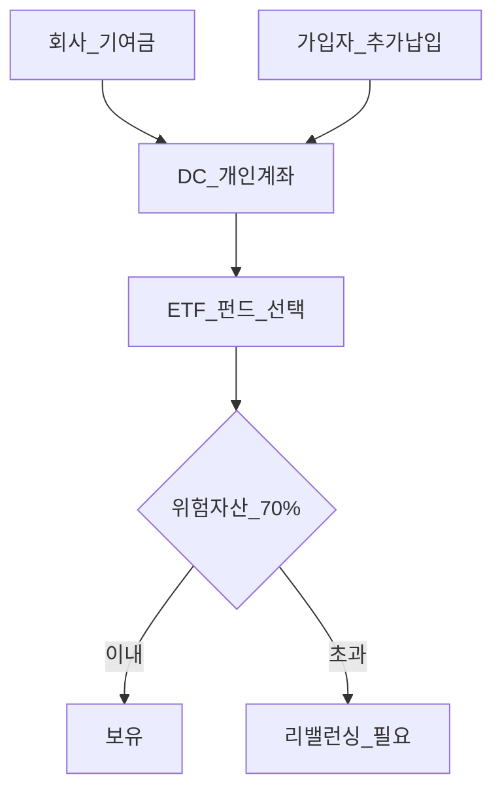
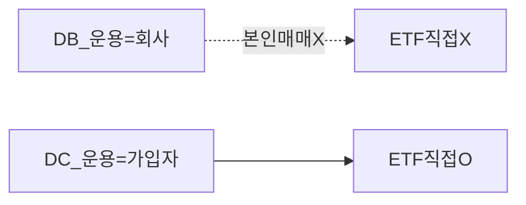

# DC형 퇴직연금 (확정기여형) 완전 가이드

> **면책**: 본 문서는 교육 목적이며, 특정 개인·법인에 대한 투자·세무·법률 자문이 아닙니다. 제도·세율·상품 조건은 변경될 수 있으므로 실행 전 [통합연금포털](https://www.pension.or.kr)·취급 기관을 확인하세요.

## 메타

| 항목 | 내용 |
|------|------|
| 최종 검증일 | 2026-05-24 |
| 정책·법령 기준일 | 2025-12-31 확정, 2026 DC 추가납입 공제 보도 |
| 난이도 | L3 (Deep) — [READER-GUIDE](../docs/READER-GUIDE.md) |
| 예상 읽기 시간 | 45~55분 |
| 관련 bucket | Bucket 2a (본인 운용), DB 가입자는 [db-pension.md](db-pension.md) 우선 |

## 0. 이 편 읽기 전 (5분)

| 항목 | 내용 |
|------|------|
| **난이도** | L3 (Deep) — [READER-GUIDE §L등급](../docs/READER-GUIDE.md) |
| **선수** | [db-vs-dc-pension](db-vs-dc-pension.md) |
| **이번 편에서 쓰는 기호** | L_ISA, ISA, IRP, DB, DC (해당 시) |
| **복습 한 줄** | — |

## TL;DR

1. **DC**는 회사 **기여금** + 가입자가 **ETF·펀드 직접 선택**.
2. **위험자산 70%** 한도 — 주식형 ETF·해외 ETF는 **한도 안**에서.
3. 운용 중 **과세이연** — 수령 시 연금·퇴직세.
4. **QQQ** — 상품목록·70% 내; **QLD**는 레버리지·편입 **제한** 확인.
5. **2026** DC 추가납입 **+300만 원** 세액공제 보도 — **DB 해당 없음**.

---

## 1. 한 줄 정의 + 왜 중요한가

**정의**: **확정기여형(DC, Defined Contribution)** 퇴직연금은 사용자가 **정해진 기여금**을 납입하고, **가입자**가 운용 방법을 선택하며, 그 결과가 **개인 계좌**에 적립되는 퇴직연금입니다.

!!! info "ETF"
    지수·자산 **바구니**를 한 종목처럼 거래

**왜 중요한가**: DC 가입자는 증권 앱에서 **퇴직연금 ETF**를 직접 고릅니다. **70/30**, 해외 ETF 배당, **2026 추가납입** 공제를 모르면 세금·리스크 모두 손해입니다.

---

## 2. 선수 지식 / 이후 읽을 것

**선수**:
- [db-vs-dc-pension.md](db-vs-dc-pension.md)

**이후**:
- [tax/isa-irp-pension-tax.md](tax/isa-irp-pension-tax.md)
- [tax/account-product-tax-map.md](tax/account-product-tax-map.md)
- [leveraged-etf-qqq-qld.md](../04-portfolio/leveraged-etf-qqq-qld.md)

---

## 3. 직관·비유

DC는 “**회사가 매달 정해진 돈을 넣어 주고, 본인이 그 통장에서 ETF를 고르는**” 구조입니다. DB는 “**회사가 통을 굴리고, 나는 보고만 한다**”입니다.

---

## 4. 정식 개념·용어

| 용어 | English | 정의 |
|------|---------|------|
| DC | Defined Contribution | 확정기여형 |
| 기여금 | Contribution | 사용자·가입자 납입 |
| 위험자산 | Risk assets | 주식·주식형 ETF 등 |
| 70% 규칙 | Risk limit | 위험자산 **상한** |
| 추가납입 | Voluntary contribution | 가입자 **추가** 납입 |
| 과세이연 | Tax deferral | 운용 중 과세 유예 |

### 4a. 핵심 용어 (본문 등장 순)

> 복습용. 정의는 §4 본표·[glossary](../00-roadmap/glossary.md)·본문 `!!! info` 박스.

| 용어 | 한 줄 | 관련 이론 | glossary |
|------|-------|-----------|----------|
| DC | 확정기여형 | §4 | [glossary](../00-roadmap/glossary.md#dc) |
| 기여금 | 사용자·가입자 납입 | §4 | [glossary](../00-roadmap/glossary.md#기여금) |
| 위험자산 | 주식·주식형 ETF 등 | §4 | [glossary](../00-roadmap/glossary.md#위험자산) |
| 70% 규칙 | 위험자산 **상한** | §4 | [glossary](../00-roadmap/glossary.md#70%-규칙) |
| 추가납입 | 가입자 **추가** 납입 | §4 | [glossary](../00-roadmap/glossary.md#추가납입) |
| 과세이연 | 운용 중 과세 유예 | §4 | [glossary](../00-roadmap/glossary.md#과세이연) |

---

## 5. 메커니즘

### DB vs DC

| 항목 | DB | DC |
|------|-----|-----|
| ETF 선택 | **불가**(일반) | **가능** |
| QQQ | IRP·ISA | DC **목록 내** |
| 추가납입 공제 300만(2026) | **없음** | **있음**(보도) |

---

## 6. 수식·모델

**70/30** (교육):

| 기호 | 이름 | 이 식에서 의미 |
|------|------|----------------|
| \(w_{\text{risk}\) | w_{\text{risk} | §4·본문 정의 참고 |
| \(V_\) | V_ | §4·본문 정의 참고 |
| \(stock ETF\) | stock ETF | §4·본문 정의 참고 |
| \(total\) | total | §4·본문 정의 참고 |
| \(leq\) | leq | §4·본문 정의 참고 |

\[
w_{\text{risk}} = \frac{V_{\text{stock ETF}}}{V_{\text{total}}} \leq 0.70
\]

**추가납입 절세**(2026 보도, 가상):

\[
\text{절세} \approx \min(P_{\text{add}}, 3{,}000{,}000) \times r_{\text{deduction}}
\]

---

## 7. 한국 적용

### 7.1 2025년

| 항목 | 내용 |
|------|------|
| 위험자산 | **70%** 상한 (퇴직연금 규정) |
| 해외 ETF 배당 | **외국납부세액 선환급 폐지** — 실효수익 재검토 |
| 운용 | 증권사 **퇴직연금** 메뉴 |

### 7.2 2026년 (보도)

| 항목 | 2025 | 2026 |
|------|------|------|
| DC 추가납입 세액공제 | 기존 한도 | **+300만 원** (DC만) |
| DB | — | **해당 없음** |

### 7.3 운용 실무 체크리스트

| 주기 | 할 일 |
|------|--------|
| 분기 | **70/30**·목표 비중 이탈 확인 |
| 반기 | 해외 ETF **배당**·선환급 폐지 반영 |
| 연간 | 추가납입 **300만**(시행 시)·IRP 900만과 **별도** |
| 퇴사 전 | IRP 이전 vs 일시금 — [irp.md](irp.md) |

### 7.4 QQQ·국내 ETF·채권 배치 (교육)

| 자산 | 70% 내 | 비고 |
|------|--------|------|
| QQQ | ○ (목록) | 코어 후보 |
| 국내 주식형 ETF | ○ | 비과세는 수령·계좌 규칙 |
| 채권·예금 | 30% **이상** | 변동 완충 |
| QLD | △ | [leveraged-etf](../04-portfolio/leveraged-etf-qqq-qld.md) |

### 7.5 DC 운용 월간·연간 루틴 (교육)

| 주기 | 체크 | 도구 |
|------|------|------|
| 매월 | 목표 비중 vs **70%** 위험자산 | 퇴직연금 앱·엑셀 |
| 분기 | QQQ·국내주식형 **상관** — 한쪽만 급등 시 리밸런싱 | [rebalancing-and-dca.md](../04-portfolio/rebalancing-and-dca.md) |
| 반기 | 해외 ETF **배당** 현금흐름 — 2025~ 선환급 폐지 | [part2](tax/overseas-stocks-tax-part2-dividend.md) |
| 연말 | **추가납입** + IRP 900만 **별도** 한도 | [isa-irp-pension-tax.md](tax/isa-irp-pension-tax.md) |
| 퇴사 前 | IRP 이전 vs 일시금 — 세금·운용권 | [irp.md](irp.md) |

### 7.6 DB 가입자가 DC 문서를 읽어야 할 때

- 회사 **DC 전환** 공지  
- 과거 DC 가입·**이중 제도**  
- 배우자·가족 DC만 해당 — 본인은 DB

| 본인 제도 | 읽을 문서 |
|-----------|-----------|
| **DB** | [db-pension.md](db-pension.md) + IRP·ISA |
| **DC** | 본 문서 + [db-vs-dc-pension.md](db-vs-dc-pension.md) |

**법·정책 근거**: 근로자퇴직급여보장법, 퇴직연금감독규정(위험자산 70%), 소득세법 §20·연금계좌, 2026 DC 추가납입 보도(시행 확인).

---

### 7.7 DC·IRP·ISA 역할 분담 (가상)

| 계좌 | 월(가상) | 목적 |
|------|----------|------|
| DC | 회사+추가 | 퇴직 **70%** 코어 |
| IRP | 75만 | 공제·이연 |
| ISA | 50만 | 3년 QQQ 세제 |

해외 ETF **배당**은 DC에서 **이연**되나 2025~ **선환급 폐지**로 현금흐름이 달라질 수 있습니다. 배당 중심 ETF는 DC 비중을 낮추고 ISA·IRP와 **역할 분담**을 검토하세요.

---

## 8. 숫자 예제 (가상)

> 가상 인물·금액.

> 모든 인물·금액은 가상입니다.

### 예제 1: 70/30 (가상)

| 자산 | 금액 | 비중 |
|------|------|------|
| QQQ+국내주식형 | 2,100만 | 70% |
| 채권·예금 | 900만 | 30% |
| **합계** | 3,000만 | 100% |

### 예제 2: QQQ vs QLD (가상)

| ETF | DC 편입 | 교육 |
|-----|---------|------|
| QQQ | 가능(목록) | 코어 후보 |
| QLD | **제한·비권장** | 레버리지 |

### 예제 3: 추가납입 300만 (가상, 2026)

| 항목 | 가상 P |
|------|--------|
| DC 추가납입 | 300만 |
| 공제율(가상) | 13.2% |
| 절세(가상) | 약 40만 |

---

## 9. FAQ

**Q1. DB인데 이 문서를 읽나요?**  
**A1.** [db-pension.md](db-pension.md) 우선 — DC **아님**.

**Q2. DC에서 QQQ?**  
**A2.** **상품목록**·**70%** 확인.

**Q3. ISA와 DC 중복?**  
**A3.** **가능** — 세제·한도 **별도**.

**Q4. 퇴사 시?**  
**A4.** **IRP 이전**·일시금 — [irp.md](irp.md).

**Q5. 2025 해외 배당?**  
**A5.** 선환급 **폐지** — [part2](tax/overseas-stocks-tax-part2-dividend.md).

**Q6. NXT 국내주식 DC?**  
**A6.** 퇴직연금 **상품**에 따라 — 국내주식 **비과세**는 [domestic-stocks-tax](tax/domestic-stocks-tax.md)와 별개 **계좌 규칙**.

**Q7. 청년도약?**  
**A7.** **별도**.

**Q8. 실물이전?**  
**A8.** DC·IRP **제도** — 금감원 안내 확인.

**Q9. DC에서 NXT 국내주식?**  
**A9.** **상품·중개**에 따름. 본인 주문 가능하나 **70%**·퇴직연금 규정 준수.

**Q10. DB인데 DC 추가납입 300만?**  
**A10.** **해당 없음** — [db-pension.md](db-pension.md)·개인 **IRP** 검토.

---

## 10. 함정·리스크·한계

- **70% 초과** — 매수 거절·리밸런싱  
- **QLD** 장기 보유  
- **배당 선환급 폐지** 무시  
- **DB와 혼동**  
- 상품목록·개정 **변동**

---

## L3 보충 — 장기 자산 형성 연결

본 절은 [DEPTH-STANDARD.md](../../docs/DEPTH-STANDARD.md) L3 게이트를 충족하기 위한 **실행·교차 링크** 보충입니다.

### Bucket·현금흐름 연결

| Bucket | 대표 제도·자산 | 본 문서와의 관계 |
|--------|----------------|------------------|
| 0 | 비상금 MMDA | 세금·투자 **전** 우선 |
| 1 | [청년도약](youth-leap-account.md)·[미래적금](youth-future-savings.md) | 정책 적금 — 주식 **대체 아님** |
| 2a | DB·DC | [db-vs-dc-pension.md](db-vs-dc-pension.md) |
| 2b | ISA·IRP | [isa.md](isa.md)·[isa-irp-pension-tax.md](tax/isa-irp-pension-tax.md) |
| 3 | QQQ·채권 코어 | [capm-and-risk-return.md](../08-advanced/capm-and-risk-return.md) |
| 4 | NXT·코스닥·QLD | [fomo-and-trading-hours.md](../05-behavioral/fomo-and-trading-hours.md) |

### 연간 점검 루틴 (교육)

| 분기 | 할 일 |
|------|--------|
| Q1 | [investment-tax-overview.md](tax/investment-tax-overview.md) 캘린더 확인 |
| Q2 | [rebalancing-and-dca.md](../04-portfolio/rebalancing-and-dca.md) 코어 비중 |
| Q3 | 해외 배당·금융소득 **누적** — Part2 |
| Q4 | 익년 **5월** 양도세 자료 정리 — Part1 |
| ISA | 개설일 +36개월 **만기** 알림 |

### 2025 vs 2026 정책 추적

| 항목 | 확인 출처 |
|------|-----------|
| ISA 한도·비과세 | 금융위·조세특례 시행일 |
| DC +300만 공제 | 국세청·통합연금포털 |
| 청년도약 일몰·미래적금 | [kinfa](https://ylaccount.kinfa.or.kr) |
| 금융투자소득세 | 금융위 보도·[sources.md](../../references/sources.md) |
| NXT 종목·거래중단 | [nextrade.co.kr](https://www.nextrade.co.kr) |

**면책 재확인**: 가상 예제·보도 수치는 **시점별 개정**됩니다. 실행·신고 전 공식 출처를 확인하세요.

## 11. 심화 읽기

- [references/sources.md](../references/sources.md)  
- [db-vs-dc-pension.md](db-vs-dc-pension.md)  
- 금감원 퇴직연금 백서

---

## 12. 스스로 점검 퀴즈

1. DC에서 ETF를 고르는 주체는?  
2. 위험자산 상한은?  
3. 2026 +300만 공제는 DB에 적용?  
4. QLD 권장 여부?  
5. DB 재직 중 DC 계좌가 있는 경우?

??? note "정답 힌트"

    1. 가입자 · 2. 70% · 3. 아니오 · 4. 비권장 · 5. 제도 전환·이중 가능(회사별) — 회사 확인

