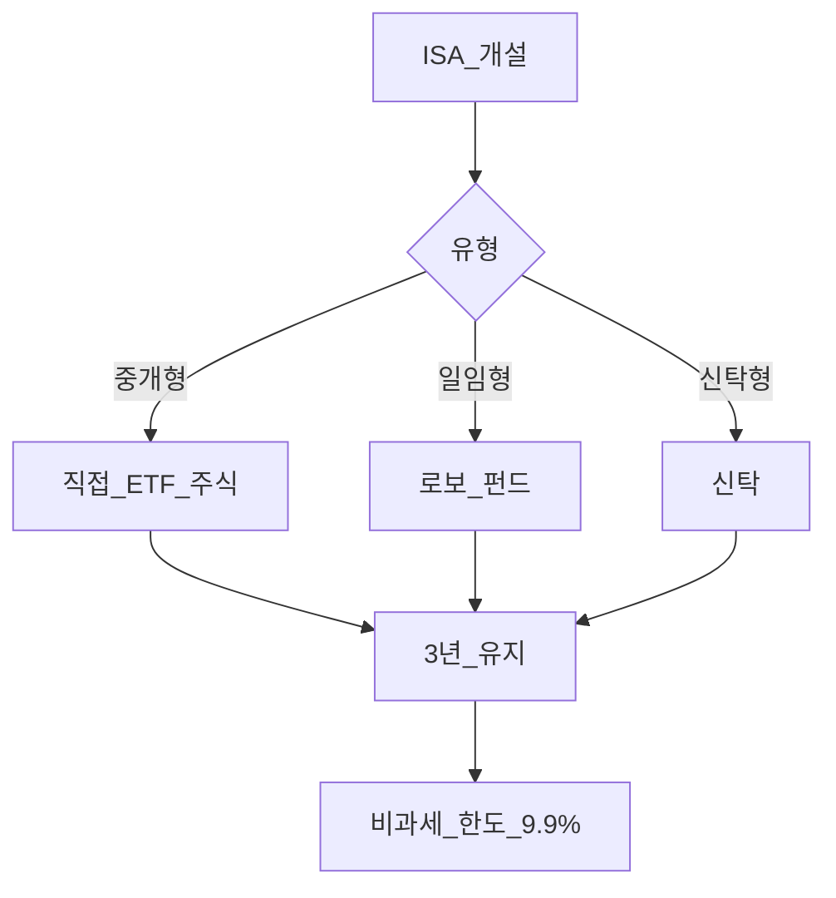
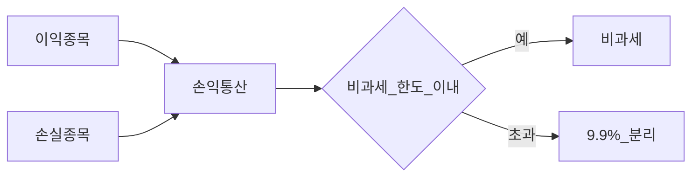
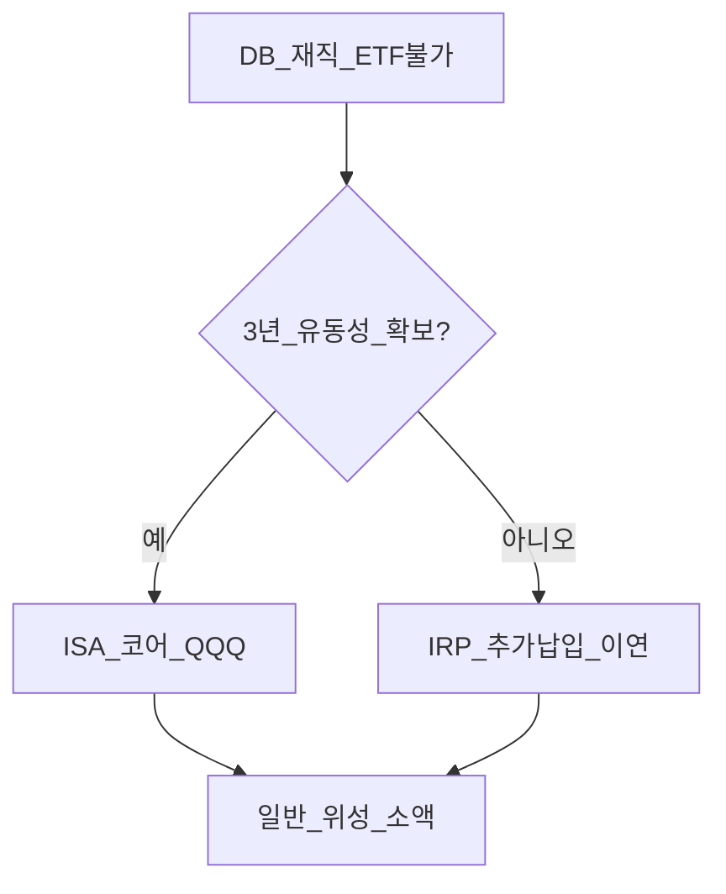

# ISA (개인종합자산관리계좌) 완전 가이드

> **면책**: 본 문서는 교육 목적이며, 특정 개인·법인에 대한 투자·세무·법률 자문이 아닙니다. 제도·세율·상품 조건은 변경될 수 있으므로 실행 전 금융위·국세청·취급 금융기관을 확인하세요.

## 메타

| 항목 | 내용 |
|------|------|
| 최종 검증일 | 2026-05-24 |
| 정책·법령 기준일 | 2025-12-31 확정, 2026 ISA 개편안 별도 표기 |
| 난이도 | L3 (Deep) — [READER-GUIDE](../docs/READER-GUIDE.md) |
| 예상 읽기 시간 | 45~55분 |
| 관련 bucket | Bucket 2b~3 (본인 운용·코어 ETF) |

## 0. 이 편 읽기 전 (5분)

| 항목 | 내용 |
|------|------|
| **난이도** | L3 (Deep) — [READER-GUIDE §L등급](../docs/READER-GUIDE.md) |
| **선수** | [tax/investment-tax-overview](tax/investment-tax-overview.md), [tax/overseas-stocks-tax-part1-cgt](tax/overseas-stocks-tax-part1-cgt.md) |
| **이번 편에서 쓰는 기호** | L_ISA, ISA, IRP, DB, DC (해당 시) |
| **복습 한 줄** | — |

## TL;DR

1. **ISA**는 **3년 이상** 유지 시 매매차익·배당 등에 **비과세 한도** + 초과분 **9.9%** 분리과세(일반형 기준).
2. **중개형**은 ETF·주식 **직접 매매** — QQQ·국내 ETF 가능(증권사 상품목록).
3. **손익통산**: 계좌 안 이익·손실을 합산해 **세제 효율** 극대화.
4. **2025**: 비과세 200만(서민 400만)·연 납입 2,000만·총 1억 — **2026 개편**(500만/1,000만·4,000만·2억) **시행 확인 필수**.
5. **DB 가입자**에게 코어 슬롯으로 적합 — 재직 중 DB에서는 ETF 불가.

---

## 1. 한 줄 정의 + 왜 중요한가

**정의**: **ISA(Individual Savings Account, 개인종합자산관리계좌)** 는 일정 기간 **유지**와 **납입 한도**를 지키는 대신, 계좌 내 금융투자소득에 **우대 세제**를 적용하는 **개인 종합 투자 계좌**입니다.

!!! info "ETF"
    지수·자산 **바구니**를 한 종목처럼 거래

**왜 중요한가**: 해외 ETF(**QQQ** 등)를 **일반 계좌**만 쓰면 **양도소득세·5월 신고** 부담이 큽니다. 조건을 맞추면 ISA가 **장기 코어**의 세금 방패가 됩니다. [db-pension.md](db-pension.md) 가입자는 DB 밖에서 **반드시** 검토할 계좌입니다.

---

## 2. 선수 지식 / 이후 읽을 것

**선수**:
- [tax/investment-tax-overview.md](tax/investment-tax-overview.md)
- [tax/overseas-stocks-tax-part1-cgt.md](tax/overseas-stocks-tax-part1-cgt.md)

**이후**:
- [irp.md](irp.md) — 3년 vs 과세이연
- [tax/isa-irp-pension-tax.md](tax/isa-irp-pension-tax.md)
- [tax/account-product-tax-map.md](tax/account-product-tax-map.md)
- [time-horizon-and-buckets.md](../04-portfolio/time-horizon-and-buckets.md)

---

## 3. 직관·비유

ISA는 “**3년간 끓는 냄비**”입니다. 뚜껑을 열면(중도해지) 우대가 사라지거나 **추징**될 수 있습니다. 냄비 **안**에서는 여러 요리(주식·ETF·펀드)의 맛(손익)을 **합쳐서**(손익통산) 세금을 계산합니다.

**IRP**는 “**은퇴용 냉동고**”(과세이연), **일반 계좌**는 “**매번 계산대에 가는 식당**”(해외주식 양도세)에 비유할 수 있습니다.

---

## 4. 정식 개념·용어

| 용어 | English | 정의 |
|------|---------|------|
| ISA | Individual Savings Account | 개인종합자산관리계좌 |
| 중개형 | Brokerage ISA | 본인 직접 주문 |
| 일임형 | Discretionary ISA | 로보·펀드 위탁 |
| 신탁형 | Trust ISA | 신탁 구조 |
| 손익통산 | Netting | 계좌 내 손익 합산 |
| 비과세 한도 | Tax-free allowance | 3년 누적 비과세 상한 |
| 분리과세 9.9% | Separate 9.9% | 한도 초과분 세율(일반형) |

## 4a. 핵심 용어 (본문 등장 순)

| 용어 | 한 줄 | 관련 이론 | glossary |
|------|-------|-----------|----------|
| ISA | 3년 이상 유지 시 금융투자소득 세제 우대 | 세제설계 | [ISA](../00-roadmap/glossary.md#isa-individual-savings-account-개인종합자산관리계좌) |
| 3년 유지 | 중도해지 시 우대 소멸·추징 가능 | 제도 준수 | — |
| 비과세 한도 | 3년 누적 비과세 상한(서민 확대) | 소득세 | — |
| 중개형 | 본인이 ETF·주식 직접 매매 | 실행·코어 | — |
| 일임·신탁형 | 로보·펀드·신탁 위탁 구조 | 위임 | — |
| 손익통산 | 계좌 내 이익·손실 합산 과세 | 포트 세제 | — |
| 분리과세 9.9% | 한도 초과분 분리과세(일반형) | 한계세율 | — |
| IRP | 과세이연·퇴직 연금 슬롯; ISA와 비교 | 연금세제 | [IRP](../00-roadmap/glossary.md#irp-individual-retirement-pension-개인형-퇴직연금) |
| QQQ·해외 ETF | 코어 후보; 증권사 상품목록 확인 | 해외투자 | [QQQ](../00-roadmap/glossary.md#qqq) |
| DB 가입자 | DB 밖 ISA가 코어 슬롯으로 흔함 | 연금·계좌 | [DB](../00-roadmap/glossary.md#db-defined-benefit-확정급여형) |
| 2026 개편안 | 한도·비과세 확대(시행 확인 필수) | 정책변경 | — |

## 4b. 관련 이론 미니맵

- **[투자 소득 세제](tax/investment-tax-overview.md)** — 금융소득·양도세 지도
- **[해외주식 양도세](tax/overseas-stocks-tax-part1-cgt.md)** — 일반 계좌 대비 ISA 효과
- **[계좌·상품 세금 맵](tax/account-product-tax-map.md)** — ISA·IRP·일반 배치
- **[해외 주식·ETF](../03-markets/overseas-equities-intro.md)** — QQQ 경로·5월 신고
- **[시간·Bucket](../04-portfolio/time-horizon-and-buckets.md)** — 3년 규칙과 장기 코어

---

## 5. 메커니즘

### 5.1 유형별 흐름

### 5.2 손익통산·세제

| 유형 | 운용 | QQQ·코어 ETF |
|------|------|--------------|
| **중개형** | 본인 매매 | **가능**(상품목록) |
| **일임형** | 위탁 | 펀드·로bo 포트폴리오 |
| **신탁형** | 신탁 | 상품별 |

---

## 6. 수식·모델

3년 누적 **비과세 혜택**(교육용):

| 기호 | 이름 | 이 식에서 의미 |
|------|------|----------------|
| \(절세액\) | 절세액 | §4·본문 정의 참고 |
| \(누적순이익\) | 누적순이익 | §4·본문 정의 참고 |
| \(H\) | H | §4·본문 정의 참고 |
| \(tau\) | tau | §4·본문 정의 참고 |
| \(일반\) | 일반 | §4·본문 정의 참고 |

\[
\text{절세액} \approx \min(\text{누적순이익}, H) \times \tau_{\text{일반}} + \max(0, \text{누적순이익} - H) \times (\tau_{\text{일반}} - 0.099)
\]

- \(H\): 비과세 한도 (2025 일반 **200만**, 2026 개편 **500만** 보도)  
- \(\tau_{\text{일반}}\): 해외주식 양도 **22%** 등 대체 과세율(단순 비교용)

**납입 한도**: 연 **2,000만**(2025) → **4,000만**(2026 보도), 총 **1억→2억**.

---

## 7. 한국 적용

### 7.1 2025년 (확정)

| 항목 | 일반형 | 서민형·농어민형 |
|------|--------|-----------------|
| 비과세(3년) | 200만 원 | 400만 원 |
| 연 납입 | 2,000만 원 | 동일 |
| 총 납입 | 1억 원 | 동일 |
| 유지 | **36개월** | 동일 |
| 초과분 | **9.9%** 분리 | 동일 |

### 7.2 2026년 (개편안·시행 확인)

| 항목 | 2025 | 2026 (보도·법안) |
|------|------|------------------|
| 비과세(일반) | 200만 | **500만** |
| 비과세(서민) | 400만 | **1,000만** |
| 연 납입 | 2,000만 | **4,000만** |
| 총 납입 | 1억 | **2억** |

**법·정책 근거**: 조세특례제한법, 금융위 ISA 안내.

### 7.3 QQQ·해외 ETF

- **중개형 ISA** 내 해외 ETF — **증권사별** 편입  
- 배당·매매차익 모두 **계좌 통산** — [part2](tax/overseas-stocks-tax-part2-dividend.md), [part3](tax/overseas-stocks-tax-part3-scenarios.md)  
- **3년 미만** 해지: 혜택 상실·**추징** 주의

### 7.4 ISA 개설·운용 체크리스트 (교육)

| 단계 | 할 일 | 실수 방지 |
|------|--------|-----------|
| 개설 전 | **중개형 vs 일임형** 결정 — QQQ 직접은 중개형 | 일임형 선택 후 “ETF 못 삼” |
| 개설 시 | 서민형·농어민형 **요건** — 비과세 400만 vs 200만 | 요건 미충족 시 일반형만 |
| 연중 | **연 납입 2,000만**(2025)·총 1억 한도 | 초과 납입 불가·이월 규칙 확인 |
| 매매 | 계좌 **내** 손익통산 — 손실 종목도 세제에 반영 | 종목별로만 생각 |
| 36개월 | 해지·전환 **캘린더** 등록 — [time-horizon-and-buckets.md](../04-portfolio/time-horizon-and-buckets.md) | 2년차 급전 → 추징 |
| 2026 | 개편 **시행일**·기존 계좌 **적용** 여부 | 신규만 혜택 착각 |

### 7.5 ISA vs IRP vs 일반 — 의사결정 (DB 가입자)

| 목적 | 우선 계좌 | 이유 |
|------|-----------|------|
| QQQ 3년+ 코어 | **ISA** | 비과세 한도·9.9% 초과 |
| 퇴직금·추가 납입 | **IRP** | 세액공제 900만·이연 |
| 1년 내 현금화 | **일반**(소액) | 유동성 — 양도세 인지 |
| 회사 퇴직금 | **IRP 이전** | ISA **불가** |

**법·정책 근거**: 조세특례제한법 ISA 특례, 금융위 ISA 운용 안내, 국세청 금융소득·ISA 해설.

---

### 7.6 ISA 운용 시나리오 (가상 3유형)

| 유형 | 가상 프로필 | ISA 역할 | IRP 병행 |
|------|-------------|----------|----------|
| A | DB·30대 | QQQ 코어 3년 | 900만 공제 |
| B | DC·40대 | 국내+해외 ETF | DC 70% + ISA |
| C | 프리랜서 | 일임형 ISA | IRP 필수 |

**2026 개편 시**: 비과세 **500만**·연납입 **4,000만**이 시행되면, 가상 A는 **납입만** 상향하고 **3년 유지·손익통산** 원칙은 동일합니다. 시행 전에는 2025 한도로 계획하고, 확정 시 [investment-tax-overview.md](tax/investment-tax-overview.md)를 갱신하세요.

---

## 8. 숫자 예제 (가상)

> 모든 인물·금액은 가상입니다.

### 예제 1: 3년 ISA vs 일반 (가상)

| 항목 | 가상 J (ISA 3년) | 가상 K (일반) |
|------|------------------|---------------|
| QQQ 매매차익(3년 누적) | 800만 원 | 800만 원 |
| 비과세 한도(2025) | 200만 | — |
| 초과 600만 | 9.9% ≈ 59만 | 22% 공제 후 ≈ 121만 (단순) |

→ **한도·유지**가 핵심. 2026 한도 확대 시 차이 확대(보도).

### 예제 2: 손익통산 (가상)

| 종목 | 손익(가상) |
|------|------------|
| ETF A | +300만 |
| ETF B | −100만 |
| **순이익** | **200만** → 2025 한도 **딱 맞음** 비과세 |

### 예제 3: DB + ISA (가상)

| 슬롯 | 가상 L |
|------|--------|
| DB | 회사만, ETF 없음 |
| ISA | 월 100만 납입 × 36개월, QQQ DCA |
| IRP | 월 50만 추가 |

---

## 9. FAQ

**Q1. ISA 3년 전에 해지하면?**  
**A1.** 비과세 **상실**·이미 받은 혜택 **추징** 가능 — 신중.

**Q2. 청년도약·미래적금과 중복?**  
**A2.** **별도** — 적금 Bucket 1 vs ISA Bucket 2b.

**Q3. NXT 국내주식도 ISA?**  
**A3.** **가능**(중개형·상품). 과세는 [domestic-stocks-tax](tax/domestic-stocks-tax.md).

**Q4. ISA만으로 연 900만 IRP 공제?**  
**A4.** **아니오** — IRP·연금저축 **별도** 한도.

**Q5. 일임형 vs 중개형 QQQ?**  
**A5.** QQQ 직접은 **중개형**.

**Q6. 2026에 ISA 새로 열어야 하나?**  
**A6.** 개편 **시행일**·기존 계좌 **적용** 여부 — 금융사·국세청 확인.

**Q7. QLD 레버리지?**  
**A7.** [leveraged-etf-qqq-qld](../04-portfolio/leveraged-etf-qqq-qld.md) — 코어 **비권장**.

**Q8. DB 퇴직금을 ISA에?**  
**A8.** **불가** — 퇴직금은 **IRP** 이전.

**Q9. ISA에 국내주식·NXT도 넣나요?**  
**A9.** **중개형**이면 가능(상품목록). 과세는 국내주식 규칙 + **ISA 세제** — [domestic-stocks-tax](tax/domestic-stocks-tax.md).

**Q10. 2026 한도 확대 후 기존 ISA는?**  
**A10.** **시행일·적용 범위**를 금융사·국세청에서 확인. 자동 적용을 가정하지 말 것.

---

## 10. 함정·리스크·한계

- **3년 미만** 해지·급전 필요와 충돌  
- **납입 한도** 초과  
- **일임형** 선택 후 QQQ 직접 불가  
- **2026 개편** 미확인 상태에서 과도한 납입 계획  
- ISA ≠ **모든 세금 면제** (한도·유형별)  
- 금융투자소득세 **유예**와 별개 개념

---

## 11. 심화 읽기

- [references/sources.md](../references/sources.md)  
- [tax/isa-irp-pension-tax.md](tax/isa-irp-pension-tax.md)  
- [irp.md](irp.md), [db-pension.md](db-pension.md)

---

## 12. 스스로 점검 퀴즈

1. ISA 비과세를 받으려면 최소 몇 년 유지하는가?  
2. QQQ를 직접 고르려면 어떤 ISA 유형인가?  
3. 2025 일반형 비과세 한도는?  
4. 손익통산의 목적은?  
5. DB 퇴직금을 ISA에 넣을 수 있는가?

??? note "정답 힌트"

    1. 3년(36개월) · 2. 중개형 · 3. 200만 원 · 4. 세제 효율·손실 상쇄 · 5. 아니오(IRP)

