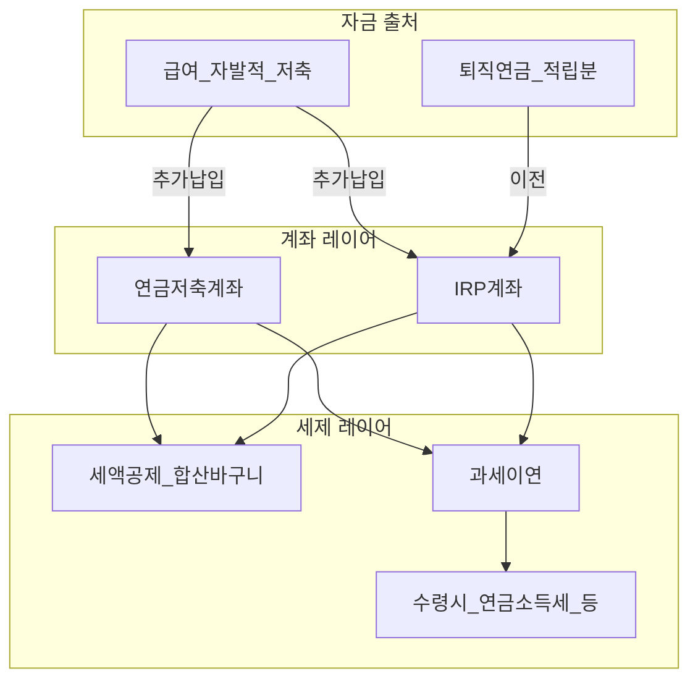
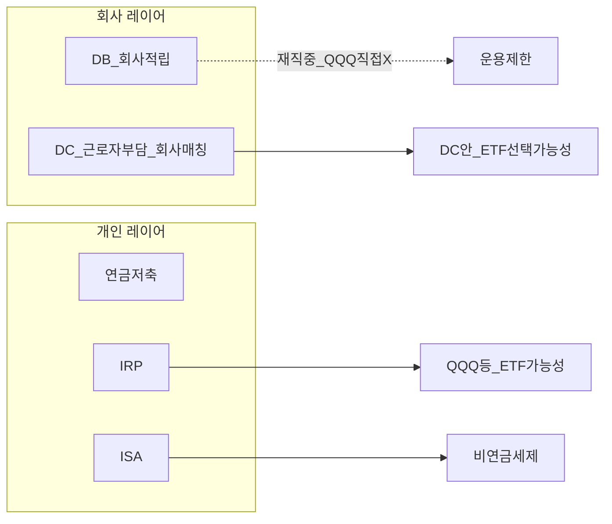

# 연금저축 vs IRP 비교 — 세액공제 900만 원, 인출, ETF, DC·DB와의 관계

> **면책**: 본 문서는 교육 목적이며, 특정 개인·법인에 대한 투자·세무·법률 자문이 아닙니다. 세액공제율·추가 특례·금융상품 약관·수령 요건은 **소득형태·가입 시기·금융사**에 따라 달라질 수 있으므로 실행 전 [국세청](https://www.nts.go.kr)·[통합연금포털](https://www.pension.or.kr)·취급 금융기관의 **최신 공지**를 확인하세요.

## 메타

| 항목 | 내용 |
|------|------|
| 최종 검증일 | 2026-05-25 |
| 정책·법령 기준일 | 2025-12-31 확정 사항 위주, 2026 연금·ISA 보도는 **별도 검증** 필요 |
| 난이도 | L4 (Graduate) — [READER-GUIDE](../docs/READER-GUIDE.md) |
| 예상 읽기 시간 | 70~90분 |
| 관련 bucket | Bucket 2b(연금·과세이연·본인 운용), Bucket 0(현금흐름·세액공제 설계) |

## 0. 이 편 읽기 전 (5분)

| 항목 | 내용 |
|------|------|
| **난이도** | L4 (Graduate) — [READER-GUIDE §L등급](../docs/READER-GUIDE.md) |
| **선수** | [irp](irp.md), [tax/isa-irp-pension-tax](tax/isa-irp-pension-tax.md) |
| **이번 편에서 쓰는 기호** | L_ISA, ISA, IRP, DB, DC (해당 시) |
| **복습 한 줄** | L3 선수 편을 먼저 읽으면 수식이 수월함 |

## TL;DR

1. **연금저축**과 **IRP(개인형퇴직연금)** 는 “**납입 세액공제 + 운용 과세이연 + 수령 시 연금 과세**”라는 큰 틀에서는 **가깝지만**, **역할(퇴직금 이전 가능성·가입 경로·상품 구조)** 에서 **다릅니다**.
2. 두 제도의 납입분에 대한 **세액공제는 합산 한도**를 사용하는 것이 일반적 안내이며, 교육 문서에서 통상 **연 900만 원(일반 가이드)** 로 설명됩니다. **본인의 소득·공제 가능 구간**은 연말정산으로 확인해야 합니다.
3. **ETF·펀드 매수**는 증권사 IRP·연금저축에서 활용도가 높으나, 상품마다 **매수 가능 목록·위험자산 비중 규정**이 따르므로 “모든 ETF 무제한”이라고 가정하면 안 됩니다.
4. **DC형·DB형** 회사 연금은 **세제의 주체가 다릅니다**(회사 적립·근로자 부담금·이연 구조). 연금저축·IRP의 **900만 공제**와 **DC 2026 추가 보도**를 [isa-irp-pension-tax.md](tax/isa-irp-pension-tax.md) 와 함께 **합쳐서** 봐야 합니다.
5. **중도 인출·비수령 과세**가 구조적 함정이 되기 쉽습니다. 장기 복리 목적이면 **목표 납입 템포**와 **연금 수령 플랜**을 먼저 잡는 것이 현명합니다.
6. 교육용으로 회사 채널(DC/DB) 과 개인 연금 채널을 **별도 스프레드시트 줄**에서 추적해야 **위험·과세 순서 이중 카운팅**을 줄일 수 있습니다([db-vs-dc-pension.md](db-vs-dc-pension.md), [tax/isa-irp-pension-tax.md](tax/isa-irp-pension-tax.md)).

---

## 1. 한 줄 정의 + 왜 중요한가

**정의**: **연금저축**은 근로소득자 등이 금융기관에 **개인 연금 계좌**를 개설해 **자발적으로 납입**하고, 적격 운용을 거쳐 노후에 연금·일시금 형태로 받는 **개인 연금 저축 상품군**입니다. **IRP**는 **퇴직연금** 계열로, **퇴직금 적립분의 이전·보관·추가납입**을 **개인 명의**로 운용하기 위한 계좌입니다. 둘 다 “장기 + 세제 혜택”이 핵심이지만, **자금의 출처**(급여에서의 자발적 저축 vs 퇴직연금 이전)와 **제도상 위치**가 다릅니다.

**왜 중요한가** (장기 자산 형성·bucket 연결):

!!! info "Bucket"
    시간·목적별 **자금 슬롯**(0 비상금 → 3 코어 등)

!!! info "ETF"
    지수·자산 **바구니**를 한 종목처럼 거래

한국 개인 투자자의 **핵심 레버**는 (1) ISA의 **초과분 9.9%** 등 거래단계 세제, (2) IRP·연금저축의 **납입 할인(세액공제)**, (3) 회사 DC의 **matching·추가납입특례**입니다. 이 세 축을 **동시에 최적화**하려면 “**같은 미국 ETF를 어디 계좌에서 사느냐**”가 아니라 “**어느 레이어에서 세금을 미루고, 어느 레이어에서 면제·분리과세를 받느냐**”가 먼저입니다. 연금저축과 IRP는 **Bucket 2b** 의 **대표 슬롯**이며, [irp.md](irp.md) 와 병독하면 DB 가입자 시나리오까지 **일관되게** 설계할 수 있습니다.

---

## 2. 선수 지식 / 이후 읽을 것

**선수**:
- [irp.md](irp.md) — IRP의 퇴직금 이전·위험자산 한도·운용 흐름
- [tax/isa-irp-pension-tax.md](tax/isa-irp-pension-tax.md) — ISA·IRP·연금저축·DC **세제 맵**
- [db-vs-dc-pension.md](db-vs-dc-pension.md) — DB/DC와 개인 연금의 역할 분담
- [dc-pension.md](dc-pension.md) 또는 [db-pension.md](db-pension.md) — 회사 연금 레이어 정의

**이후**:
- [isa.md](isa.md) — 3년 유지 vs 연금 이연의 **트레이드오프**
- [tax/account-product-tax-map.md](tax/account-product-tax-map.md) — 계좌·상품별 세금 큰 그림
- [../04-portfolio/time-horizon-and-buckets.md](../04-portfolio/time-horizon-and-buckets.md) — 납입 슬롯을 bucket에 할당
- [../04-portfolio/passive-vs-active.md](../04-portfolio/passive-vs-active.md) — 연금 안에서의 ETF·지수 설계

---

## 3. 직관·비유

연금저축을 “**스스로 채우는 연료 탱크**”라고 부르고, IRP는 “**회사에서 빼온 퇴직연금을 담는 이차 탱크 + 추가 급유구**”라고 상상해 보세요. 둘 다 **같은 종류의 엔진(장기 복리·이연과세)** 에 연결되지만, **연료가 들어오는 배관**이 다릅니다. 연금저축은 **매달 월급에서 스스로 호스를 꽂아 넣는 구조**이고, IRP는 **퇴직 시(또는 재직 중 일부 절차에서) 큰 덩어리가 한 번에 들어올 수 있는 구조**입니다.

또 하나의 비유는 **카드 할인 쿠폰이 공유 지갑에 있다**는 것입니다. 교육 설명에서 자주 쓰이는 **연금저축+IRP 납입분 세액공제 합산 한도(통상 900만 원/년 가이드)** 는 “**한 지갑에서 두 카드가 같이 쓴다**”에 가깝습니다. 그래서 한쪽에만 몰빵했다가 **한도 초과분은 공제 혜택 없이 이연만** 받는 상황이 되기 쉽습니다. 반대로 IRP에 퇴직금이 크게 들어와도, 그것이 **자동으로 세액공제 한도를 늘려주진 않습니다**(이전 ≠ 납입 공제). **DC** 는 회사 matching·2026 보도된 **추가 특례** 등 **별도의 쿠폰 지갑**이 있을 수 있어, [isa-irp-pension-tax.md](tax/isa-irp-pension-tax.md) 표를 **인쇄해 붙여두고** 비교하는 편이 안전합니다.

---

## 4. 정식 개념·용어

| 용어 | 한글 | English | 정의 |
|------|------|---------|------|
| 연금저축 | 개인 연금저축 | Pension savings | 금융기관 **개인 명의** 계좌로 **자율 납입**, 적격 운용 후 연금·일시금 수령 |
| IRP | 개인형퇴직연금 | Individual Retirement Pension | 퇴직연금 **이전·추가납입·운용·수령**을 위한 개인 계좌 |
| 과세이연 | — | Tax deferral | 적격 구간에서 운용 차읋·이자 등 **당기 과세 유예**되는 효과(제도 설명상) |
| 세액공제 | — | Tax credit | 근로소득자 등 **납입 요건 충족 시** 납입액의 일부를 **세액에서 차감**(세율 구간·한도는 본인 확인) |
| 합산 한도 | 공제 한도 공유 | Combined limit | 교육 문서에서 통상 **IRP+연금저축 납입분**을 **같은 바구니**로 설명 |
| 퇴직금 이전 | 이전 적립 | Rollover | 퇴직 등 사유 발생 시 **회사 퇴직연금 → IRP** 로 옮기는 절차 |
| 연금수령 | 연금 지급 | Pension payout | 연금 개시 연령 등 요건 충족 후 **분할 지급**, **분리·저율** 등 제도 설명에 따름 |
| 일시금 수령 | 일시금 | Lump sum | 적립액을 한 번에 받는 방식, **과세 방식·율**은 제도·시점에 따름 |
| 위험자산 | 위험 자산 | Risk assets | 주식·주식형 펀드 등 **비중 상한** 규정이 붙는 경우가 많음 |
| ETF | 상장지수펀드 | Exchange-traded fund | 거래소 상장 **지수 추종** 상품, 증권사 상품 목록에 있으면 매수 가능 경우 다수 |
| DC | 확정기여형 | Defined contribution | **납입 규칙** 중심 회사 연금, 근로자 **부담금·선택** 구조 |
| DB | 확정급여형 | Defined benefit | **급여 규칙** 중심, 재직 중 개인이 ETF 직접 고르기 **어렵다**는 설명이 일반적 |

### 4a. 핵심 용어 (본문 등장 순)

> 복습용. 정의는 §4 본표·[glossary](../00-roadmap/glossary.md)·본문 `!!! info` 박스.

| 용어 | 한 줄 | 관련 이론 | glossary |
|------|-------|-----------|----------|
| 연금저축 | 금융기관 **개인 명의** 계좌로 **자율 납입**, 적격 운용 후 연금·일시금 수령 | §4 | [glossary](../00-roadmap/glossary.md#연금저축) |
| IRP | 퇴직연금 **이전·추가납입·운용·수령**을 위한 개인 계좌 | §4 | [glossary](../00-roadmap/glossary.md#irp) |
| 과세이연 | 적격 구간에서 운용 차읋·이자 등 **당기 과세 유예**되는 효과 | §4 | [glossary](../00-roadmap/glossary.md#과세이연) |
| 세액공제 | 근로소득자 등 **납입 요건 충족 시** 납입액의 일부를 **세액에서 차감** | §4 | [glossary](../00-roadmap/glossary.md#세액공제) |
| 합산 한도 | 교육 문서에서 통상 **IRP+연금저축 납입분**을 **같은 바구니**로 설명 | §4 | [glossary](../00-roadmap/glossary.md#합산-한도) |
| 퇴직금 이전 | 퇴직 등 사유 발생 시 **회사 퇴직연금 → IRP** 로 옮기는 절차 | §4 | [glossary](../00-roadmap/glossary.md#퇴직금-이전) |
| 연금수령 | 연금 개시 연령 등 요건 충족 후 **분할 지급**, **분리·저율** 등 제도 설명에 따름 | §4 | [glossary](../00-roadmap/glossary.md#연금수령) |
| 일시금 수령 | 적립액을 한 번에 받는 방식, **과세 방식·율**은 제도·시점에 따름 | §4 | [glossary](../00-roadmap/glossary.md#일시금-수령) |
| 위험자산 | 주식·주식형 펀드 등 **비중 상한** 규정이 붙는 경우가 많음 | §4 | [glossary](../00-roadmap/glossary.md#위험자산) |
| ETF | 거래소 상장 **지수 추종** 상품, 증권사 상품 목록에 있으면 매수 가능 경우 다수 | §4 | [glossary](../00-roadmap/glossary.md#etf) |
| DC | **납입 규칙** 중심 회사 연금, 근로자 **부담금·선택** 구조 | §4 | [glossary](../00-roadmap/glossary.md#dc) |
| DB | **급여 규칙** 중심, 재직 중 개인이 ETF 직접 고르기 **어렵다**는 설명이 일반적 | §4 | [glossary](../00-roadmap/glossary.md#db) |

용어는 법령 용어와 금융상품 약관이 **미세하게 다를 수** 있습니다. 본 문서는 **통합연금포털·금융위 설명**과 일치하도록 최신본을 우선합니다.

---

## 5. 메커니즘

### 5.1 연금저축과 IRP의 현금·세제 흐름(개념도)

위 그림에서 **퇴직금 이전 화살표는 IRP 쪽에만** 붙습니다. 연금저축으로의 **직접 이전이 가능한지·조건**은 금융사 절차와 규정에 따르므로 “항상 동일”이라 단정하지 않습니다.

### 5.2 DC·DB와 개인 연금 레이어의 분리

DB 재직 중에는 개인 ETF 선택이 제한된다는 점에서 **IRP·ISA가 Bucket 2b 보조 축**이 됩니다. 자세한 시나리오는 [irp.md](irp.md) 의 DB 분기표를 참고합니다.

### 5.3 운용 라이프사이클 표

| 단계 | 연금저축 체크리스트 | IRP 체크리스트 |
|------|---------------------|----------------|
| 개설 | 은행·증권·보험 **상품 스프레드** 비교 | 퇴직금 보관 목적이면 **수수료·매매 편의** 우선 |
| 납입 | 급여일 후 **자동이체**로 행동 설계 | **추가납입**이 공제 바구니를 소모 |
| 운용 | 목표 비중에 맞춘 **글로벌 코어 ETF** 등 | 위험자산 한도·해외 ETF **분배금 과세 이슈** 확인 |
| 이전 | 퇴직 시 IRP 연계 여부는 **케이스별** | 퇴직금 **일시금 vs 이전** 비교표 작성 |
| 수령 | 연금 vs 일시금 **세후 현금흐름 시뮬레이션** | 연금개시 요건·세율 **연도별 재확인** |

---

## 6. 수식·모델

세액공제의 **절세액 근사**(교육용, 단순화):

| 기호 | 이름 | 이 식에서 의미 |
|------|------|----------------|
| \(절세\) | 절세 | §4·본문 정의 참고 |
| \(근사\) | 근사 | §4·본문 정의 참고 |
| \(적격 납입액\) | 적격 납입액 | §4·본문 정의 참고 |
| \(L_\) | L_ | §4·본문 정의 참고 |
| \(year\) | year | §4·본문 정의 참고 |
| \(rho\) | rho | §4·본문 정의 참고 |

\[
\text{절세}_{\text{근사}} \approx \min(\text{적격 납입액},\, L_{\text{year}}) \times \rho
\]

여기서 \(L_{\text{year}}\) 는 설명 편의상 **합산 한도**(예: 교육 문서에서 자주 인용되는 **연 900만 원**)를 두고, \(\rho\) 는 본인의 **공제율**(세법상 구간·소득에 따라 결정)입니다. 실제 연말정산에서는 **타 공제·세액공제 순위·한도 초과분**까지 고려해야 하므로 전문가 검토 또는 국세청 간이 계산기가 필요합니다.

**연금 적립의 미래가치**(납입만 고려한 세전 근사):

\[
FV = \sum_{t=1}^{n} P_t (1+r)^{\,n-t}
\]

연금저축·IRP 모두 \(P_t\) 에 **공제 혜택이 있는 납입**과 **혜택 없는 납입**이 섞일 수 있습니다. 한도를 초과한 \(P_t\) 는 여전히 **이연 효과**가 있을 수 있으나 “절세” 관점에서는 **마지막 한 원까지 한도 안에 넣는 것이 유리한지**를 매년 재점검합니다.

**비용 마찰이 있는 복리의 근사**(교육용, 간단 매개변수 \(\phi\) 로 연간 회전 마찰을 요약하면):

\[
FV_{\text{net}} \approx \sum_{t=1}^{n} P_t (1+r-\phi)^{\,n-t}
\]

실제 회전 패턴과 스프레드는 선형 근사에 못 미칠 수 있습니다. 교육용으로 패시브 교육 룰이라도 줄이세요.

---

## 7. 한국 적용

### 7.1 2025년 기준 (확정 안내 위주)

| 항목 | 연금저축 | IRP |
|------|---------|-----|
| 목적 | 개인 노후 준비·장기 저축 | 퇴직금 보관·추가납입·운용 |
| 세액공제 | 적격 납입에 대해 **IRP와 합산 한도** 안에서 공제(교육 안내) | 동일 |
| 과세이연 | 적격 운용 구간에서 이연 효과 설명 | 동일 |
| ETF | 증권사 계좌에서 가능 상품 **목록형** | 동일, 퇴직금 다액은 **비중 관리** 중요 |
| 행동 함정 | 소액 분산 납입 후 **수수료·환율 헤지 난제** | 퇴직금 일시금 소비·부동산 이전 **충동** |

**법·정책 근거**: 「소득세법」상 연금계좌 관련 세액공제, 「조세특례제한법」상 연금저축 등 특례, 금융위·금감원 **연금저축·퇴직연금 안내자료**. 구체 조문 번호는 개정에 따라 바뀌므로 공식판을 검색합니다.

### 7.2 2026년 개편·시행 예정 (해당 시)

| 항목 | 2025 (교육용 요약) | 2026 (보도·입법 흐름, 본문 재확인) |
|------|---------------------|--------------------------------------|
| ISA 비과세 한도 등 | 종전 안내 적용 | [isa-irp-pension-tax.md](tax/isa-irp-pension-tax.md) 참고해 **증액 보도** 반영 필요 |
| DC 추가 납입 | 회사별 규정 | **근로자-only 추가 특례** 보도 — DB 없는 경우 해당 여부 확인 |
| 연금 인출 규제 | 금융사 약관·세법 | 과세 형태·패널티 **케이스 스터디** 업데이트 |

**통합 검증 방법**: 같은 날 세 개 탭을 띄웁니다 — (1) 국세청 **연금계좌 세액공제**, (2) 통합연금포털 **수령 시뮬레이션**, (3) 본 문서 표. 불일치가 보이면 **공식안이 우선**입니다.

### 7.3 케이스별 납입·이전 우선순위(교육용 의사결정 트리)

아래 표는 세무 확정안이 아니라 **설계 순서 연습표**입니다. 실제 순위는 근로 형태·가족 재무·금융자산 크기마다 바뀝니다.

| 상황 스냅샷 | 우선 채워넣기(개념) | 이유(개략) | 함께 볼 문서 |
|--------------|---------------------|-------------|----------------|
| DB 재직·급여 여유 적음 | (1) 월별 비상금 (2) IRA 대체로 IRP **추납 가능분** 검토 | 재직 레이어에 ETF 접근 불가 가능성 높음 | [irp.md](irp.md) |
| DB 재직·급여 여유 큼 | (1) DC 없으면 추가 한도 검토 불필요 (2) ISA 3년 **면세 채널** vs IRP 이연 채널 비교 후 연금 레이어 | 동일 종목이라도 과세 채널 차이 장기 크게 작동 | [isa-irp-pension-tax.md](tax/isa-irp-pension-tax.md) |
| DC 재직 matching 높음 | (1) DC 부담부터 회사 규정 상한까지 (2) 잔여 소득을 IRP 또는 연금저축 중 **수수료 낮은 쪽** | 회사 레이어만큼 높은 risk-free 레버는 드뭅니다 | [dc-pension.md](dc-pension.md) |
| 퇴직 직후 | (1) 생활비 6~24개월 **현금** (2) IRP 이전 설계표 (3) 일시 과세 회피 캘린더 | IRP 선택은 과세 시간 구조 변경을 동반 가능 | 통합연금포털 |
| 프리랜서·복수 사업 소득 | 연간 소득 변동 높음 → 매분기 **예상 과세표준** 업데이트 후 납입 | 공제 불능 구간 놓기 쉽고 연말에 한꺼번에 정산하기 어려움 | 국세청 홈택스 |

표를 채워 넣었다면 다음 단계는 **달력 이벤트**를 만드는 것입니다. 급여일 익영업일 **자동 이체 일자**, 거주지 이주·건강 이벤트로 현금 버퍼를 까먹지 않도록 **예산 카테고리**를 두고, 장기 레이어만 과시하지 않도록 **연간 리뷰**에서 연금 레이어만 따로 회의 시간을 빼 놓습니다.

### 7.4 세제와 금리·환경이 연금 선택에 미치는 2차 효과(장문 설명)

**금리 레짐**(정책금리 급등·디레버리지)에서는 채권 ETF도 변동성이 커져 **표면상 목표 안정성 높음**이라 해도 연금 레이어의 **변동폭 트라우마**가 납입 이탈로 이어질 수 있습니다. 반대로 **유동성 느슨** 구간에서는 위험 자산 버블 논란이 커져 **무리한 레버 또는 테마 종목 매매 빈도**가 늘기 쉬우므로 규제상 **위험자산 한도 초과 트랩**에 걸립니다.

**환율**은 미국 장 지수형 ETF 매수 시 무시할 요소가 아닙니다. 연금 수령이 한국 과세 레이블로 붙더라도 **운용 단계 현금 흐름**은 원화평가가 출렁여 **표정이 망가질 위험**(행동 재무)입니다. 교육용으로는 헤지 유무까지 넣되, 본격적인 환 헤지는 비용 때문에도 **복잡 계층**으로 남습니다.

**금융기관 간 경쟁**은 매매 수수료·펀드 판매수수료·해외 거래 채널에서 체감됩니다. “세액공제만큼 회수하면 그만”이 아니라 **10년 누적 비용**(시간 포함)까지 비교하는 것이 L4 입니다. 교육용으로 간단히, 연 턴오버 3회·평균 스프레드 5bp 라면 장기 CAGR 에서 깎이는 **마찰**이 생각보다 큽니다. 그래서 **월 1회 납입 + 분기 리밸런싱** 같은 휴먼 룰이 문서 바깥 차원에서 필요합니다.

**가족 이벤트**(출산·양육·주택 매입)에서는 연금 레이어를 건드는 실수 패턴은 “**목돈 필요 → 장기 레이어만 건드려 해결 시도**”입니다. 교육용으로 추천하는 방식은 **레이어만 교체**(현금 레이어만 줄이거나 대출 활용)·연금은 납만 유지 같은 **방어적 순서표** 작성입니다.

**상속·증여** 레이블과 연금 사이 시간 구조 차이 때문에 사망 또는 가족 합류 시나리오는 전문 분야지만, 교육용으로는 계좌에 **금융사 지정 필요** 같은 운영 절차를 미리 챙긴다는 이야기까지는 덧붙입니다. 구체 증세는 노무사·변호사·세무사 삼각 채널로 넘어갑니다.

### 7.5 IRP 연금저축과 DC 레이어의 ‘세제 슬랙’ 활용 순서 예시

근로소득이 일정 크기 이상이면 **복리 채널이 여러 개** 생깁니다. 이때 순서 문제는 사람마다 다른데, 교습용 순서 하나를 예로 들면 다음과 같습니다. (1) **비과세 채널(ISA 가능분)** 과 **추매칭**(DC 존재 시) 채워 넣어 **무비용 레버 극대화** (2) **연금 합산 900 교육용 한도 안** 채워 **납입 공제** 확보 (3) 잔여는 **변동 레이블 일반 과세**(소액 위성 종목 포함) 순으로 위성 레이블을 허용. 이 순서는 **변동 급여**라면 무용지물이 됩니다. 따라서 순서표는 매년 수정합니다.

또 다른 관점은 **심리적 내구성**입니다. 연금 납입이 부담될 때는 먼저 **납입액 줄이되 중단 피함**이라는 패턴 추천이 행동재무에서 자주 나옵니다. IRP 라인은 퇴직금 덩어리가 있어 **납입 감축 신호**를 놓치기 쉬우므로 현금 레이블과 매월 매칭해야 합니다.

---

## 8. 숫자 예제 (가상)

> 모든 인물·금액·세율은 **교육용 가상**입니다. \(\rho\) 는 본인의 실제 공제율과 다릅니다.

### 예제 1: 연금저축만으로 한도 채운 경우

근로자 A는 연간 **연금저축 납입 900만 원**을 목표로 합니다. IRP 추가납입은 하지 않습니다. 가상으로 공제율 \(\rho = 13.2\%\) 라면 근사 절세는 \(9{,}000{,}000 \times 0.132 = 1{,}188{,}000\) 원 수준입니다(단순). 실제로는 **세액공제 한도·최저한세** 등으로 달라질 수 있습니다. A가 글로벌 ETF에 연간 납입의 70%를 배분했다면 장기적으로 **통화·지역 분산** 효과를 기대하되 단기 변동성은 감내합니다.

### 예제 2: IRP 퇴직금 이전 + 연금저축 병행

근로자 B는 퇴사하며 퇴직금 **일시금 2억 원**과 **IRP 이전 3억 원**을 동시에 고민합니다. 이 예제에서는 **현금 필요·대출금·심리적 안정** 때문에 일시금 2억을 일부 사용하고 나머지는 IRP 이전했다고 가정합니다. 재취업 후 매달 **연금저축+IRP 합산 75만 원**을 납입해 **연 900만 근처**까지 채우려 합니다. 이 경우 세액공제 바구니는 **두 계좌가 같이 소모**하므로 증권사 앱에서 **“올해 납입 누적”** 과 **연말정산 시뮬**을 매월 대조해야 합니다.

### 예제 3: ETF 비중만 바꿔도 현금흐름 리스크가 달라짐

같은 900만 납입이라도 ETF A(미국 장기 채권) vs ETF B(글로벌 주식)는 **변동성·배당·환율**이 다릅니다. 교육용으로 B의 연 변동성이 A의 두 배이라 하면 **정신적 계좌(행동 편향)** 차원에서 B는 다음 해 납입을 건너뛸 확률이 높다고 실험에서 자주 관찰됩니다. 그래서 L4에서는 **목표 비중을 먼저** 정하고 분할 매수합니다.

### 예제 4: 연금저축에만 과도 몰빵하다 ISA 면세 바닥까지 못 쓴 사례(가상)

근로자 C는 연금세제가 직관적이라 **연간 900**을 무조건 꽉 채웠지만, ISA 레이블은 초기 불신으로 거의 이용하지 않았습니다. 교육용으로 과거 22% 금소 배제와 3년 초과 분 9.9% 가정까지 넣어보면, 같은 변동 자산 장기 CAGR 이라도 **과세 순간의 삭감** 때문에 개인 순자산 우위 레이블이 달라질 수 있습니다. C는 장기 레이블을 늘리기 전에 [isa-irp-pension-tax.md](tax/isa-irp-pension-tax.md) 에서 채널 역할 차이부터 다시 읽고 **두 레이블 납비중** 재조정해야 합니다. 이 과정에서 **거래 회전** 때문에 비용 증가가 나타나므로 과도 교체 매매까지 경계해야 합니다.

### 예제 5: IRP 재직 추가납입과 연금저축 자동 납입이 겹쳐 연말에 한도 충격(가상)

근로자 D는 월 초 IRP 에 60만 원, 월중 연금저축 자동 납입 30만 원을 설정했지만 **추석 보너스** 때문에 IRP 보너스 한 번 납 특수 이벤트를 또 추가했습니다. 연말 누적이 **적격 한도**를 넘겨 초과분이 공제 레이블 밖으로 밀린 사례를 가상으로 가정하면, 초과분은 버릴 순 없더라도 **절세 망상** 깨집니다. D는 증권사 **납 한도 카운터** 대신 월별 스프레드시트로 **납 카운팅 레이블**을 집에서 돌립니다.

### 예제 6: 퇴직 이전 과정에서 과세 순간 때문에 망설이다 놓치는 패턴

근로자 E는 과세 순간 때문에 IRP 선택을 미룬 사이 현금처럼 쓰이는 레이블로 새어 나가 퇴직 적립 레이블이 줄었습니다. 장기 과세 순간 줄이려는 순간 선택이 레이블이 아니면 **복리 깎임** 때문에 오히려 기대 순자산 감소가 커진다는 **역설 교육**을 상기해야 합니다. 수치화는 회계사 책임지만 감각으론 “**자금 순서를 문서 바깥에도 둔다**”가 해법입니다.

### 예제 7: DC 높은 직원이 연금 레이블 전부 줄인 뒤 위성 과세 과다

근로자 F는 DC 회사 부담만 믿고 개인 레이블을 과소화했습니다. DC 도 상한이 있거나 변동 채널 제한 때문에 **목표 순자산**을 못 맞추는 경로가 존재합니다. F가 개인 채널을 연금 레이블이 아니라 과세 많은 채널 위주로 채워 넣었다면 순자산 궤적이 교육용 시뮬에서 열세일 수 있습니다. 해법은 **회사 채널 상한부터 계산표** 작성 후 레이블 잔량 배분입니다.

### 예제 8: 채권형 ETF 과다 채워 위험자산 한도는 통과했으나 실질 수익 낮음

증권형 자산 채워 넣어도 **장기 CPI** 따라가지 못하는 구성은 연금이라도 순구매력 감소가 됩니다. 교육용 근거로 과거 높은 인플레이션 구간의 실질 수익을 읽으며 **금리 채널·드레이션** 교육을 병행합니다.

---

## 9. FAQ

**Q1. 연금저축과 IRP 중 하나만 선택해야 하나요?**  
**A1.** 재무 목표와 자금 출처가 다릅니다. **퇴직금 보관 계획**이 있다면 IRP가 구조적으로 중요하고, **급여에서 꾸준히 낮은 마찰로 납입**하려면 연금저축이 편한 경우도 많습니다. 둘 다 쓸 수 있으며, 핵심은 **합산 세액공제 한도**와 **중복 과세 회피** 설계입니다.

**Q2. “900만 원 한도”는 정확히 무엇에 적용되나요?**  
**A2.** 교육 문서에서 통상적으로 **IRP 적격 추가납입 + 연금저축 적격 납입**을 **합쳐** 설명합니다. 각 연도별로 **약관·연말정산 안내가 최종**입니다. DC의 **별도 특례**는 다른 바구니로 이해해야 합니다([isa-irp-pension-tax.md](tax/isa-irp-pension-tax.md)).

**Q3. 퇴직금을 IRP로 옮기면 세액공제가 저절로 늘어나나요?**  
**A3.** **아님이 일반적입니다.** 이전 적립금은 제도별로 **연금 과세 형태와 이연 처리** 문제이지, 현금 추가납입과 동일하게 “납입 공제”가 붙지 않을 수 있습니다. 구체는 통합연금포털 Q&A 참고입니다.

**Q4. 연금 계좌에서 ETF 매수 가능한가요? 증권사만 되나요?**  
**A4.** **거래 가능 상품 목록**이 계좌·금융사마다 있습니다. 많은 증권사 IRP·연금저축에서 **상장 ETF** 선택지가 넓지만, 일부 채권형·레버리지는 제외입니다. 레버리지·인버스 등은 **금융당국 안내 변경** 가능성도 염두에 둡니다.

**Q5. 중도 해지·급하게 인출하면 어떻게 되나요?**  
**A5.** **세법상 불이익·금융소득 분리 과세 등** 불리한 케이스가 존재할 수 있습니다. “비상금” 용도는 **입출금 가능한 다른 버킷**으로 분리하는 것이 교육적으로 권장됩니다. 필요 시 **금융사 상담보고서** 확보 후 결정합니다.

**Q6. 회사가 DC형인데 연금저축이 의미 없나요?**  
**A6.** DC는 **연금 레이어**가 이미 존재합니다. 그 안에서만으로는 목표 노후 현금이 부족할 수 있습니다. 회사 규모·matching·직원 부담만으로 감당 불가하면 **연금저축·IRP·ISA** 레이어를 추가합니다.

**Q7. DB형인데 IRP 말고 연금저축부터 할까요?**  
**A7.** DB 재직 중 ETF 직매매가 불가능에 가까운 세팅이라면 개인 레이어는 **IRP+ISA** 우선 순위 논의가 많습니다([irp.md](irp.md)). 연금저축 단독이 절대적 정답은 아닙니다.

**Q8. 해외 배당 발생 ETF는 불리한가요?**  
**A8.** **배당·원천징수·신고** 이슈가 일반 과세 채널과 다르게 작동할 수 있습니다. 연금 과세 형태 속에서 어떻게 반영되는지 **연간 거래 명세와 금융사 안내**로 확인해야 합니다.

**Q9. 부부가 각각 계좌를 열면 한도도 두 배인가요?**  
**A9.** 가구 단위 세제가 아니라면 **근로소득자 각자 요건 충족 시** 각자에게 공제가 설계됩니다. 세부적으로는 **종합소득·합산 과세 가능성** 포함해 전문가에게 문의해야 합니다.

**Q10. ETF와 펀드를 섞어도 위험자산 규제에 문제 없나요?**  
**A10.** 증권형 자산 비중 규제가 존재하는 경우 **종목 교체 순간** 한도 초과 트랩에 걸립니다. **리밸런싱 전날 계산 표** 만들기가 L4 디테일입니다.

**Q11. 같은 ETF를 ISA와 연금저축에 나눠 담도 되나요?**  
**A11.** 형태적으로 막힐 수도 있지만, 보통 문제는 규제가 아니라 **운영 복잡도**입니다. 배당 신고·과세 순간·거래 회전을 추적해야 해서 교육용으로는 초기엔 채널을 나누기보다 목표 레이블만 나누는 편이 낫습니다.

**Q12. DC 계좌에서 이미 회전이 큰데 IRP 회전까지 늘리면 어떻게 하나요?**  
**A12.** **전 포트 순위 헷지** 관점에서 봅니다. 회사 채널 회전 비용만으로도 과세 순간 존재할 수 있습니다. 추가 IRP 라인에서는 **패시브 룰**로 회전 줄이고 [dc-pension.md](dc-pension.md)·[tax/isa-irp-pension-tax.md](tax/isa-irp-pension-tax.md) 순으로 숫자 맞춥니다.

---

## 부록 A. 인출 관련 교육용 절차(세부 요건은 국세청·통합연금 재확인)

“인출”은 약관·세법 용어로 **연금외수령·중도해지 등** 형태별로 명칭이 갈립니다. 교습용 순서 표는 다음과 같습니다.

1. 금융기관 특약상 **위약·수수료** 확인  
2. 세법 레이블(금소·기타소득 등) 분류 교육  
3. 과세연금저축·이연 과세 순간 교란 여부 교육  
4. 현금 순서 패널**(비상 버퍼 먼저)** 재확인

| 상담 시 질문 예시 | 목적 |
|-------------------|------|
| 중도 시 세법상 어떤 소득 레이블? | 신고 과정 교육 |
| 위약 총액 시뮬 | 순자산 환산 |
| 배분금 과세 순간 교육 레이블 | ETF 세부 과정 교육 |
| 재가입·재이전 채널 | 복귀 비용 교육 |

---

## 부록 B. 연금 채널 ETF 공통 교육 — 비용·배당·유동 교육

연금이라고 **운용 비용 제로 아님**을 상기합니다. 운용보수·추종 오차·스왑·환 레이블 때문에 동일 ETF 명칭이라도 체결 구조가 다를 수 있습니다. 교육용 체크: 운용보수 비교표, 배당 발생·원천, 시간대별 스프레드, 회전 과다 경계. 과세 순간 때문에라도 과매매를 줄이라는 교육적 경고 레이블을 반복합니다.

## 부록 C. DC·DB와 연금저축·IRP를 한 표로 정리하지 못하는 이유(메타 교육)

세제 주체와 자금 순서가 레이블마다 달라 **완비 비교표**를 한 장에 놓으면 과장되기 쉽습니다. 교육용 근본 요약만 다시 적습니다.

| 레이블 | 자금 순서 교육 | 세제 순서 교육 | 개별 ETF 교육 |
|--------|----------------|----------------|---------------|
| DB 회사 채널 | 회사 레이블 | 회사 과세 순간 교육 | 재직 교육 과정상 제약 설명 많음([db-pension.md](db-pension.md)) |
| DC 회사 채널 | 회사 규칙 교육 | 회사 과세 순간 교육 | 교육용으로 많이 열린 편([dc-pension.md](dc-pension.md)) |
| 연금저축 개인 채널 | 개인 순서 교육 | 납 레이블 900 교육용 합산 | 매수 교육 열린 편, 상품목록 존재 |
| IRP 개인 채널 | 퇴직 이전 순서 교육 | 납 레이블 900 교육용 합산 + 이연 교육 | 매수 교육 열린 편, 안전자산 교육 |

부록 목적은 “**모든 교육을 한 표로 줄이려 하지 마라**”는 메타 학습입니다. 실제 순자산 설계에서는 스프레드시트 채널마다 줄을 나눠 **현금 순서 교육**과 **순 과세 순간 교육**을 같은 시트 다른 탭으로 유지해야 합니다. 이렇게 하면 연금저축 과 IRP 를 둘 다 쓸 때도 **더블 카운팅 순자산 과대평가**를 줄일 수 있습니다. 또 회사 채널과 개인 채널을 합산할 때 **위험 위치 중복 교육**을 피해야 합니다(동일 채널 ETF 중복 과다 교육). 마지막으로 시트 밖 회의에서 **목표 순자산 순위**와 연결해야 연금 과잉 과소 문제를 줄입니다.

교육용으로 학습자에게 요구하는 과제 형식 예시입니다. 각 레이블에 대해 (1) 올해 납입 카운팅 교육, (2) 운용보수 교육, (3) 목표 순위 교육, (4) 위기 시 인출 순서 교육, (5) 과세 순간 교육 자료 레퍼런스 URL 이라도 메모 교육. 이 과제 레이블이 완료되었다면 레벨 표기 L4 교육의 최소 과제 교육을 만족한 것으로 교육용으로 간주 가능합니다.

추가로 **가계부와 연동**해 “연금 납입 줄”과 “소비 줄”을 같은 주간 리뷰에 넣으면, 연금 과다 납으로 인한 **생활 레이어 교란** 패턴을 줄이는 데 도움이 됩니다. 이 문장은 교육 행동 과제이며 법적 효력은 없습니다.

부록 C 끝머리 교육 명시: 본 문서는 [irp.md](irp.md) 와 [tax/isa-irp-pension-tax.md](tax/isa-irp-pension-tax.md) 교육 경로를 따라가며 읽을 때 효과 극대 교육 패턴을 채택했습니다. 독자는 최소 한 번은 세 문서를 같은 날 열어 교육 순서를 교차 검증하길 권장합니다.

---

## 10. 함정·리스크·한계

- **한도 착각**: “연봉이 크니 무조건 900 전부 세제 받는다”는 가정은 위험합니다. **근로소득만으로 공제 불가 영역**이 있을 수 있고 다른 공제가 먼저 소모될 수 있습니다.
- **이전 과정의 일시 과세 망설임**: 과세 형태 때문에 IRP 로 이전하지 못하면 **복리 깎임** 또는 **무계획 소비 출혈**이 커질 수 있습니다. 숫자는 전문가가 돌립니다만 감각으론 “현금 순서표” 필요.
- **ETF 과밀 매매**: 수수료·스프레드·거래 시간대 교란까지 합하면 **패시브의 이점 역전** 가능합니다. 교육 레이블에선 회전 속도 줄이기가 장기 과제.
- **레짐 변경 리스크**: 연금 과세 형태와 공제 요건은 **연간 예산안**부터 변동 가능합니다. 과거 패턴 과신 금물.
- **과도한 채우기**: 현금 버퍼를 비우면 장기 레이어라도 행동 실패합니다. 교육용으로 생활비 개월 명시적 디폴트 권장.
- **금융사 상품 강매**: 연금이라는 간판에 숨은 **내재비용**과 **판매 채널 인센티브**를 체크합니다.
- **해외 과세 복합 이슈**: 배당 원천·신고 과정 교육용으로 존재하며 간단 과세 채널 가정 깨지기 쉽습니다.
- **문서 신뢰 한계**: 교육용 가이드를 법조문처럼 쓰면 안 됩니다. **공식 근거 1차 확인** 원칙입니다.

---

## 11. 심화 읽기

- [국세청](https://www.nts.go.kr) — 연금계좌·세액공제 신고 안내 최신판
- [통합연금포털](https://www.pension.or.kr) — IRP 가입자 가이드, 수령 시뮬, 비정형 이벤트 FAQ
- 금융위원회·금융감독원 보도 — 퇴직연금·개인연금 상품 규제·민원 패턴 교육
- 교재: 개인 재무설계의 **연금 3층**, 행동경제 학습 책의 장기 레이블 유지 파트  
- 학술 차원: 과세 이연 채널과 거래 과세 채널 교체 시 **복리 순자산 분포 차이**(시뮬 논문) 참고 검색

---

## 12. 스스로 점검 퀴즈

1. 연금저축과 IRP의 **세액공제 합산 한도** 교육용 설명을 스스로 말로 요약할 수 있나요?  
2. **퇴직금 이전**과 **추가납입 세액공제**가 구분되어야 하는 이유를 설명해 보세요.  
3. DB 가입자가 IRP 에서 ETF 를 사는 패턴과 연금저축 우선 패턴의 차이는?  
4. DC 만 있는 직원이 연금저축을 줄여야 하는 시그널 2가지?  
5. 중도 인출 시 **어떤 조항들을 읽어봐야** 하는지 절차로 써 보세요.

??? note "정답 힌트"

    한도는 교육상 **두 계좌가 같은 바구니**를 씁니다 / 이전은 대개 **추납 한도 증액≠** / DB 는 **회사 레이어**와 IRP 레이어의 역할 차 / DC 만으로 노후 현금 목표 미달 또는 **복리 레이어 부족** / 중도는 **금융사 특약 먼저 + 국세청 FAQ** 순으로 확인.

