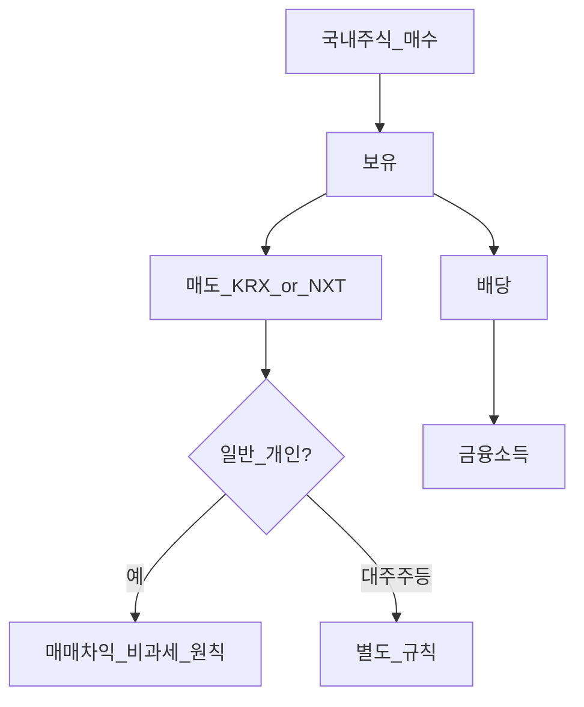
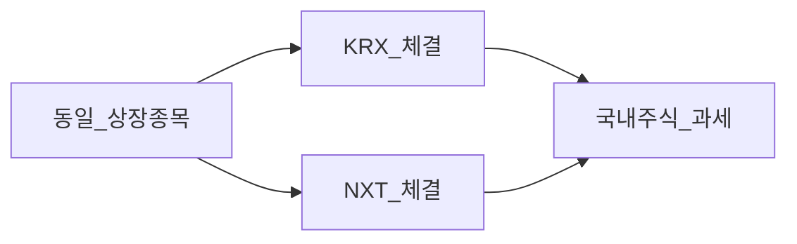

# 국내주식 세금 — KRX·넥스트레이드(NXT)

> **면책**: 본 문서는 교육 목적이며, 특정 개인·법인에 대한 투자·세무·법률 자문이 아닙니다. 대주주·법인 등 예외는 별도 확인.

## 메타

| 항목 | 내용 |
|------|------|
| 최종 검증일 | 2026-05-24 |
| 정책·법령 기준일 | 소득세법 2025~2026 |
| 난이도 | L3 (Deep) — [READER-GUIDE](../../docs/READER-GUIDE.md) |
| 예상 읽기 시간 | 35~45분 |
| 관련 bucket | Bucket 3~4 국내주식·코스닥 |

## 0. 이 편 읽기 전 (5분)

| 항목 | 내용 |
|------|------|
| **난이도** | L3 (Deep) — [READER-GUIDE §L등급](../../docs/READER-GUIDE.md) |
| **선수** | [investment-tax-overview](investment-tax-overview.md), [korea-ats-nextrade](../../03-markets/korea-ats-nextrade.md) |
| **이번 편에서 쓰는 기호** | L_ISA, ISA, IRP, DB, DC (해당 시) |
| **복습 한 줄** | — |

## TL;DR

1. **일반 개인** 국내 **상장주식 매매차익 비과세**(원칙).
2. **KRX**와 **NXT** 체결 모두 **국내 상장** — 매매차익 **동일 원칙**.
3. **배당**은 **금융소득** — 분리·종합 규칙.
4. **대주주·금융투자소득세** 등 **예외** 별도.
5. **해외주식**과 혼동 금지 — [part1-cgt](overseas-stocks-tax-part1-cgt.md).

---

## 1. 한 줄 정의 + 왜 중요한가

**정의**: 국내 거래소(**한국거래소·넥스트레이드**)에 상장된 주식을 개인이 매매할 때 적용되는 **양도소득·배당** 규칙입니다.

**왜 중요한가**: NXT **12시간** 거래를 써도 **국내주식 세법**은 같습니다. “ATS라 세금이 다르다”는 **오해**를 막습니다.

---

## 2. 선수 지식 / 이후 읽을 것

**선수**:
- [investment-tax-overview.md](investment-tax-overview.md)
- [korea-ats-nextrade.md](../../03-markets/korea-ats-nextrade.md)

**이후**:
- [overseas-stocks-tax-part1-cgt.md](overseas-stocks-tax-part1-cgt.md)
- [account-product-tax-map.md](account-product-tax-map.md)

---

## 3. 직관·비유

국내주식 매매는 (일반 개인) **“팔아도 양도세 신고가 없는 편의점”**에 가깝고, **배당**은 **“영수증이 있는 소득”**이라 원천징수·금융소득 규칙을 탑니다. **해외주식**은 **“해외 편의점”** — 팔 때마다 **5월 정산**.

---

## 4. 정식 개념·용어

| 용어 | 정의 |
|------|------|
| 상장주식 | KRX·코스닥·NXT 등 **국내 상장** |
| 매매차익 | 매도가 − 취득가 − 비용 |
| 배당소득 | 금융소득 |
| 대주주 | 지분·요건 충족 시 **별도 과세** |
| NXT | **대체거래소(ATS)** — 상장주 **동일 종목** 거래 |

### 4a. 핵심 용어 (본문 등장 순)

> 복습용. 정의는 §4 본표·[glossary](../../00-roadmap/glossary.md)·본문 `!!! info` 박스.

| 용어 | 한 줄 | 관련 이론 | glossary |
|------|-------|-----------|----------|
| 상장주식 | KRX·코스닥·NXT 등 **국내 상장** | §4 | [glossary](../../00-roadmap/glossary.md#상장주식) |
| 매매차익 | 매도가 − 취득가 − 비용 | §4 | [glossary](../../00-roadmap/glossary.md#매매차익) |
| 배당소득 | 금융소득 | §4 | [glossary](../../00-roadmap/glossary.md#배당소득) |
| 대주주 | 지분·요건 충족 시 **별도 과세** | §4 | [glossary](../../00-roadmap/glossary.md#대주주) |
| NXT | **대체거래소 | §4 | [glossary](../../00-roadmap/glossary.md#nxt) |

---

## 5. 메커니즘

### KRX vs NXT

---

## 6. 수식·모델

매매차익 (일반 개인, 원칙):

| 기호 | 이름 | 이 식에서 의미 |
|------|------|----------------|
| \(T_\) | T_ | §4·본문 정의 참고 |
| \(domestic CGT\) | domestic CGT | §4·본문 정의 참고 |
| \(비과세\) | 비과세 | §4·본문 정의 참고 |

\[
T_{\text{domestic CGT}} = 0 \quad (\text{비과세})
\]

배당 (금융소득 합산):

\[
Fin = D_{\text{domestic}} + D_{\text{foreign}} + I + \cdots
\]

---

## 7. 한국 적용

### 7.1 2025~2026

| 항목 | 일반 개인 |
|------|-----------|
| KRX·코스닥 매매차익 | **비과세** |
| NXT 매매차익 | **동일** (국내 상장) |
| 배당 | 금융소득 **2,000만** 판단 |
| ISA 내 국내주식 | **계좌 세제** 우선 |
| DC·IRP | **과세이연** |

### 7.2 예외·주의 (교육)

| 구분 | 일반 개인 | 비고 |
|------|-----------|------|
| 대주주 | **과세** 가능 | 지분·요건 |
| 금융투자소득세 | **유예** 보도 | 대주주·고액 |
| 법인 | **별도** | 본 문서 범위 밖 |
| 비상장 | **별도** | 상장=KRX·코스닥·NXT |

### 7.3 NXT·장후·FOMO

- **체결 장소**만 NXT — **종목·상장**은 국내.  
- 장후 **급등 추격**은 세금보다 **행동** 리스크 — [fomo](../../05-behavioral/fomo-and-trading-hours.md).  
- 코스닥 **투자주의·관리** — 변동성↑ ≠ 세율↑.

### 7.5 ISA·DC·IRP 내 국내주식 (계좌 세제 우선)

| 계좌 | 매매차익(운용 중) | 배당 | 퇴사·만기 |
|------|-------------------|------|-----------|
| 일반 | 비과세(원칙) | 금융소득 | 즉시 과세 이벤트 |
| ISA | **손익통산·한도** | 통산 | 3년·9.9% |
| IRP·DC | **과세이연** | 이연(규칙) | 연금·퇴직세 |

NXT로 체결해도 **상장주식·계좌 규칙**은 위와 같습니다. “NXT라 비과세가 사라진다”는 **오해**입니다.

### 7.6 대주주·금융투자소득세 — 일반 개인과 구분

| 구분 | 일반 개인(소액·비대주주) | 대주주·고액 |
|------|---------------------------|-------------|
| 국내 매매차익 | **비과세** 원칙 | **별도** — 전문가 확인 |
| 금융투자소득세 | **유예** 보도(2026) | 시행 시 **별도** 추적 |
| 본 저장소 기본 독자 | **후자** 문서 + [investment-tax-overview](investment-tax-overview.md) | |

**법·정책 근거**: 소득세법, 국세청 안내, [korea-ats-nextrade](../../03-markets/korea-ats-nextrade.md).

---

### 7.7 코스닥·NXT·FOMO — 세금과 행동 분리

| 이슈 | 세금(본 문서) | 행동 |
|------|---------------|------|
| 코스닥 급등 | 매매차익 **원칙 동일** | [fomo-and-trading-hours.md](../../05-behavioral/fomo-and-trading-hours.md) |
| NXT 장후 | **동일** | 과매매 비용 |
| 투자주의·관리 | **동일** | 유동성·하한가 |

세금이 낮다고 **Bucket 4** 비중을 늘리는 것은 CAPM·분산 관점에서 **별도** 판단입니다 — [capm-and-risk-return.md](../../08-advanced/capm-and-risk-return.md).

---

## 8. 숫자 예제 (가상)

> 가상 금액.

> 모든 인물·금액은 가상입니다.

### 예제 1: NXT 매매 (가상)

| 항목 | 가상 U |
|------|--------|
| NXT 매수·매도 차익 | +500만 |
| 양도세(일반) | **0** |

### 예제 2: 배당 (가상)

| 항목 | 가상 V |
|------|--------|
| 국내 배당 | 800만 |
| 해외 배당 | 500만 |
| 합계 | 1,300만 — **2,000만 이하** |

### 예제 3: ISA (가상)

| | 일반 | ISA 3년 |
|--|------|---------|
| 국내 ETF 차익 300만 | 비과세(원칙) | **통산·ISA 한도** |

### 예제 4: 배당+해외 합산 (가상)

| | 가상 AO |
|--|---------|
| 국내 배당 | 600만 |
| 해외 배당 | 1,500만 |
| 합계 | 2,100만 → [part2](overseas-stocks-tax-part2-dividend.md) |

### 예제 5: DC 퇴직연금 국내주식 (가상)

| | 가상 AP (DC) |
|--|--------------|
| 국내주식 매매차익 | **이연** |
| 퇴직연금 메뉴 | 70% 규칙 — [dc-pension](../dc-pension.md) |

---

## 9. FAQ

**Q1.** NXT만 쓰면 세금 다르? — **아니오**.  
**Q2.** 코스닥 티어·세금? — **매매차익 원칙 동일** — [kosdaq-tier-system](../../03-markets/kosdaq-tier-system.md).  
**Q3.** QQQ는? — **해외** — part1.  
**Q4.** 장후·NXT FOMO? — [fomo-and-trading-hours](../../05-behavioral/fomo-and-trading-hours.md).  
**Q5.** DB가 NXT? — **개인** 계좌.  
**Q6.** 금융투자소득세? — **별도**·유예.  
**Q7.** ISA 2년? — 추징 위험.  
**Q8.** 국내+해외 손실 상쇄? — **매매차익 유형** 주의 — part1.

---

### 실행 워크숍 체크리스트 (교육)

| # | 질문 | Yes 시 다음 문서 |
|---|------|------------------|
| 1 | 해외 ETF·주식을 보유 중인가? | [overseas-stocks-tax-part1-cgt.md](overseas-stocks-tax-part1-cgt.md) |
| 2 | 해외 배당이 연 500만 이상인가? | [part2-dividend](overseas-stocks-tax-part2-dividend.md) |
| 3 | DB 재직인가? | [db-pension.md](../db-pension.md) + IRP·ISA |
| 4 | 국내주식을 NXT에서 거래하는가? | [korea-ats-nextrade.md](../../03-markets/korea-ats-nextrade.md) |
| 5 | 10년 코어가 QQQ인가? | [isa.md](../isa.md) 또는 [isa-irp-pension-tax.md](isa-irp-pension-tax.md) |

위 표는 **의사결정 보조**이며, 개인 소득·가구·회사 제도에 따라 답이 달라집니다. 불확실하면 [investment-tax-overview.md](investment-tax-overview.md) → [account-product-tax-map.md](account-product-tax-map.md) 순으로 읽으세요.

## 10. 함정·리스크·한계

- **NXT=해외** 착각  
- **배당** 무시 → 2,000만 초과  
- **대주주** 해당 무시  
- **법인·전문투자자** 예외  
- **금융투자소득세** 유예 변동

---

## L3 보충 — 장기 자산 형성 연결

본 절은 [DEPTH-STANDARD.md](../../../docs/DEPTH-STANDARD.md) L3 게이트를 충족하기 위한 **실행·교차 링크** 보충입니다.

### Bucket·현금흐름 연결

| Bucket | 대표 제도·자산 | 본 문서와의 관계 |
|--------|----------------|------------------|
| 0 | 비상금 MMDA | 세금·투자 **전** 우선 |
| 1 | [청년도약](../youth-leap-account.md)·[미래적금](../youth-future-savings.md) | 정책 적금 — 주식 **대체 아님** |
| 2a | DB·DC | [db-vs-dc-pension.md](../db-vs-dc-pension.md) |
| 2b | ISA·IRP | [isa.md](../isa.md)·[isa-irp-pension-tax.md](../tax/isa-irp-pension-tax.md) |
| 3 | QQQ·채권 코어 | [capm-and-risk-return.md](../08-advanced/capm-and-risk-return.md) |
| 4 | NXT·코스닥·QLD | [fomo-and-trading-hours.md](../05-behavioral/fomo-and-trading-hours.md) |

### 연간 점검 루틴 (교육)

| 분기 | 할 일 |
|------|--------|
| Q1 | [investment-tax-overview.md](../tax/investment-tax-overview.md) 캘린더 확인 |
| Q2 | [rebalancing-and-dca.md](../04-portfolio/rebalancing-and-dca.md) 코어 비중 |
| Q3 | 해외 배당·금융소득 **누적** — Part2 |
| Q4 | 익년 **5월** 양도세 자료 정리 — Part1 |
| ISA | 개설일 +36개월 **만기** 알림 |

### 2025 vs 2026 정책 추적

| 항목 | 확인 출처 |
|------|-----------|
| ISA 한도·비과세 | 금융위·조세특례 시행일 |
| DC +300만 공제 | 국세청·통합연금포털 |
| 청년도약 일몰·미래적금 | [kinfa](https://ylaccount.kinfa.or.kr) |
| 금융투자소득세 | 금융위 보도·[sources.md](../../../references/sources.md) |
| NXT 종목·거래중단 | [nextrade.co.kr](https://www.nextrade.co.kr) |

**면책 재확인**: 가상 예제·보도 수치는 **시점별 개정**됩니다. 실행·신고 전 공식 출처를 확인하세요.

## 11. 심화 읽기

- [investment-tax-overview.md](investment-tax-overview.md)  
- [korea-ats-nextrade.md](../../03-markets/korea-ats-nextrade.md)

---

## 12. 스스로 점검 퀴즈

1. NXT 국내주식 매매차익(일반)?  
2. 배당 소득 구분?  
3. QQQ 과세 문서?  
4. ISA 국내주식은?  
5. 해외주식과 국내 매매차익 차이?

??? note "정답 힌트"

    1. 비과세 원칙 · 2. 금융소득 · 3. part1-cgt · 4. ISA 세제 · 5. 해외는 양도세

