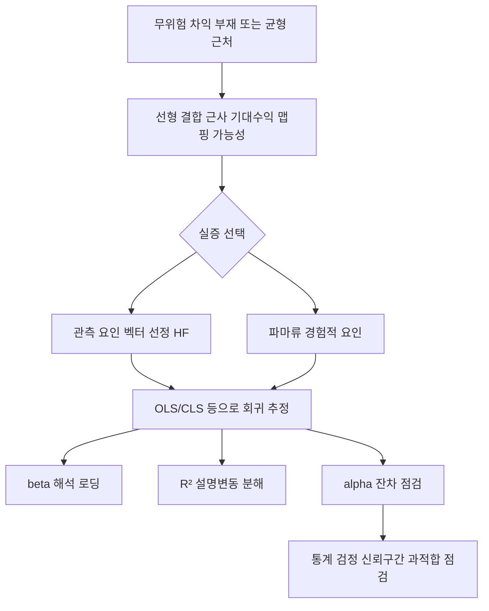
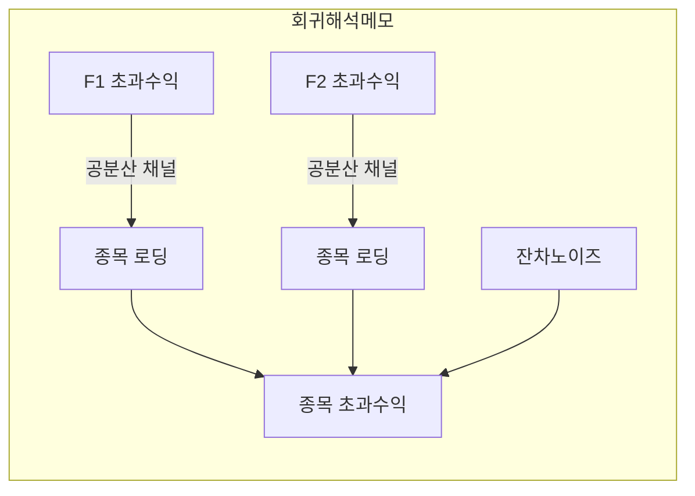
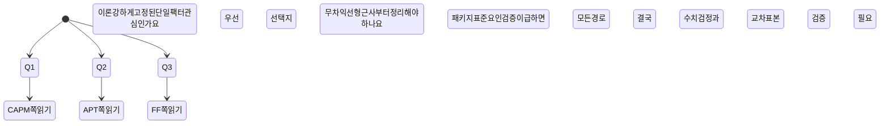

# APT와 다중요인 자산 가격결정 모델

> **면책**: 본 문서는 교육 목적이며, 특정 개인·법인에 대한 투자·세무·법률 자문이 아닙니다. 제도·분석 결과·예시 수치는 시점별로 바뀔 수 있습니다. 학습용으로 활용하기 전후에 공식 자료 및 전문 자문 여부를 독립적으로 검토하세요.

## 메타

| 항목 | 내용 |
|------|------|
| 최종 검증일 | 2026-05-25 |
| 정책·법령 기준일 | 해당 없음 (이론·계량 프레임 중심) |
| 난이도 | L4 (Graduate) — [READER-GUIDE](../docs/READER-GUIDE.md) |
| 예상 읽기 시간 | 35~55분 |
| 관련 bucket | Bucket 4 (포트폴리오 이론·요인 귀인·실무 해석 한계 통합 사고) |

## 0. 이 편 읽기 전 (5분)

| 항목 | 내용 |
|------|------|
| **난이도** | L4 (Graduate) — [READER-GUIDE §L등급](../docs/READER-GUIDE.md) |
| **선수** | 없음 |
| **이번 편에서 쓰는 기호** | 본문 §4·§4a 표 참고 |
| **복습 한 줄** | L3 선수 편을 먼저 읽으면 수식이 수월함 |

## TL;DR

1. **APT(차익거래 가격이론)**는 무위험 차익 조건 아래 많은 거시요인 선형조합으로 기대수익률이 설명될 수 있음을 말하며, 구체적인 “단 하나의 올바른 요인 목록”을 이론이 자동 확정하지는 않는다.
2. **CAPM**은 단일 시장 초과수익률이라는 균형 근거 요인 설정이 강하지만 단순해서 설명력이 불충분한 경우가 잦고, **FF(파마–프랜치류)**는 경험적 요인 규격을 실증에 맞춰 확장한 대표적 다중요인 모델이다.
3. **다중요인 회귀**의 계수(\(\beta\))는 “해당 요인 포트폴리오 1단위 변화에 따른 자산의 조건부 공동변동”이고, **\(R^2\)**는 설명된 변동 비율, **절편(historical alpha로 자주 해석)**은 모형이 놓친 평균 초과수익 잔차에 불과하다(통계적 유의성·표본기간 민감).
4. **요인 포트폴리오**는 관측 가능한 대리변수(proxy) 요인 구성을 통해 이론·실증을 연결하는 다리 역할을 하며, 순위·평균 차이·변동 성격에 따라 결과 해석이 달라진다.
5. 실무에서는 “모형이 진리인가?”보다 “어떤 **위험 프리미엄 귀인** 설명 경로를 허용하고, 무엇을 **구조변화 이벤트**로 보정할 것인가?”가 더 중요하다.

## 1. 한 줄 정의 + 왜 중요한가
!!! info "SMB (Small Minus Big)"
    소형−대형 규모 팩터.

!!! info "APT (Arbitrage Pricing Theory)"
    다요인 자산가격 모형.

**정의**: 스티븐 로스(S. A. Ross)가 제안한 **APT**(Arbitrage Pricing Theory, 차익거래 가격이론)는, 무위험 차익이 존재하지 않는 균형에서 자산 기대수익률이 **여러 요인**(위험이나 정보 구조의 요약 축들)의 **선형 결합으로 표현되는지**와 그 조건들을 형식화한다. 다중요인 **회귀**는 해당 선형 근사를 과거 데이터에 맞춰 **통계적으로 추정한 실무 접합(interfacing) 도구**다.

**왜 중요한가** (장기 자산 형성·bucket 연결):

- 장기 목표설정에서는 “시장 하나로 설명된다”고 가정한 CAPM 단일 채널이 **설명 불가 잔차(알파로 오해되기 쉬운 부분)**를 키울 위험이 있다. APT 관점은 “수익률 형성 채널이 복수일 수 있다”는 사고방식 전환이다.
- **요인 귀인**(value, momentum, 크기 등의 경험적 요인 포함) 문제는 순수 이론(CAPM/APT)·경험적 모형(FF 등)·거래 규약(비용, 유동성)이 충돌하는 지점이므로, L4 학습자는 회귀 해석 도구까지 묶어 **과대해석 금지**를 습관화해야 한다.

## 2. 선수 지식 / 이후 읽을 것

**선수**:

- 단일 \(\beta\)와 SML 직관, 시장 초과수익의 정의 범위: [CAPM과 위험·수익](./capm-and-risk-return.md)
- 경험적 다중요인(Fama–French 계열)·팩터 ETF 맥락: [요인 투자·파마–프랜치 계열 개요](./factor-investing-fama-french.md)
- 회귀·\(t\)**통계·다중공선성**(multicollinearity) 기초(별도 학습 노트 권장)

**이후**:

- 동일 디렉터리 내 다른 L4 장에서 **판별 모형**(ML)·**구조변화**(regime)·**패널**(시계열 교차 단면) 접목
- 학술 회귀로 나아갈 경우: **허들(Hurdle)·샤링턴(Shrinking)·강건 표준오차(Newey–West 등)** 교재 챕터

## 3. 직관·비유

우산 가게 두 곳 사이에서 **무위험 물건 사고팔아 항상 차익** 나는 상태가 무한 반복된다면 사람들이 몰려들어 양쪽 가격을 바로잡는다는 이미지가 **차익거래 차단 조건의 직관**이다. APT는 “자산별로 조금씩 다른 센서(민감도)를 가진 기계실”이라 생각하면 편하다—온도(거시요인 1), 습도(요인 2), 전압(요인 3)이 조금씩 출렁일 때 **각 기계(자산)의 경고등(수익률)**이 공통 요인에 선형으로 반응한다는 **단순화 가정**을 둔다.

다만 실제 시장은 **비선형**, **제도적 마찰**, **정보 비대칭**, **유동성 프리미엄**으로 센서가 바뀌고, 측정 오차로 **가짜 공통요인**(spurious factor)이 보이기도 한다. 그래서 회귀의 **\(R^2\)가 크다**고 해서 “위험이 완전히 요인으로 분해됐다”고 말할 수 없고, **알파가 유의하다**고 해서 곧바로 “초과성과의 영구적 우위”를 주장할 수 없다.

## 4. 정식 개념·용어

| 용어 | 한글 | English | 정의 |
|------|------|------|----------------|
| APT | 차익거래 가격이론 | Arbitrage Pricing Theory | 무위험 차익 부재 조건에서 기대수익이 다수 요인 선형결합 근처에 놓일 수 있는 **요인 균형 요약 모형**(구체 요인 명세는 분리 과제가 많음) |
| 선형 요인 공간 | — | Linear factor span | 변수들이 공통 정보 축 선형결합 근처에 놓일 때의 **설명 변수 집합** |
| 무위험 차익 | — | Arbitrage (risk-free in limit) | **확실·한계 무위험**으로 무한 레버 또는 동일 상태에서 상반된 위치 차익(정밀 정의는 학술 교재 차용) |
| 요인 포트폴리오 | 팩터 벤치마크 포트폴리오 | Factor (mimicking) portfolio | 이론적 요인의 **관측 대리변수**(길이 다른 벡터 간의 교량) 역할 포트폴리오 |
| 회귀로딩(loadings) | 베타 | Factor betas (\(\beta\)) | 요인 초과수익 1단위 변화 대비 종목·전략의 **조건부 공동변동 크기**(표본추정) |
| 적합도 지표 | 설명변동 비율 | \(R^2\) | 회귀로 설명되는 수익률 변동 **비중**(과적합·표본외 유효성은 별도 검증 필요) |
| 절편 | 알파라 부르기도 함 | Regression intercept (\(\alpha\)) | 요인 채택 집합 고정 후 **설명 변수가 못 준 평균 잔차**; 경제적 초과성과와 동일하지 않을 수 있음 |
| APT vs CAPM | — | APT vs CAPM | CAPM은 **단일 균형요인**(시장) 가정 강함, APT는 **요인 차원·명세 여유**(대신 실증에서 명세 과제 발생) |

### 4a. 핵심 용어 (본문 등장 순)

> 복습용. 정의는 §4 본표·[glossary](../00-roadmap/glossary.md)·본문 `!!! info` 박스.

| 용어 | 한 줄 | 관련 이론 | glossary |
|------|------|------|----------------|
| APT | 무위험 차익 부재 조건에서 기대수익이 다수 요인 선형결합 근처에 놓일 수 있는 **요인 균형 요약 모형** | §4 | [glossary](../00-roadmap/glossary.md#apt) |
| 선형 요인 공간 | 변수들이 공통 정보 축 선형결합 근처에 놓일 때의 **설명 변수 집합** | §4 | [glossary](../00-roadmap/glossary.md#선형-요인-공간) |
| 무위험 차익 | **확실·한계 무위험**으로 무한 레버 또는 동일 상태에서 상반된 위치 차익 | §4 | [glossary](../00-roadmap/glossary.md#무위험-차익) |
| 요인 포트폴리오 | 이론적 요인의 **관측 대리변수** | §4 | [glossary](../00-roadmap/glossary.md#요인-포트폴리오) |
| 회귀로딩(loadings) | 요인 초과수익 1단위 변화 대비 종목·전략의 **조건부 공동변동 크기** | §4 | [glossary](../00-roadmap/glossary.md#회귀로딩) |
| 적합도 지표 | 회귀로 설명되는 수익률 변동 **비중** | §4 | [glossary](../00-roadmap/glossary.md#적합도-지표) |
| 절편 | 요인 채택 집합 고정 후 **설명 변수가 못 준 평균 잔차**; 경제적 초과성과와 동일하지 않을 수 있음 | §4 | [glossary](../00-roadmap/glossary.md#절편) |
| APT vs CAPM | CAPM은 **단일 균형요인** | §4 | [glossary](../00-roadmap/glossary.md#apt-vs-capm) |

## 5. 메커니즘

추가로 **표본 교차**(in-sample/out-of-sample)·**표본 간 안정성**을 점검하지 않으면, 회귀 파이프라인이 학술 교과서에는 멋있어도 **실무 위험 프리미엄 설명에는 빈약**할 수 있다. 요인 순서 변경·단위통일 여부 또한 결과를 흔든다.

## 6. 수식·모델 (해당 시)

### 로스 APT의 보편 근간(표기 수준 안내)

이론은 자산 초과수익의 기대값이 많은 상태변수 또는 요인 \(F\)들의 노출(linear exposure) 함수로 근사될 조건들을 검토한다. 실증에서는 보통 시간 \(t\)에 대해 다음과 같은 **선형 회귀**를 추정한다(아래 모든 기호는 **학습 예시 표기**이며 특정 학파·데이터 제공자 명세와 1:1 일치 필요는 없음).

| 기호 | 이름 | 이 식에서 의미 |
|------|------|----------------|
| \(r\) | 할인율·수익률 | 기간당 이자·요구수익률 |
| \(n\) | 기간 | 연·월 등 복리·할인에 쓰는 횟수 |
| \(PV\) | 현재가치 | 오늘 시점으로 환산한 금액 |
| \(FV\) | 미래가치 | 미래 시점의 목표·결과 금액 |

\[
 r_{i,t}^e = \alpha_i + \sum_{k=1}^K \beta_{i,k} f_{k,t} + \varepsilon_{i,t}
\]

**읽는 법**: 시장 초과수익에 대한 민감도가 **β**다. 

**R_f**·**ERP**와 함께 요구수익 **r**을 구성한다. [DEPTH-STANDARD](../docs/DEPTH-STANDARD.md) 참고.
**유도 (L4)**:
1. **정의**: **r_**, **e**, **alpha**를 동일 시점·동일 통화로 맞춘다. — 단위 불일치면 식이 무의미해진다.
2. **식 변형**: 양변을 정리해 목표 변수를 한쪽에 둔다. — 할인·복리는 **시점 이동**이 핵심이다.

여기서 \( r_{i,t}^e = r_{i,t} - r_{f,t} \)처럼 **무위험 금리를 뺀 초과수익**으로 두는 경우가 일반적이며, \( f_{k,t} \)는 \(k\)번째 요인의 **초과수익**(또는 표준화된 혁신)이다. **시장 모형**으로 축소하면 \(K=1\)이고 \(f_{1,t}\)가 시장 초과수익이 되어 CAPM 단일요인 형태와 겉모습이 비슷해진다—그러나 **이론적 균형 근거는 다르다**(CAPM 주장의 유도 경로와 APT의 무차익 인수가 접점은 있지만 동일 명제는 아니다).

추정된 \(\hat{\beta}_{i,k}\)는 시간에 따라 바뀌는 **역동적 피해야 할 부분**(rolling, Kalman 필터 등 고급 기법 논외)이라는 점까지 염두에 두면, “베타는 성격처럼 고정된다”고 말하면 위험하다.

| 기호 | 이름 | 이 식에서 의미 |
|------|------|----------------|
| \(r\) | 할인율·수익률 | 기간당 이자·요구수익률 |
| \(n\) | 기간 | 연·월 등 복리·할인에 쓰는 횟수 |
| \(PV\) | 현재가치 | 오늘 시점으로 환산한 금액 |
| \(FV\) | 미래가치 | 미래 시점의 목표·결과 금액 |

\[
 SSR = \sum_t \hat{\varepsilon}_{i,t}^2,\quad
 SST = \sum_t (r_{i,t}^e - \bar{r}_i^e)^2,\quad
 R^2_i = 1 - \frac{SSR}{SST}
\]

**읽는 법**: **sum_t**와 **r_**의 관계를 위 식으로 쓴다. 경제·재무 해석은 변수표 「이 식에서 의미」와 [DEPTH-STANDARD](../docs/DEPTH-STANDARD.md) 기호 예제를 맞춘다.
**유도 (L4)**:
1. **정의**: **sum_t**, **r_**, **R**를 동일 시점·동일 통화로 맞춘다. — 단위 불일치면 식이 무의미해진다.
2. **식 변형**: 양변을 정리해 목표 변수를 한쪽에 둔다. — 할인·복리는 **시점 이동**이 핵심이다.
\(\hat{\alpha}_i\)는 요인 채택이 주어졌을 때의 **평균 초과설명 차이**(절편)·**구조변화 존재 시 편향**될 여지가 커 검정 시 신중해야 한다. 다종목 공통 패널로 확대하면 교차항목 상관 때문에 **통계 검정 교정**(클러스터·HAC 등이 일반)·**다중 검정**(many hypotheses) 문제가 따라온다.

---

 기호 예제를 맞춘다.
**유도 (L4)**:
1. **정의**: **sum_t**, **r_**, **R**를 동일 시점·동일 통화로 맞춘다. — 단위 불일치면 식이 무의미해진다.
2. **식 변형**: 양변을 정리해 목표 변수를 한쪽에 둔다. — 할인·복리는 **시점 이동**이 핵심이다.
\(\hat{\alpha}_i\)는 요인 채택이 주어졌을 때의 **평균 초과설명 차이**(절편)·**구조변화 존재 시 편향**될 여지가 커 검정 시 신중해야 한다. 다종목 공통 패널로 확대하면 교차항목 상관 때문에 **통계 검정 교정**(클러스터·HAC 등이 일반)·**다중 검정**(many hypotheses) 문제가 따라온다.

## 7. 한국 적용

### 7.1 2025년 기준 (확정해석 주의)

- 국내 시장에서는 **KOSPI·KOSPI200** 등 벤치마가 CAPM 차원에서는 전통적 선택지지만, APT·FF류 다중요인 사용 시에는 **통화 헤지 포함 여부·ADR·외국인 순매매·외환 스와프 변수** 선택이 결과를 바꿀 수 있다. 이 섹션은 **제도 교육**이 아니라 **표본 선택 주의점** 목록이다.
- 개별 종목·소형 종목에서는 **저유동 프리미엄** 때문에 같은 요인도 소음이 커 **\(R^2\)**가 낮거나 불안정하다는 점은 전 세계적으로 공통 패턴이다.

### 7.2 2026년 개편·시행 예정 (해당 시)

| 항목 | 비고 |
|------|------|
| 본 학습 장 | 법규 명세 불필요—**금융기관별 내부 요인 책정·리스크 엔진**은 독립적 |

**법·정책 근거**: 본 페이지는 교육용 이론·계량 표기 안내이다. 회계기준(IFRS)·자본시장법상 공시 규격은 해당 전문 페이지를 참고하라.

## 8. 숫자 예제 (가상)

> 모든 인물·금액은 가상입니다. 아래 표·수식은 패턴 학습 목적입니다.

### 예제 1: 두 요인만 있는 단순 회귀로 베타·\(R^2\) 읽기

가상 회사 \(A\)의 월 초과수익을 두 요인(시장·가상 크기 요인 SMB\(^\*\)) 초과수익으로 회귀했다고 하자(\(^{\*}\)**완전 가상 이름**이다).

표본 결과(가상 숫자):

| 항목 | 계수 추정값 | 표준오차 가정값 | 해석 학습 목적 문장 |
|------|------|------|----------------|
| 절편 \(\hat{\alpha}\) | 연율환산 가상값 +6.0%(월간 환산은 생략) | 유의 가능 | 단기간 박스 속 샘플이면 **통계 과대해석** 위험이 큼 |
| 시장 로딩 | 1.10 | 표준 근처 | 시장이 1 표준 변화할 때 **공동변동이 큰 편**으로 읽는 연습 |
| 가상 SMB | -0.25 | 작은 절댓값 | **부호**가 음이면 대형주 편향 상황의 은유로만 이해 |
| \(R^2\) | 0.18 | — | **요인이 설명한 변동**이 18% 수준이라는 뜻—나머지는 잔차 |

### 예제 2: CAPM 대비 다중요인으로 \(R^2\)가 늘었을 때의 함정

동일 \(A\)에 대해 CAPM만 쓰면 \(R^2\)가 0.09였다가, 가상 요인 하나를 더해 0.18로 늘었다고 하자. 이것은 **표본 내 설명력 향상**일 뿐, **미래 예측력·거래 이익**을 보장하지 않는다. 특히 요인이 **데이터 스누핑·마이닝**에서 왔다면 \(\hat{\alpha}\)의 “유의”는 **거짓 양성**일 수 있다.

## 9. FAQ

**Q1. APT는 CAPM을 “부정”하나요?**  
**A1.** 둘은 **서로 다른 출발점**을 갖는다. CAPM은 단일 시장 위험 프리미엄 구조를 강하게 시도하고, APT는 **요인 차원을 열어둔 선형 근사의 일반론**에 가깝다. 실무에서는 CAPM을 **특수한 \(K=1\) 케이스**로도 이해할 수 있지만, 이론적 동치는 아니다.

**Q2. “요인”은 반드시 거시경제 변수여야 하나요?**  
**A2.** 아니다. **관측 가능한 대리 포트폴리오**(FF의 SMB·HML 등)도 요인으로 쓰인다. 다만 그때는 **경제 이론 설명**과 **순수 데이터 패턴**을 구분하는 훈련이 필요하다.

**Q3. \(\beta\)가 크면 위험이 큰가요?**  
**A3.** 큰 \(\beta\)는 **해당 요인과의 공분산 기여**가 크다는 뜻이지, 총위험(VaR 등)의 완전한 척도는 아니다. 요인간 상관·잔차 변동이 합쳐져야 총위험 그림이 완성된다.

**Q4. \(R^2\)가 낮으면 모형이 쓸모없나요?**  
**A4.** 금융 시계열은 본질적으로 **잔차 변동이 크다**. 낮은 \(R^2\)는 **정상**에 가깝다. 중요한 것은 **해석 일관성·추정 안정성·표본 외 성능**이다.

**Q5. 회귀 알파가 유의하면 전략이 이긴다는 뜻인가요?**  
**A5.** 아니다. **거래비용·세금·슬리피지·데이터 생존편향**을 반영하면 사라질 수 있다. 또한 **데이터 기간이 짧으면** 우연일 수 있다.

**Q6. APT가 요인 명세를 정해 주지 않는다면 실무에서는 어떻게 하나요?**  
**A6.** **가설 기반**(경제 논거) 요인 선택 + **강건 검정**(다른 표본, 서브피어리어드)·**교차검증**이 표준 패턴이다. “회귀로 유의하게 나오는 변수를 다 넣기”는 위험하다.

**Q7. Fama–French는 APT의 검증이라고 보면 되나요?**  
**A7.** 간단히 그렇게 말하면 학습용으론 편하지만 엄밀히는 **경험적 자산 가격 문헌**의 한 갈래다. FF는 **요인 구성 규칙**이 특정해 있어 실무·학술에서 표준이 되었을 뿐, 모든 시장·기간에 보편 타당하다는 주장은 별개다. 상세는 [요인 투자·파마–프랜치](./factor-investing-fama-french.md)와 대조하라.

**Q8. 요인 포트폴리오를 ETF로 대체해도 되나요?**  
**A8.** **추정 오차·추적오차·리밸런싱 규칙 차이**가 생긴다. 학습 단계에선 괜찮지만, 엄밀 연구에선 **동일 구성 규칙**을 맞추는 것이 선호된다.

**Q9. 다중공선성이 걱정될 때는?**  
**A9.** 요인간 상관이 높으면 개별 \(\beta\)의 분산이 커져 **해석 불안정**해진다. **VIF 점검**, **요인 회전·정규화**, **Bayes shrinkage** 등이 고급 대응이다(본 문서는 개념만 언급).

**Q10. 구조변화(위기, 제도 개편) 이후에는 모형을 바꿔야 하나요?**  
**A10.** 실무적으로는 **스플릿 샘플**이나 **상태별 계수**를 검토하는 편이 안전하다. 단일 긴 시계열을 전부 한 번에 끼워 맞추면 **평균으로 감춘 비선형**이 생긴다.

## 10. 함정·리스크·한계

- **데이터 스누핑**(요인 이름만 바꿔 반복 테스트)은 \(\hat{\alpha}\)·\(R^2\)를 과대평가한다.
- **생존편향**(상장폐지·편입·편출) 처리 없이 과거 회귀를 돌리면 \(\beta\)·\(\alpha\)가 왜곡된다.
- **동시성 문제**(lookahead): 미래 정보가 섞이면 결과는 환상적이다.
- **유동성·거래 가능성**이 다른 자산군 비교 회귀는 **스케일이 다르게** 깨진다.
- **요인 순서 변경·표준화**에 따른 **수치 민감성**.
- 회귀로 얻은 “요인 간 선형 근사”는 **실제 위험이 선형이라는 증명**이 아니다.
- 교차단면 많은 종목을 동시 테스트하면 **다중 비교**(family-wise error) 때문에 전통 \(p\)값 단독 판단이 위험하다.

---

**Q. 실무에서는?**  
교과서 식·기호를 그대로 적용하기 전에 **수수료·세금·데이터 시점**을 분리한다. 숫자는 [DEPTH-STANDARD](../docs/DEPTH-STANDARD.md)처럼 기호만 먼저 맞추고, 법령·시장 수치는 §8 표·외부 출처로 갱신한다.

## 11. 심화 읽기

- [CAPM과 위험·수익](./capm-and-risk-return.md) — 단일 \(\beta\)·SML·한계 재정리에 유리하다  
- [요인 투자·파마–프랜치](./factor-investing-fama-french.md) — 경험적 다중요인과 실무 투자 응용의 접점 논의  
- Ross, S. A. APT 관련 초기 학술 교재 챕터(원문 제목 표기 생략—도서관/데이터베이스 검색 권장)  
- 현대 자산 가격 교재 중 **무차익·선형 근사·요인 회귀** 통합 챕터

## 연습문제 (L4, 기호)

1. 위 §6 주요 식에서 변수 하나를 미지로 두고, 나머지를 기호로 둔 **관계식**을 쓰시오.
2. 가정이 깨질 때(유동성·세금·다중 IRR 등) 위 식의 **한계**를 기호·부등식으로 서술하시오.
3. §8 예제와 동일 기호(M·P·PV 등)로 **부호·단조성**만 검증하는 짧은 논증을 하시오.

### 해설 키

1. 직전 변수표의 「이 식에서 의미」를 이용해 동일 차원으로 정리한다.
2. 「가정이 깨지면」 절의 한계 사례와 연결한다.
3. 숫자 대입 없이 **부호**·**단위** 일치만 확인한다.
## 12. 스스로 점검 퀴즈

1. APT가 CAPM보다 오히려 “덜 명시적인” 부분과 “더 관대해 보이는” 부분 각각 무엇인가 서술하라.  
2. 회귀에서 \(\hat{\beta}\) 한 단위 증가의 **경제적 의미**(요인 초과수익 정의 포함)를 말로 서술하라.  
3. \(R^2\) 증가가 **미래 수익 개선과 동치가 아닌 이유**를 세 가지 열거하라.

??? note "정답 힌트"

    - 힌트 1: **요인 목록 명세**(이론이 자동으로 고정 안 함) 대 **단일 균형요인·유도**(CAPM)·**실증 규칙 고정**(FF) 대비 관점  
    - 힌트 2: **공분산·조건부 노출**(그리고 단위통일)·**표본 시간 변동 허용** 여부까지 엮어 말하면 만점 근처  
    - 힌트 3: 과적합, 비용, 구조변화, 데이터 채굴, 생존편향 등 **현실 장애 요소** 포함

## 부록 A. 표: CAPM vs APT vs 파마–프랜치(FF류) 비교 학습 매트릭스

| 축 | CAPM | APT(Ross류) | Fama–French 계열 |
|------|------|------|----------------|
| 요인 차원 | 단일 시장 초과수익 중심(전형적) | **다차원 허용**(구체 변수는 선택 과제) | **다차원**(시장 외 크기·가치 등 경험적 요인 포함) |
| 이론적 출발점 | 균형·보수적 최적화·시장 \(\beta\) | **무위험 차익 차단**(선형 근사) | 경험적 요인 패키지 + 학술 정비 과정이 중심 |
| 실증 형태 보통 회귀 | \(r^e=\alpha+\beta_{\mathrm{mkt}}\,r_{\mathrm{mkt}}^e+\varepsilon\) | \(r^e=\alpha+\sum \beta_k f_k +\varepsilon\) | FF3/FF5/UMD 등 패키지가 문헌표준처럼 쓰임 |
| 장점 단순 기술 | 직관·단순함 | 확장 가능한 **방향 나침반** 역할 | **설명 변수 풀이 풍부**함 |
| 약점 | 설명 불충분·\(R^2\) 낮음 | 요인 채택 애매 | 요인 명세 특정 때문에 **외삽 검증 필요** |

## 부록 B. 회귀 해석 치트시트(mini)

아래 표는 **통계 과목 복습**용이다. 교과서별 기호 차이 존재.

| 기호 대상 | 학습 목적 의미 | 과대해석 경고 한 줄 |
|------|------|----------------|
| \(\hat{\beta}_{i,k}\) | 요인 \(k\)에 대한 **평균적 공동변동 기울기** 한 조각일 뿐 | 비선형·상호작용·상태변화 놓치면 헛소리 가능 |
| \(R^2\) | 채택 요인 세트 안에서의 **설명 비중** | 모형 교체로도 쉽게 조작된다 |
| \(\hat{\alpha}\) 평균 | 설명변수 평균을 맞춘 뒤 **남은 평균 초과설명 차이**(가상) | 비용 포함 전 장기 교차검증 전엔 초과성과 주장 금물 |
| 잔차 \(\hat{\varepsilon}\) | 특수정보·잡음이 섞임 | 패턴 패닝해서 ‘새 요인 만들기’는 위험 |

## 부록 C. mermaid 상태 다이어그램(학습형)

모형 선택을 **두 축**(이론 vs 실증)·**네 국면**으로 상상했을 때의 가상 학습 플레이어맙이다.

## 부록 D. 간단 기호표(문서 단위 명세)

\begin{align*}
& r_{i,t}:\ \text{(가상표기) 자산 \(i\)의 기간 \(t\) 총수익률} \\
& r_{f,t}:\ \text{무위험 이자율 또는 근사치} \\
& r_{i,t}^e = r_{i,t}-r_{f,t} \\
& f_{k,t}:\ \text{요인 \(k\) 초과수익(시장 포함 가능)} \\
& \varepsilon_{i,t}:\ \text{설명변수 세트 바깥의 잔차}
\end{align*}

---

본 문서 **난이도 태그**: L4 | **발행 검토일**(학습 페이지 기준): 2026-05-25