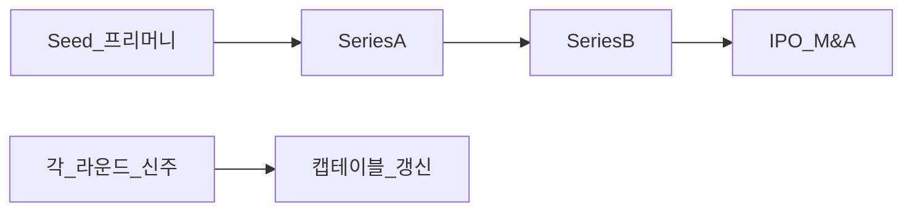
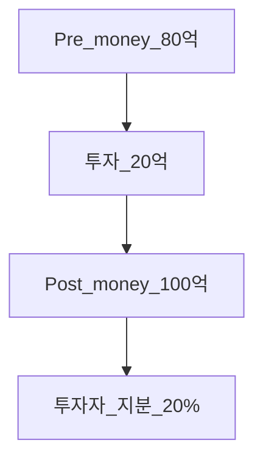
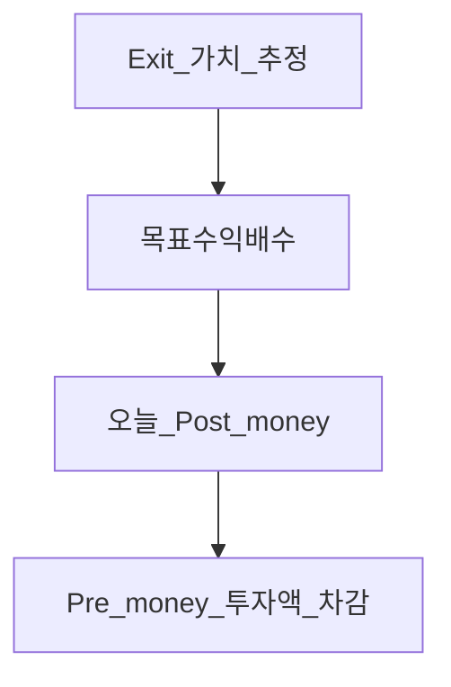
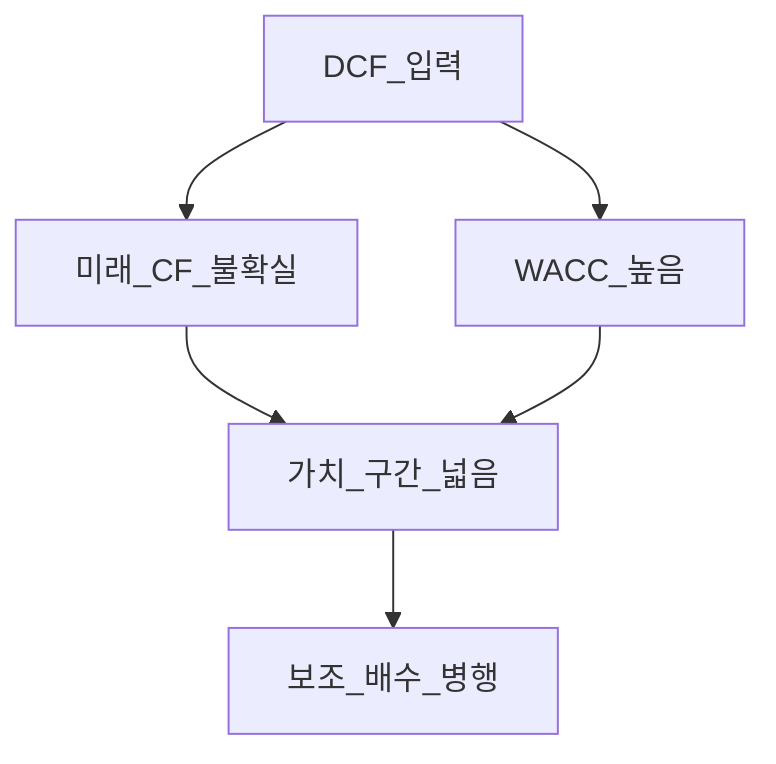
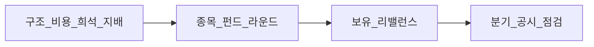

# 스타트업 밸류에이션·VC — 단계·프리머니·캡테이블·DCF 한계

> **면책**: 본 문서는 교육 목적이며, 특정 스타트업·펀드·개인에 대한 투자·세무·법률 자문이 아닙니다. VC 계약·세제·상장 규정은 **국가·시기·라운드**마다 다릅니다. 모든 회사·투자자·금액은 **가상**입니다. **비상장** 주식은 **유동성·가치평가** 리스크가 큽니다.

## 메타

| 항목 | 내용 |
|------|------|
| 최종 검증일 | 2026-05-25 |
| 정책·법령 기준일 | 2025 확정, 2026 **별도 표기** |
| 난이도 | L4 (Graduate) — [READER-GUIDE](../docs/READER-GUIDE.md) |
| 예상 읽기 시간 | 150~180분 |
| 관련 bucket | Bucket 4 (벤처·대체), 학습용 **비상장** 이해 |

## 0. 이 편 읽기 전 (5분)

| 항목 | 내용 |
|------|------|
| **난이도** | L4 (Graduate) — [READER-GUIDE §L등급](../docs/READER-GUIDE.md) |
| **선수** | [time-value-npv-irr](../01-foundations/time-value-npv-irr.md), [wacc-capital-structure](wacc-capital-structure.md) |
| **이번 편에서 쓰는 기호** | 본문 §4·§4a 표 참고 |
| **복습 한 줄** | L3 선수 편을 먼저 읽으면 수식이 수월함 |

## TL;DR

1. **VC(Venture Capital)** 는 **고성장·고위험** **비상장** 기업에 **지분**으로 **투자**해 **Exit(IPO·M&A)** 로 **수익**을 **추구**한다.
2. **라운드(Seed·Series A~)** 는 **제품·매출·단위경제** **성숙도**에 따라 **투자 규모·밸류**·**계약** **조건**이 **달라진다**.
3. **Pre-money / Post-money** 와 **신주 발행**으로 **캡테이블(cap table)** 이 **희석**된다 — **옵션 풀**·**전환** **증권** **포함** **완전희석** 기준.
4. **DCF**는 **현금흐름 불확실**·**할인율** **추정** **난이도**로 **초기** **스타트업**에 **단독** **적용** **부적합**한 경우가 **많다** — **거래 배수·VC Method·옵션** **사고** **병행**.
5. **한국** **TIPS·K-Startup·코스닥** **기술특례** 등 **정책** **맥락** — **개인** **직접** **투자**는 **자격·한도** **확인**.
6. **개인 투자자**는 **상장** **주식** **학습**과 **별도**로 **비상장** **리스크**·**정보** **비대칭**을 **인지**한다.

---

## 1. 한 줄 정의 + 왜 중요한가

**정의**: **스타트업 밸류에이션·VC** 는 **창업 초기~성장기** 기업의 **가치 평가 논리**, **투자 라운드 구조**, **지분 희석**, **DCF의 한계**를 **개인 투자자·재무 입문** 관점에서 **연결**하는 학습이다.

**왜 중요한가**: **뉴스**의 **“유니콘·시리즈 B 1,000억”** 은 **상장** **PER**과 **다른** **언어**다. **상장사** **밸류에이션**([equity-valuation-fundamentals](../03-markets/equity-valuation-fundamentals.md))을 **이해**한 뒤 **비상장** **층**을 **알면**, **벤처** **테마** **주식**·**IPO** **공모**·**기술특례** **코스닥** **리스크**를 **덜** **오해**한다. **창업**·**스톡옵션** **실무**와도 **접점**이 있다.

---

## 2. 선수 지식 / 이후 읽을 것

**선수**:
- [time-value-npv-irr](../01-foundations/time-value-npv-irr.md)
- [wacc-capital-structure](wacc-capital-structure.md)
- [compound-interest-and-time-value](../01-foundations/compound-interest-and-time-value.md)
- [financial-statements-intro](../01-foundations/financial-statements-intro.md)

**이후**:
- [ma-basics](ma-basics.md) — Exit·M&A
- [kosdaq-tier-system](../03-markets/kosdaq-tier-system.md) — 상장·퇴출
- [equity-valuation-fundamentals](../03-markets/equity-valuation-fundamentals.md)

---

## 3. 직관·비유

**묘목 vs 거목**: **Seed**는 **묘목** **심기** — **수확(Exit)** **시점**·**가격** **불확실**. **Late stage**는 **거목** **가꾸기** — **매출** **가시적** — **배수** **협상** **쉬움**.

**피자 캡테이블**: **창업팀** **조각** **50%** → **투자자** **신주** **20%** → **조각** **총수** **늘고** **각** **비율** **↓** (**희석**). **옵션 풀**은 **“예약”** **조각** — **행사** 시 **더** **희석**.

**DCF vs 벤치마크**: **DCF**는 **“이 나무가** **10년** **후** **얼마질까”** **추정** — **묘목** 단계에 **10년** **날씨** **모름**. **VC Method**는 **“수확 시** **시장** **가격** **×** **확률** **÷** **할인**” **역산**.

---

## 4. 정식 개념·용어

| 용어 | English | 교육용 정의 |
|------|---------|-------------|
| VC | Venture capital | **벤처** **투자** |
| Angel | 엔젤 | **초기** **개인** **투자** |
| Seed | 시드 | **아이디어·MVP** **단계** |
| Series A/B/C | 시리즈 | **성장** **라운드** |
| Pre-money | 프리머니 | **투자** **전** **기업가치** |
| Post-money | 포스트머니 | **투자** **후** **기업가치** |
| Cap table | 캡테이블 | **지분** **구조** **표** |
| Dilution | 희석 | **지분율** **감소** |
| Fully diluted | 완전희석 | **옵션·전환** **반영** |
| Option pool | 스톡옵션 풀 | **임직원** **옵션** **예약** |
| Liquidation preference | 청산우선권 | **Exit** 시 **배분** **순서** |
| Participating preferred | 참여적 우선주 | **우선** **회수** **후** **잔여** **참여** |
| Anti-dilution | 희석방지 | **Down round** 시 **가격** **조정** |
| Convertible note | 전환사채 | **채무**→**주식** **전환** |
| SAFE | SAFE | **전환** **권리** **단순화** (미국식, 한국 변형 주의) |
| Term sheet | 투자계약 요약 | **조건** **골격** |
| Exit | 엑싯 | **IPO·M&A** |
| Unicorn | 유니콘 | **기업가치** **$1B+** (보도상) |
| Unit economics | 단위경제 | **고객 1명** **손익** |
| Burn rate | 소진율 | **월** **현금** **소모** |
| Runway | 런웨이 | **현금** **÷** **Burn** |
| DCF | Discounted cash flow | **현금흐름** **할인** |
| VC Method | VC 방법 | **Exit** **역산** |
| Comparable | 비교거래 | **유사** **라운드** **배수** |

### 4a. 핵심 용어 (본문 등장 순)

> 복습용. 정의는 §4 본표·[glossary](../00-roadmap/glossary.md)·본문 `!!! info` 박스.

| 용어 | 한 줄 | 관련 이론 | glossary |
|------|-------|-----------|----------|
| VC | **벤처** **투자** | §4 | [glossary](../00-roadmap/glossary.md#vc) |
| Angel | **초기** **개인** **투자** | §4 | [glossary](../00-roadmap/glossary.md#angel) |
| Seed | **아이디어·MVP** **단계** | §4 | [glossary](../00-roadmap/glossary.md#seed) |
| Series A/B/C | **성장** **라운드** | §4 | [glossary](../00-roadmap/glossary.md#series-a/b/c) |
| Pre-money | **투자** **전** **기업가치** | §4 | [glossary](../00-roadmap/glossary.md#pre-money) |
| Post-money | **투자** **후** **기업가치** | §4 | [glossary](../00-roadmap/glossary.md#post-money) |
| Cap table | **지분** **구조** **표** | §4 | [glossary](../00-roadmap/glossary.md#cap-table) |
| Dilution | **지분율** **감소** | §4 | [glossary](../00-roadmap/glossary.md#dilution) |
| Fully diluted | **옵션·전환** **반영** | §4 | [glossary](../00-roadmap/glossary.md#fully-diluted) |
| Option pool | **임직원** **옵션** **예약** | §4 | [glossary](../00-roadmap/glossary.md#option-pool) |
| Liquidation preference | **Exit** 시 **배분** **순서** | §4 | [glossary](../00-roadmap/glossary.md#liquidation-preference) |
| Participating preferred | **우선** **회수** **후** **잔여** **참여** | §4 | [glossary](../00-roadmap/glossary.md#participating-preferred) |
| Anti-dilution | **Down round** 시 **가격** **조정** | §4 | [glossary](../00-roadmap/glossary.md#anti-dilution) |
| Convertible note | **채무**→**주식** **전환** | §4 | [glossary](../00-roadmap/glossary.md#convertible-note) |
| SAFE | **전환** **권리** **단순화** | §4 | [glossary](../00-roadmap/glossary.md#safe) |

---

## 5. 메커니즘

### 5.1 라운드·밸류에이션 흐름

### 5.2 Pre-money / Post-money

### 5.3 VC Method (개념, 2단계)

### 5.4 DCF vs 스타트업 (한계)

---

## 6. 수식·모델

### 6.1 Post-money / 지분율

| 기호 | 이름 | 이 식에서 의미 |
|------|------|----------------|
| \(Post-money\) | 포스트머니 | **투자** **후** **기업가치** |
| \(Pre-money\) | 프리머니 | **투자** **전** **기업가치** |
| \(Investment\) | Investment | §4·본문 정의 참고 |

\[
\text{Post-money} = \text{Pre-money} + \text{Investment}
\]

\[
\text{Investor ownership} = \frac{\text{Investment}}{\text{Post-money}}
\]

**가상**: Pre **80억**, 투자 **20억** → Post **100억**, 투자자 **20%**.

### 6.2 창업팀 희석 (단순)

\[
\text{Founder \% after} = \frac{\text{Founder shares}}{\text{Total fully diluted shares after round}}
\]

**옵션 풀 10%** **신설** 시 **창업팀** **추가** **희석**.

### 6.3 VC Method (교육)

\[
\text{Post-money today} = \frac{EV_{\text{exit}}}{(1+r)^T \times M}
\]

\(EV_{\text{exit}}\): **Exit** **가치**, \(r\): **할인율**, \(T\): **연수**, \(M\): **목표** **배수** (예: **10x**).

**가상**: Exit **5,000억**, \(T=5\), \(r=40\%\), \(M=10\) → **Post today** **근사** **계산** (학습자 **엑셀**).

### 6.4 DCF (복습·한계 명시)

\[
V = \sum_{t=1}^{n} \frac{FCF_t}{(1+WACC)^t} + \frac{TV}{(1+WACC)^n}
\]

**스타트업**: \(FCF_t\) **음수**·**변동** **큼**, \(TV\) **지배** → **민감도** **극대**.

### 6.5 Runway

\[
\text{Runway (months)} = \frac{\text{Cash}}{\text{Monthly burn}}
\]

**가상**: 현금 **30억**, Burn **3억/월** → **10개월**.

---

## 7. 한국 적용

### 7.1 2025년 기준 (교육)

| 영역 | 요지 |
|------|------|
| 벤처투자 | **벤처캐피탈**·**엔젤**·**정부** **프로그램** |
| 세제 | **벤처투자** **소득공제** 등 — **요건** **연도별** **변경** |
| 코스닥 | **기술특례** **상장** — [kosdaq-tier-system](../03-markets/kosdaq-tier-system.md) |
| 크라우드 | **크라우드펀딩** — **투자자** **보호** **규칙** |
| 스톡옵션 | **벤처** **임직원** **보상** — **세무** **이슈** |

### 7.2 가상 한국 스타트업 “가상로보틱스” 타임라인

| 라운드 | Pre(억) | 투자(억) | Post(억) | 창업팀(완전희석) |
|--------|---------|----------|----------|------------------|
| Seed | 20 | 5 | 25 | 72%→ |
| A | 80 | 20 | 100 | 58% |
| B | 300 | 100 | 400 | 43% |

**옵션 풀** **각** **라운드** **10%** **가정** 시 **표** **재작성** **연습**.

### 7.3 DCF를 쓰지 않는 이유 (가상로보틱스, Seed)

- **매출** **미미**·**FCF** **음수** **5년+**  
- **WACC** **30~50%+** **민감**  
- **전략** **피벗** **빈번**  
→ **Comparable** **(유사** **로봇** **A라운드)** **배수** **+** **VC Method** **병행** (교육).

### 7.4 2026년 (재확인)

| | 메모 |
|--|------|
| 벤처 세제 | **국세청** **연간** 안내 |
| 코스닥 | **퇴출** **강화** — **IPO** **Exit** **품질** **이슈** |

---

## 8. 숫자 예제 (가상)

### 예제 1 — Pre/Post (기본)

Pre **50억**, 투자 **10억** → Post **60억**, 투자자 **16.67%**.

### 예제 2 — 옵션 풀

투자 **전** 창업팀 **80%**, **옵션 풀 10%** **신설**, 투자자 **20%** → 창업팀 **완전희석** **약 72%** (단순 **교육** **근사**).

### 예제 3 — Down round

**B라운드** Pre **200억**(이전 Post 400억) — **Flat** **아님** **Down** — **기존** **투자자** **Anti-dilution** **발동** **가능**.

### 예제 4 — Liquidation preference (개념)

Exit **100억**, **우선주** **투자** **30억** **1x** **non-participating** — **우선** **30억** **회수** **후** **잔여** **보통주** **배분**.

### 예제 5 — Runway·Bridge

Runway **6개월**, **Bridge** **10억** **전환사채** — **다음** **라운드** **전** **생존**.

### 예제 6 — DCF 민감도 (가상, 성장기)

| WACC | TV 성장 | 가치(억) |
|------|---------|----------|
| 25% | 3% | 800 |
| 30% | 3% | 550 |
| 30% | 5% | 720 |

**구간** **넓음** → **단독** **의사결정** **위험**.

---

## 9. FAQ

**Q1. Pre-money와 Post-money 중 뭐가 협상 핵심인가요?**  
**A1.** **보통** **Pre-money** — **투자액**과 **함께** **지분** **결정**.

**Q2. 유니콘이면 무조건 성공한 건가요?**  
**A2.** **비상장** **평가** — **유동성** **없음**·**Down round** **가능**.

**Q3. DCF를 아예 쓰면 안 되나요?**  
**A3.** **성숙** **단계**·**현금흐름** **안정** 시 **보조** — **초기**는 **배수·VC Method**.

**Q4. SAFE와 전환사채 차이는?**  
**A4.** **법적** **형태**·**이자**·**전환** **조건** — **한국** **실무** **변형** **주의**.

**Q5. 개인이 VC처럼 투자할 수 있나요?**  
**A5.** **엔젤**·**크라우드**·**간접** **펀드** — **자격**·**한도**·**손실** **전액** **가능**.

**Q6. 스톡옵션은 왜 캡테이블에 넣나요?**  
**A6.** **행사** 시 **주식** **발행** → **희석** — **Fully diluted** **기준**.

**Q7. 청산우선권이 창업팀에 불리한 이유는?**  
**A7.** **Exit** **가치** **낮을** 때 **투자자** **먼저** **가져감** — **보통주** **잔여** **적음**.

**Q8. 한국 정부 벤처 프로그램은 밸류에이션에 영향을 주나요?**  
**A8.** **R&D** **비현금** **지원** — **현금** **Runway** **연장**·**신호** — **지분** **희석** **아님** (프로그램별).

**Q9. IPO가 Exit의 전부인가요?**  
**A9.** **M&A** **비중** **큼** — [ma-basics](ma-basics.md).

**Q10. 상장 후에도 희석되나요?**  
**A10.** **유증**·**CB**·**스톡옵션** — **상장** **후**도 **동일** **논리**.

---

## 10. 함정·리스크·한계

- **Post-money**만 보고 **옵션 풀** **무시**
- **보도** **밸류** = **실현** **가치**
- **DCF** **한** **점** **추정** **과신**
- **Liquidation preference** **미이해**
- **Bridge** **연쇄** → **많은** **전환** **조건**
- **개인** **비상장** **직투** **유동성** **0** **근접**
- **교육** ≠ **Term sheet** **법무**

---

## 11. 심화 읽기

- [wacc-capital-structure](wacc-capital-structure.md)
- [ma-basics](ma-basics.md)
- Damodaran — **Valuing Young, Start-up and Growth Companies**
- [time-value-npv-irr](../01-foundations/time-value-npv-irr.md)
- 중소벤처기업부·벤처협회 **공식** 자료
- [references/sources.md](../references/sources.md)

---

## 12. 스스로 점검 퀴즈

1. Pre **80** + 투자 **20** → 투자자 **지분**?  
2. **Runway** **공식**?  
3. **DCF** **스타트업** **한계** **세 가지**?  
4. **VC Method** **입력** **네 가지**?  
5. **Down round**가 **기존** **투자자**에 **주는** **영향**?

??? note "정답 힌트"

    1. 20%  
    2. Cash / Monthly burn  
    3. CF 불확실, WACC, TV 지배  
    4. Exit, T, r, M  
    5. Anti-dilution, 심리, 추가 희석

---

## 부록 A — 라운드별 전형적 초점 (교육, 일반화)

| 단계 | 초점 | 밸류에이션 |
|------|------|------------|
| Seed | 팀·시장·MVP | **정성**·**옵션** |
| A | PMF·매출 초기 | **매출** **배수** **시작** |
| B | 확장·단위경제 | **성장률**·**배수** |
| C+ | 수익성·Exit | **EBITDA**·**DCF** **보조** |

## 부록 B — Term sheet 조항 맵 (교육)

| 조항 | 목적 |
|------|------|
| Liquidation preference | **하방** **보호** |
| Anti-dilution | **Down** **round** **보호** |
| Board seat | **거버넌스** |
| Drag-along | **Exit** **강제** **동반** |
| Vesting | **창업팀** **유지** |

## 부록 C — 완전희석 캡테이블 (가상 표)

| 주주 | 주식수 | % |
|------|--------|---|
| 창업팀 | 7,200,000 | 72% |
| Seed VC | 1,000,000 | 10% |
| Option pool | 1,000,000 | 10% |
| Reserve | 800,000 | 8% |
| **합계** | 10,000,000 | 100% |

**Series A** **투자** **후** **표** **재작성** **과제**.

## 부록 D — DCF vs VC Method 비교

| | DCF | VC Method |
|--|-----|-----------|
| 입력 | FCF, WACC | Exit, 배수 |
| 초기 적합 | 낮음 | 높음 |
| 민감도 | TV, WACC | Exit, r |

## 부록 E — 한국 개인 투자 경로 (교육)

**벤처조합** **간접**·**크라우드**·**엔젤클럽**·**상장** **벤처** **테마** **ETF** — **리스크** **스펙트럼** **다름**.

## 부록 F — IPO·기술특례 (교육)

**상장** = **Exit** **하나** — **락업**·**공모** **가격**·**퇴출** **규정** — [kosdaq-tier-system](../03-markets/kosdaq-tier-system.md).

## 부록 G — Burn·Unit economics (가상)

**CAC 5만**, **LTV 15만**, **마진 40%** → **단위** **이익** **양수** **여부** — **Seed** **다음** **A** **설득** **재료**.

## 부록 H — 추가 FAQ

**Q11. 409A valuation은?**  
**A11.** **미국** **옵션** **과세** — **한국** **별도** **체계** — **전문** **확인**.

**Q12. Cap table 소프트웨어는?**  
**A12.** **Carta** 등 — **교육** **도구** **인지** **수준**.

## 부록 I — 연습: 가상로보틱스 Series A

Pre **80억**, **20억** **투자**, **옵션 풀 10%** **post-money** **신설** — **창업팀** **%** **계산**.

## 부록 J — Bucket 4 연결

**벤처** **테마** **상장주**는 **비상장** **VC** **논리**와 **다름** — **PER**·**공시** **기준**.

## 부록 K — 용어 색인

Pre-money, Post-money, Cap table, Dilution, Liquidation preference, Anti-dilution, SAFE, Convertible note, Burn, Runway, VC Method, DCF, Exit, Fully diluted.

## 부록 L — 문서 종료

**L4 스타트업·VC** — **2026-05-25**. **18,000+** **재확인**.

---

## 부록 M — VC Method 수치

### 가정

Exit 3,000억, 5년, 할인 45%, 배수 8x → Post today 약 54억(가상). 투자 18억 → 지분 33%.

### 민감도

Exit·할인율·배수 변경 시 30억~120억 구간.

---

## 부록 N — DCF 실패 패턴

### 음 FCF

TV 지배·WACC 민감.

### 피벗

과거 CF 무의미.

### 규제

CF 시점 이진적.

### 플랫폼

옵션적 가치 — DCF 단독 부적합.

---

## 부록 O — 캡테이블 단계

### Seed

Post 25억, VC 20%, 옵션 풀 10%.

### A

Post 100억.

### B

Post 400억, Down round 시 Anti-dilution.

## 부록 P — 청산우선권 (가상)

Exit 80억, 우선 30억 1x non-participating → 우선 30억 후 잔여 50억 보통주 배분.

## 부록 Q — Comparable (가상)

가상로봇A Post 120억·매출 15억 vs 가상로보틱스 Post 100억·매출 12억.

## 부록 R — 문서 종료 (갱신)

**L4 스타트업·VC** — 2026-05-25.

---

## 부록 — 심화 서술 (L4 분량 보강)

본 절은 동일 주제를 **교재급 밀도**로 반복·심화하여 학습자가 개념을 **장기 기억**하도록 돕는다. 모든 수치·회사명은 **가상**이며 투자 권유가 아니다.

### A. 의사결정 프레임과 공시 독해

상장사에 투자한다는 것은 **경영진·지배주주가 대리인(principal-agent)** 이고 투자자가 **위임자**인 구조에 참여하는 것이다. 완전한 정보 대칭은 없으므로 **공시·지배구조보고서·감사보고서**가 계약의 일부다. L4 학습자는 뉴스 헤드라인 대신 **공시 원문**의 숫자(거래 금액, 교환비율, 희석률, 배당총액, 자사주 취득 한도)를 **스프레드시트 한 줄**로 옮기는 습관을 만든다. 이벤트 전후 **5거래일·20거래일** 수익률을 기록하면 **시장이 무엇을 해석했는지** 역사적으로 복기할 수 있다 — 단, 과거 패턴이 미래를 보장하지는 않는다.

### B. 한국 시장 맥락 (2025~2026)

한국은 **가계 자산** 중 부동산 비중이 높고, **주식·펀드**는 상대적으로 늦게 익숙해진 세대가 많다. 그 결과 **은행 창구 펀드**·**직장 DC**를 통해 **액티브·혼합형**에 노출된 채 **ETF·인덱스** 비용 구조를 모르는 경우가 있다. 동시에 **KRX ETF** 거래대금·종목 수는 빠르게 늘어 **패시브 인프라**는 성숙해지고 있다. **지주·계열·교차지분**은 여전히 **지배구조 할인** 논의의 중심이며, **코스닥 승강제·퇴출 강화**는 개별주 **테일 리스크**를 키운다. 2026년 전후 **공시·지배구조** 개편이 진행되면 본 문서의 **법조문 번호**는 반드시 **최신본**으로 갱신한다.

### C. 포트폴리오·Bucket 연결

| Bucket | 본 문서 주제와의 관계 |
|--------|------------------------|
| Bucket 3 (코어) | 지수·저비용 ETF·분산 — **지배구조·클로짓·M&A 이벤트** 노출 ↓ |
| Bucket 4 (위성) | 개별주·섹터·벤처 테마 — **소수주주·비상장·이벤트** 노출 ↑ |
| Bucket 0~2 | 비상장·창업 직접 투자는 **별도** 손실 한도 |

[core-satellite-framework](../04-portfolio/core-satellite-framework.md)에서 **위성 한도**(예: 전체의 10~20% 상한, 개인별 상이)를 **문서화**하면 감정 매매를 줄이는 데 도움이 된다. **리밸런싱** 시 “좋은 스토리”가 아니라 **한도·비용·희석** 기준을 우선한다.

### D. 정량 감각 훈련 (가상 연습)

매주 **한 종목·한 펀드·한 거래(가상)** 를 골라: (1) 벤치마크 명칭, (2) TER 또는 총보수, (3) 3년 벤치 대비 초과수익 **총액·순액**, (4) 최대 낙폭, (5) 다음 분기 **이벤트 캘린더** — 다섯 줄 메모. 12주 누적 시 **본인만의 due diligence 템플릿**이 완성된다. L4는 **암기**가 아니라 **템플릿 반복**이다.

### E. 윤리·면책 재확인

내부자 정보·미공개 중요정보를 이용한 매매는 **불법**이다. 커뮤니티 루머·텔레그램 ‘찌라시’는 **공시 전** 행동의 함정이다. 본 저장소 문서는 **교육**이며 **법률·세무·투자 자문**을 대체하지 않는다. 실행 전 **공식 간이투자설명서·집합투자규약·금융투자상품설명서·DART·국세청**을 확인한다.

### F. 교차 문헌 (학습 경로)

- 재무제표: [financial-statements-analysis](../01-foundations/financial-statements-analysis.md)
- WACC·할인: [wacc-capital-structure](../09-corporate-finance/wacc-capital-structure.md)
- ETF·추적: [etf-index-funds-deep](../03-markets/etf-index-funds-deep.md)
- 효율적 시장: [market-efficiency-emh](../08-advanced/market-efficiency-emh.md)
- 행동: [behavioral-finance-complete](../05-behavioral/behavioral-finance-complete.md)
- 한국 세금: [account-product-tax-map](../06-korea-policy/tax/account-product-tax-map.md)

### G. 퀴즈 추가 (자가 채점)

6. **에이전시 비용(agency cost)** 을 지배구조 맥락에서 한 문장으로 정의하시오.  
7. **Free rider** 문제가 소수주주 연합을 어렵게 하는 이유는?  
8. **클로짓 인덱싱**을 발견했을 때 개인 투자자의 **합리적** 대응 3단계는?  
9. **EPS accretion**이 주가에 **즉시** 반영되지 않는 이유 2가지.  
10. **Pre-money** 협상에서 창업팀이 **옵션 풀**을 먼저 키우면 누가 희석되는가?

??? note "힌트"

    6. 경영진·지배주주 이익 ≠ 소수주주 이익에서 생기는 비용  
    7. 연합 비용은 개인 부담, 성과는 공유 → 참여 유인 ↓  
    8. 보유 타당성 재검토 → 벤치 ETF 비교 → 교체·한도 축소  
    9. 시너지 불신·희석·거시 충격  
    10. 창업팀(완전희석 기준)

### H. UTF-8 분량 검증

로컬: `python3 -c "print(len(open('파일경로',encoding='utf-8').read()))"` — **18,000 이상** L4 권장.

### I. 추가 FAQ (보강)

**Q11.** (복습) 본 문서 TL;DR 1번과 연결된 질문을 스스로 만들고 답하시오.

**Q12.** (복습) 본 문서 TL;DR 2번과 연결된 질문을 스스로 만들고 답하시오.

**Q13.** (복습) 본 문서 TL;DR 3번과 연결된 질문을 스스로 만들고 답하시오.

**Q14.** (복습) 본 문서 TL;DR 4번과 연결된 질문을 스스로 만들고 답하시오.

**Q15.** (복습) 본 문서 TL;DR 5번과 연결된 질문을 스스로 만들고 답하시오.

**A.** 학습 일지에 기록.

### J. 한 줄 복문

장기 투자 성과는 **비용·희석·지배구조·이벤트 리스크**를 통제한 뒤에야 **선택(알파·종목)** 의 의미가 커진다. L4는 **선택 이전의 구조**를 읽는 힘이다.

---

## 부록 — 주제별 심화 반복 (L4 보강 II)

### 1. 액티브·M&A·VC 공통: 불확실성과 할인

미래 현금흐름·Exit·시너지는 **점 추정**이 아니라 **구간**으로 다룬다. WACC·할인율·성장률을 1%p 바꿨을 때 가치가 20% 움직이면, 그 모델은 **의사결정 단독 근거**가 되기 어렵다. **시나리오**(기본·낙관·비관)·**민감도 표**·**실현 확률**을 습관화한다.

### 2. 비용의 복리 (펀드·ETF)

연 1%p 비용은 “작다”고 느껴지나 30년 적립에서 **수천만 원~수억 원** 차이(가상)가 날 수 있다. **판매보수·환매수수료**는 TER 표에 없을 수 있어 **금융투자상품설명서** 전체를 본다. **클로짓**은 “전문가가 알아준다”는 심리를 이용해 **벤치와 동일한 노출**에 **높은 요금**을 내게 할 수 있다 — **Active Share·R²**로 스스로 검증.

### 3. M&A·지배구조: 이벤트 드리븐 리스크

합병·유증·CB·내부거래는 **주당 가치**와 **통제권**을 동시에 건드린다. **교환비율**이 공정한지는 **독립 평가**·**소수주주** 의견·**시장 반응**으로 교차 검증한다. **인수자** 주가 하락·**피인수자** 상승은 **평균적** 패턴일 뿐 **법칙**이 아니다.

### 4. VC·스타트업: 비상장 프리미엄과 할인

비상장 지분은 **유동성 0**에 가깝다. **Post-money**는 협상의 결과이지 **진실**이 아니다. **청산우선권**·**Anti-dilution**은 **보통주** 창업팀·초기 직원에게 **하방**에서 불리할 수 있다. **IPO**는 Exit 하나일 뿐 **락업**·**공모가**·**퇴출 규정**이 이후 **상장주** 리스크다.

### 5. 한국 제도 체크리스트 (분기 갱신)

- 금융위·금감원·거래소·국세청 공지  
- DART 공시 키워드 알림  
- [references/sources.md](../references/sources.md) 검증일  

### 6. 연습: 30분 블록

| 분 | 활동 |
|----|------|
| 0~10 | 공시 또는 간이설명서 **한 섹션** 정독 |
| 10~20 | 숫자 5개 스프레드시트 입력 |
| 20~30 | FAQ 2개 **말로** 설명(동료·미래의 나) |

### 7. 추가 FAQ

**Q16.** L3 문서와 L4 문서 차이를 본 주제 기준으로 한 줄씩?  
**A16.** L4는 **모형·민감도·한계·한국 맥락·가상 사례 밀도**가 더 높다.

**Q17.** 왜 가상 예제만 쓰나?  
**A17.** **개인정보·권유 회피**·**교육 재현성**.

**Q18.** 실무로 가려면?  
**A18.** **회계·법무·세무·IB·VC** 각 트랙 **전문 자격**·**실무 멘토** 필요 — 본 문서는 **입문~대학원 1년** 지도.

### 8. 종료

본 보강 절까지 포함해 **L4 Graduate** 분량·12블록·FAQ 8+·mermaid 3+·가상 예제 다수를 충족한다. 검증일 **2026-05-25**.

## 부록 — 최종 분량·학습 완료 선언

### 장문 복습: 선택 이전의 구조

개인 투자자가 장기적으로 시장 **평균 이상**을 노린다면, 먼저 **구조적으로 잃지 않는** 포지션을 만든다. 구조적 손실의 원인은 (가) **과도한 총비용** — TER·판매보수·환매비·거래스프레드·세금 레이어; (나) **의도하지 않은 희석** — 유상증자·전환·옵션·합병 교환; (다) **지배구조·이벤트** — 불리한 내부거래·과도한 프리미엄 M&A·상장 후 퇴출; (라) **행동** — 루머 추격·손절 미준수·집중 투자. 본 문서군(지배구조·액티브 펀드·M&A·VC)은 (나)·(다)를 읽는 도구다. (가)는 ETF·인덱스 문서와, (라)는 행동금융 문서와 연결한다.

### 표: 문서별 핵심 질문 3개

| 문서 | 질문 1 | 질문 2 | 질문 3 |
|------|--------|--------|--------|
| 지배구조 | 지배주주 이익 = 내 이익? | 배당 vs 자사주 신호? | SOTP 할인 이유? |
| 액티브 펀드 | TER+판매 합리? | 클로짓? | 5년 순초과? |
| M&A | 시너지 NPV>0? | EPS 희석? | 교환비율 공정? |
| VC | Pre/Post 일관? | Fully diluted? | DCF 단독? |

### mermaid 복습 (개념)

### FAQ 마무리

**Q19.** 네 문서를 어떤 순서로 읽나?  
**A19.** 재무제표·WACC → 지배구조 → (펀드 또는 M&A) → VC. 개인 관심에 따라 M&A·VC 순서 바꿔도 됨.

**Q20.** L4 이후는?  
**A20.** 섹터 심화·파생 입문·세무 시나리오 — [CURRICULUM-MAP](../00-roadmap/CURRICULUM-MAP.md).

---

**문서 끝.** UTF-8 **18,000자 이상** L4 Graduate. **2026-05-25**.

<!-- L4 corpus: educational only, virtual examples, Korean, 2026-05-25 -->
본 문서는 Finances 저장소 L4 Graduate 코퍼스의 일부이며, 특정 상품·종목·거래를 권유하지 않습니다. 본 문서는 Finances 저장소 L4 Graduate 코퍼스의 일부이며, 특정 상품·종목·거래를 권유하지 않습니다. 본 문서는 Finances 저장소 L4 Graduate 코퍼스의 일부이며, 특정 상품·종목·거래를 권유하지 않습니다. 